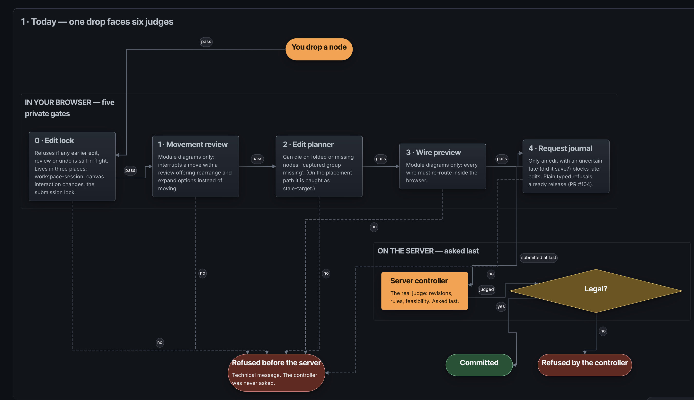
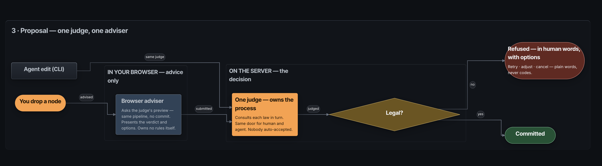
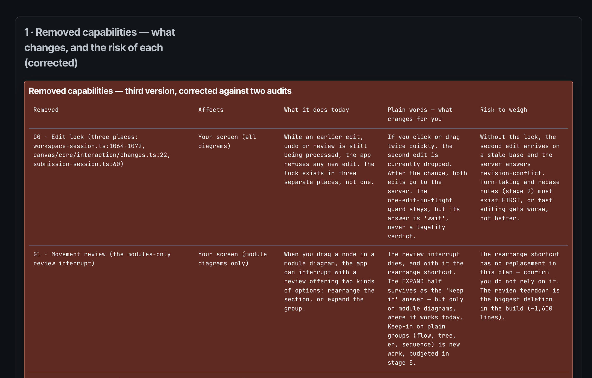
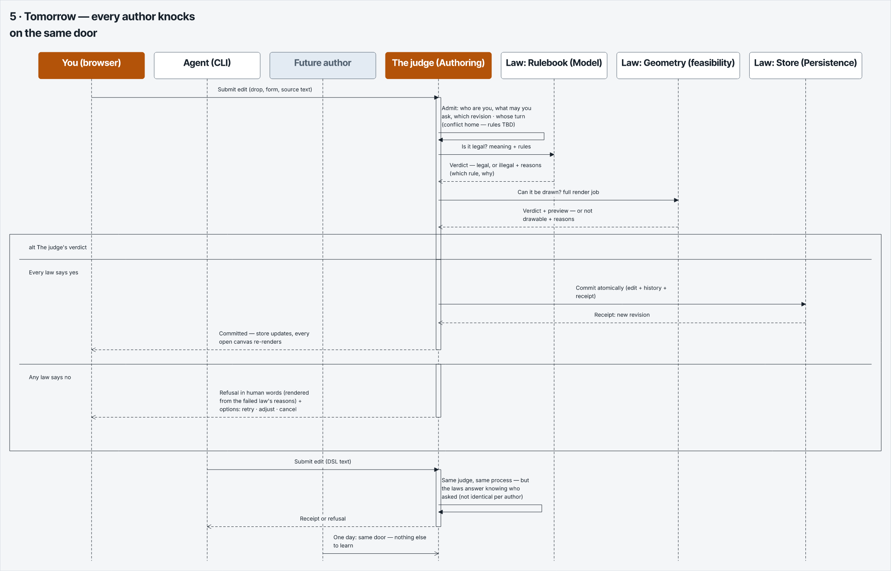
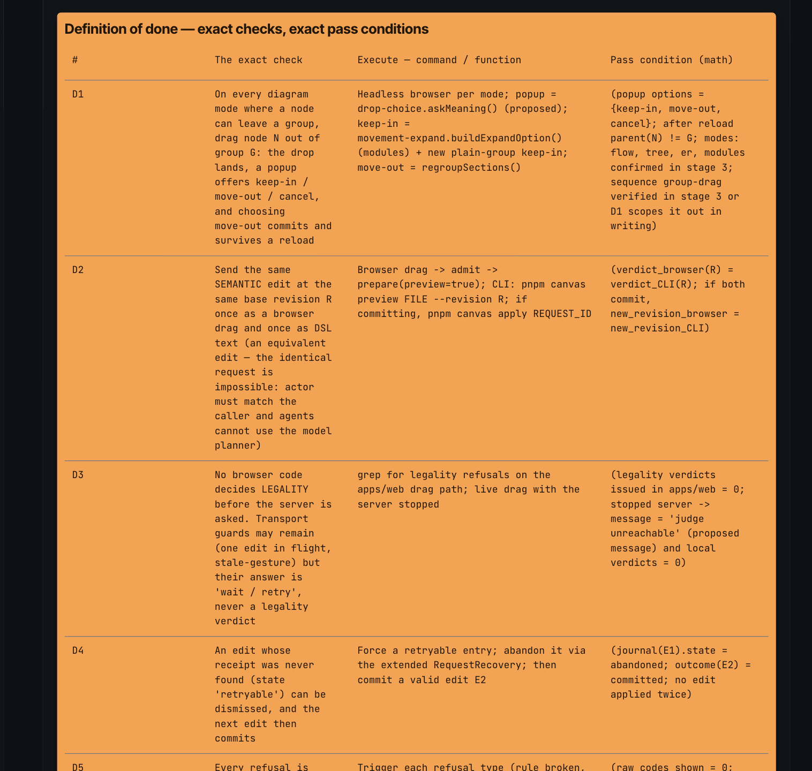
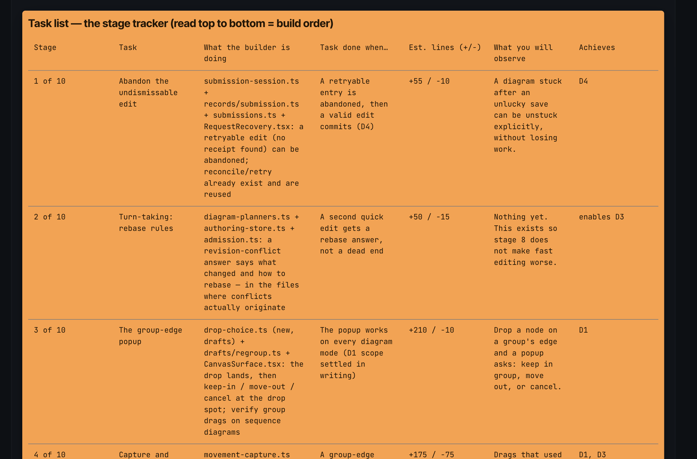

Last Updated: 24th September 2026

## Authoring: 

These are Chris' preferences for authoring specs and engineering documents.

Reference .canvas DSL (/resources/reference/example-spec-format) which has most of the below references.

When authoring a collection of specs/plans, an agent must follow the following at a MINIMUM. This is a spec interface.

Apply when the build proposal is non-trivial. Any of these are a trigger requiring the specs to be authored:
- >100 lines of code being changed
- touching >5 files  
- changing app functionality and wiring - which fundamentally changes how the app works.

The allowed exceptions:
- Rewrites that change the way code is written, but have ZERO (0) change in functionality or behaviour. 
- Refactors that reduce a file size and split into smaller files (with ZERO change in behaviour).

**100% of all exceptions must be declared loudly in writing. Chris must write "I approve the skipping of spec". **

Novakai-Canvas is deterministic in its layout. Agents are expected to be able to read from the DSL source code when evaluating and / or auditing the build spec.

Inspect diagrams before sending to human to ensure they are human readable.

**Warnings**

- DSL source code > 300 lines = warning.
- DSL source code >= 500 lines = hard stop. Report honestly. Indication of diagram growing in scope / spec too broad / agent drifting.

Source code lines - omit blank lines and lines that have only brackets e.g. {} 

## Important: 

Declare each node once per collection. show @id reuses that node in a diagram; it does not create another node. Reuse the same ID across views. Never use escape hatches to recreate a node, its contents or its relationships as a separate visual copy.

## MANDATORY RULES FOR AUTHORING A COLLECTION USING DSL

Collections are declarative. Nodes and wires are declared once. Diagrams read from the declared node list, and render an instance using @show. 

Any refernce to rules on nodes also apply to wires and all other objects. 

1. Nodes MUST ONLY be declared once. 
2. Nodes MUST NEVER be representing the same file or object using an escape hatch.

Bad: The identical node is duplicated. There are now 3 ID's referencing the same canonical information.  
``` 
node @m-ws module "workspace-session"
node @n-ws2 module "workspace-session"
node @n-ws3 module "workspace-session"
```

Good:
```
node @ws module "workspace-session"
```


### MANDATORY DIAGRAMS TO BE INCLUDED IN COLLECTION

Diagram titles to include the number.

0. Situation Today (if brownfield)



The problem today must be obvious from the diagram.

- The agent used groups to cluster information. Human eye can then see that there is a cluster of processses in "browser" and others "in server".
- Clear demonstration of 5 steps before server is reached.
- Plain launguage is used at this stage "Refused before the server" communicates in plain-language the activity.

0.1 Proposal 



- Still using plain-language so reader can understand at high level of abstraction what the proposal is.

1. Target Repo Tree.

Ascii-style tree diagram showing target repo tree (of files in scope).

Must include .css, .ts, .tsx and all other files.

Can exclude files that have minor involvement (e.g. require 1 line update, or a file path change - not signifcant contributors to the plan).

2. Entity Diagram & invariant State

Must show ER relationships - as it relates to data-store objects. 

Must be explicit and all prose commentary must be absent if it can be expressed via entity - relationship cardinality expression. The below is a 

Customer "1" ──< "n" Order
Order "1" ──< "n" OrderLine
Product "1" ──< "n" OrderLine
Customer "1" ──< "n" PriceList

Order { id: OrderId, customerId: CustomerId, status: OrderStatus, placedAt: Date, total: Money }
OrderLine { id: LineId, orderId: OrderId, productId: ProductId, qty: number, unitPrice: Money }
OrderEvent { id: EventId, orderId: OrderId, kind: EventKind, at: Date }
Customer { id: CustomerId, name: string, email: string, address: Address }
Product { id: ProductId, sku: string, name: string, basePrice: Money }
PriceList { id: PriceListId, customerId: CustomerId, currency: string, validFrom: Date }
OrderStatus = "draft" | "placed" | "cancelled" | "fulfilled"
EventKind = "placed" | "lineAdded" | "cancelled"
DiscountKind = "percentage" | "fixed"

WARNING: a TS type of "string" is to be avoided. The above is demonstration. Types used should match the senior patterns here:

/Users/christopherdasca/Programming/Novakai-canvas/AGENTS-TYPESCRIPT-CODING-STANDARDS.md

**Invariant States:**

Invariant States for the entities in scope (if applicable).

Any invariant state described must be objective and explicit - zero ambiguity is the benchmark. Mathematical notation and alogorithmic notation is expected inside parenthesis where possible - to ensure invariant state is clearly expressed by author.

e.g.:
```
OrderStatus = "draft" | "placed" | "cancelled" | "fulfilled"
EventKind = "placed" | "lineAdded" | "cancelled"
DiscountKind = "percentage" | "fixed"
invariant: Order.total = sum(OrderLine.qty * OrderLine.unitPrice)
invariant: Order.placedAt <= OrderEvent.at for every event of that order
invariant: DiscountRule.value > 0 and DiscountRule.minQty >= 0
```

3. **Module Import Diagram**

1. Module names displayed be the name of the file 
2. Module diagram wire labels MUST be the name of the function being called.
Source module imports from Target Module.
3. A module wire label MUST be present in the Target module signature. 
4. ONE wire is created from source, to target with arrow pointing at target module. Returns are 
5. Groups are folder directory names. Nested groups = nested folders.


```
section @s-spec-modules "B.3 · Build spec — module import graph (groups are folders, real functions)" mode=modules order=8 layout=layered {
  show @mg-note
  group @mg-g-apps "apps/" frame=auto role=neutral layout=layered {
  group @mg-g-web "web/" frame=auto role=neutral layout=layered {
  group @mg-g-adapters "adapters/" frame=auto role=neutral layout=layered {
  show @mg-session
  show @mg-routes
  show @mg-journal
}
  group @mg-g-editing "core/editing/" frame=auto role=neutral layout=layered {
  show @mg-capture
  show @mg-planner
  show @mg-expand
}
  group @mg-g-output "core/output/" frame=auto role=neutral layout=layered {
  show @mg-diagnostics
}
}
  group @mg-g-service "service/" frame=auto role=neutral layout=layered {
  group @mg-g-transport "core/transport/" frame=auto role=neutral layout=layered {
  show @mg-door
}
  group @mg-g-svcad "adapters/" frame=auto role=neutral layout=layered {
  show @mg-geometry
}
}
}
  group @mg-g-cap "capability/" frame=auto role=neutral layout=layered {
  group @mg-g-canvas "canvas/" frame=auto role=neutral layout=layered {
  group @mg-g-rf "adapters/react-flow/" frame=auto role=neutral layout=layered {
  show @mg-surface
}
  group @mg-g-drafts "core/drafts/" frame=auto role=neutral layout=layered {
  show @mg-drop
}
}
  group @mg-g-authoring "authoring/contract/" frame=auto role=neutral layout=layered {
  show @mg-judge
}
  group @mg-g-model "model/core/" frame=auto role=neutral layout=layered {
  show @mg-rulebook
}
  group @mg-g-persistence "persistence/core/" frame=auto role=neutral layout=layered {
  show @mg-store
}
}
  connect @mg-w1
  connect @mg-w2
  connect @mg-w3
  connect @mg-w4
  connect @mg-w5
  connect @mg-w6
  connect @mg-w7
  connect @mg-w8
  connect @mg-w9
  connect @mg-w10
  connect @mg-w11
  connect @mg-w12
  connect @mg-w13
  connect @mg-w14
}
```

Text commentary in node must be there to help the reader understand what the author is trying to communcate.

NEVER bury invariants, architectural decisions, or other load-bearing statements that are not clearly expressed in the appropriate sections.


4 Modules Summary Table

- Create a diagram that captures all modules (files) in scope. 
- This table is concise. It shows estimated line churnin the plan. 
- Estimates are just estimates. Not hard gates.
- This is to be authored as a separate diagram following the table format below:

Summary Table

| Module | Current Line Count | Churn (estimate) | Expected final line count (estimate) |
| --- | --- | --- | --- |
| placeOrder.ts | 180 | +20   |  + 40 / - 20  | 200 |
| status.ts | 250 | -10  |  +20 / - 30 | 240 |
| …(all other files listed above) |  |  |  |


5. Capability Ownership

---


6. REMOVED FUNCTIONALITTY / FEATURES / MAJOR ENGINEERING SIDE EFFECTS   

Any load-bearing decision or proposed functionality removed MUST be included.

No functionality is allowed to be silently removed.

- MUST BE Explicit. Must be Clear. Must be explained to ensure a non-technical reader understands.

Format = Table. One row per removal.

Columns = Removed, Affects, What it does today, Plain words - what changes for you, Risk to weigh.




### 7 onwards... Additional Diagrams

Additional diagrams include things such as 
- Sequence diagram
- Flowcharts

Some examples:


Flowcharts in plain language clearly explaining concepts


### Execution Diagrams - Mandatory before actual execution and building begins.

E1. Definition of Done



E2. Task List




