# Novakai Canvas

**Make the plan visible. Keep its meaning intact.**

A deterministic, lossless **diagram language** for coding with agents—human to agent, and agent to agent.

Long prose specs bury the important parts. One paraphrased constraint can become the wrong implementation. Novakai Canvas makes the objects, boundaries, relationships and sequence explicit in a readable DSL, with a canvas humans can inspect.

The target is **100% shared comprehension**: spend frontier-model reasoning on planning, then give token-efficient builders—such as Codex Luna—a precise, reviewable contract. Make a 24-hour build traceable against its plan, rather than trusting a long conversation from memory.

That is the direction, not a guarantee of perfect agent understanding. Today, “lossless” means preserving the supported diagram semantics through DSL read/write; “deterministic” assumes the same diagram, pinned resources, engine version and retained human layout state.

## Try the walkthrough

```sh
pnpm install --frozen-lockfile
pnpm --filter @novakai/canvas-web build
pnpm dev --port 5210 --workspace .novakai/walkthrough
```

In another terminal, from the repo root:

```sh
pnpm canvas theme admit resources/walkthrough.theme --request walkthrough-theme \
  --server http://127.0.0.1:5210 --workspace .novakai/walkthrough
pnpm canvas create resources/examples/walkthrough/all-diagrams.canvas \
  --request walkthrough-create --server http://127.0.0.1:5210 --workspace .novakai/walkthrough
```

Open **[the combined walkthrough](http://127.0.0.1:5210/?collection=walkthrough)**. Choose **Inspect → Settings → Dark**, then **Reading mode** in the canvas toolbar. **Next section** steps through the examples; **View → Hide all interface** removes the controls, and **Escape** restores them.

**Reading mode is an overview.** Zoom in to reveal module bodies and ports; fitting a large section can hide this detail. If the toolbar overlaps content, zoom out once or use **Hide all interface** for an unobstructed view.

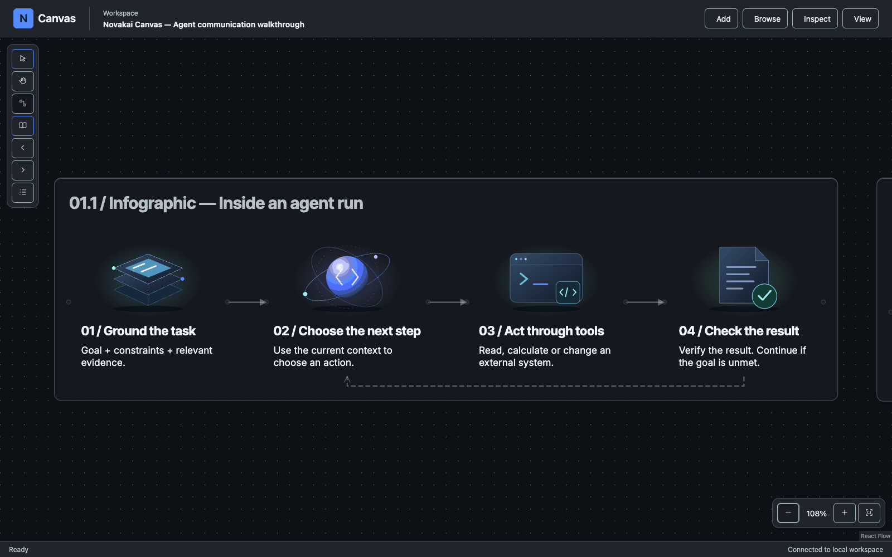

Nine example collections, ten sections in the combined canvas. Start with the idea, then move through its structure, data and behaviour. The illustration and process examples are a fictional release-review system; the repo tree uses actual paths.

<details>
<summary>Load each example as its own collection</summary>

```sh
for file in resources/examples/walkthrough/0*.canvas; do
  name=$(basename "$file" .canvas)
  pnpm canvas create "$file" --request "example-$name" \
    --server http://127.0.0.1:5210 --workspace .novakai/walkthrough
done
```

Run each create once per workspace. For an existing collection, read its current revision and use `replace --revision N` with a fresh request ID.

</details>

## What you can author

Each screenshot below is from the running app. Expand its DSL to see the complete source, or open the linked file. The app calculates positions and wire paths.

### Infographics

Explain an idea with illustrations, captions and real connections. Two sections demonstrate reusable SVG assets and built-in parametric figures. Neither requires authored node coordinates.

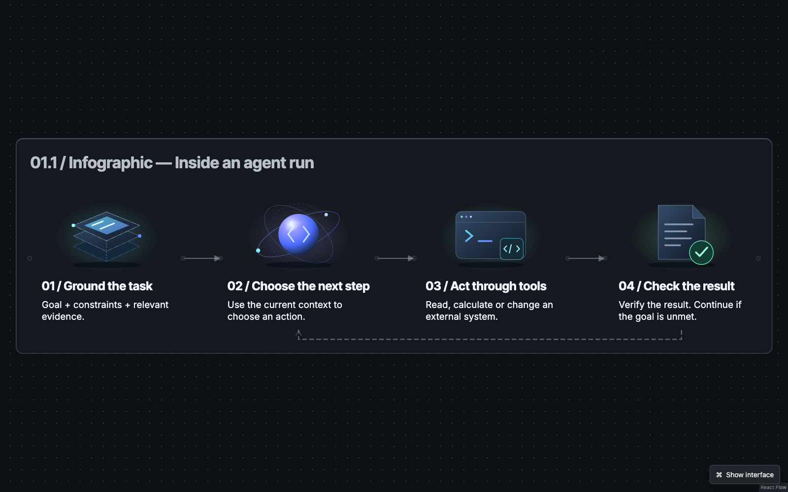

[Open the DSL](resources/examples/walkthrough/01-infographic.canvas)

<details>
<summary>DSL that authors this diagram</summary>

```text
canvas 1
collection @walkthrough-infographic "01 / Infographics" theme=walkthrough description="Original illustrated infographics. Conceptual examples, not measured performance or a claim about a particular model architecture." {
  asset @context-art image source="./assets/context.svg" alt="Three translucent layers of context"
  asset @reason-art image source="./assets/reason.svg" alt="A luminous reasoning core surrounded by orbital rings"
  asset @tools-art image source="./assets/tools.svg" alt="A terminal and callable tool interface"
  asset @evidence-art image source="./assets/evidence.svg" alt="An evidence document with a verification mark"

  node @context concept "01 / Ground the task" frame=none composition=media-top {
    image @art asset=@context-art size=large
    text @caption "Goal + constraints + relevant evidence." role=caption
  }
  node @reason concept "02 / Choose the next step" frame=none composition=media-top {
    image @art asset=@reason-art size=large
    text @caption "Use the current context to choose an action." role=caption
  }
  node @tools concept "03 / Act through tools" frame=none composition=media-top {
    image @art asset=@tools-art size=large
    text @caption "Read, calculate or change an external system." role=caption
  }
  node @proof concept "04 / Check the result" frame=none composition=media-top {
    image @art asset=@evidence-art size=large
    text @caption "Verify the result. Continue if the goal is unmet." role=caption
  }
  wire @grounded @context -> @reason "context" kind=flow step=1
  wire @action @reason -> @tools "action" kind=flow step=2
  wire @observed @tools -> @proof "observation" kind=flow step=3
  wire @feedback @proof -> @reason "continue if needed" kind=reference style=dashed
  section @agent-run "01.1 / Infographic — Inside an agent run" mode=story layout=grid columns=4 direction=right gap=normal {
    show @context @reason @tools @proof
    connect @grounded @action @observed source-side=right target-side=left
    connect @feedback source-side=bottom target-side=bottom
  }

  node @i-draft concept "Describe the change" frame=none composition=media-top {
    figure @i-art window fill=half size=large
    text @i-caption "Write intent and boundaries." role=caption
  }
  node @i-check concept "Check the contract" frame=none composition=media-top {
    figure @i-art gate pass=one size=large
    text @i-caption "Reject invalid changes before commit." role=caption
  }
  node @i-store concept "Retain the evidence" frame=none composition=media-top {
    figure @i-art store size=large
    text @i-caption "Keep the revision and its receipt." role=caption
  }
  node @i-queue concept "Work in small steps" frame=none composition=media-top {
    figure @i-art queue level=half size=large
    text @i-caption "Review one bounded change at a time." role=caption
  }
  wire @i-review @i-draft -> @i-check "validate" kind=flow
  wire @i-save @i-check -> @i-store "commit" kind=flow
  wire @i-next @i-store -> @i-queue "continue" kind=flow
  section @i-builtins "01.2 / Infographic — Built-in figures, no image assets" mode=story layout=grid columns=4 direction=right gap=normal {
    show @i-draft @i-check @i-store @i-queue
    connect @i-review @i-save @i-next source-side=right target-side=left
  }
}
```

</details>

**No SVG asset required:** the second section uses built-in `window`, `gate`, `store` and `queue` figures. SVG images are an optional supported asset path for custom illustration; they do not replace the semantic nodes or routing.

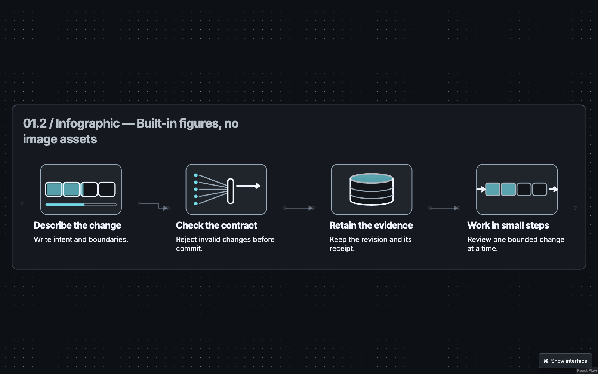

### Module diagrams

Make responsibilities, callable interfaces and nested capability boundaries visible. This example has 11 nodes across input, review and record-keeping groups.

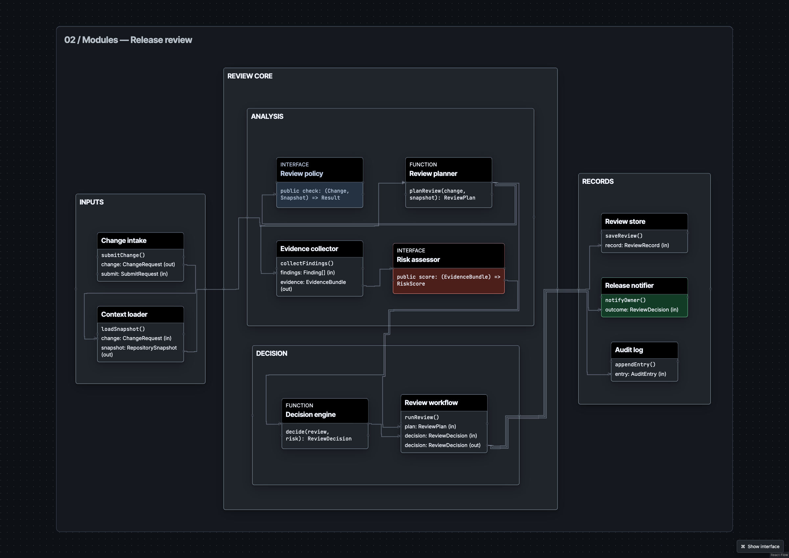

[Open the DSL](resources/examples/walkthrough/02-modules.canvas)

<details>
<summary>DSL that authors this diagram</summary>

```text
canvas 1
collection @walkthrough-modules "Agent-assisted release review" theme=walkthrough {
 node @m-intake module "Change intake" size=medium {
  code @m-intake-exports "submitChange()"
  port @m-change out "change" type="ChangeRequest"
  port @m-submit in "submit" type="SubmitRequest"
 }
 node @m-context module "Context loader" size=medium {
  code @m-context-exports "loadSnapshot()"
  port @m-context-change in "change" type="ChangeRequest"
  port @m-snapshot out "snapshot" type="RepositorySnapshot"
 }
 node @m-policy interface "Review policy" role=supporting size=medium {
  member @m-check "check" type="(Change, Snapshot) => Result" visibility=public
 }
 node @m-review function "Review planner" size=medium {
  signature @m-plan "planReview" parameters=["change", "snapshot"] returns="ReviewPlan"
 }
 node @m-evidence module "Evidence collector" size=medium {
  code @m-evidence-exports "collectFindings()"
  port @m-findings in "findings" type="Finding[]"
  port @m-evidence-out out "evidence" type="EvidenceBundle"
 }
 node @m-risk interface "Risk assessor" role=warning size=medium {
  member @m-score "score" type="(EvidenceBundle) => RiskScore" visibility=public
 }
 node @m-decision function "Decision engine" size=medium {
  signature @m-decide "decide" parameters=["review", "risk"] returns="ReviewDecision"
 }
 node @m-workflow module "Review workflow" size=medium {
  code @m-workflow-exports "runReview()"
  port @m-plan-in in "plan" type="ReviewPlan"
  port @m-decision-in in "decision" type="ReviewDecision"
  port @m-decision-out out "decision" type="ReviewDecision"
 }
 node @m-persist module "Review store" size=medium {
  code @m-persist-exports "saveReview()"
  port @m-record in "record" type="ReviewRecord"
 }
 node @m-notify module "Release notifier" role=success size=medium {
  code @m-notify-exports "notifyOwner()"
  port @m-outcome in "outcome" type="ReviewDecision"
 }
 node @m-audit module "Audit log" size=small {
  code @m-audit-exports "appendEntry()"
  port @m-entry in "entry" type="AuditEntry"
 }
 wire @m-intake-route @m-intake.@m-change -> @m-context.@m-context-change "requests repository context" kind=reference
 wire @m-context-route @m-context.@m-snapshot -> @m-review "calls planner with snapshot" kind=calls
 wire @m-policy-use @m-review -> @m-policy.@m-check "checks policy constraints" kind=reference
 wire @m-evidence-route @m-review -> @m-evidence.@m-findings "collects changed-area findings" kind=reference
 wire @m-risk-use @m-evidence.@m-evidence-out -> @m-risk "supplies evidence to risk contract" kind=reference
 wire @m-decision-use @m-risk.@m-score -> @m-decision "supplies assessed risk" kind=reference
 wire @m-workflow-plan @m-review -> @m-workflow.@m-plan-in "starts review workflow" kind=reference
 wire @m-workflow-decision @m-decision -> @m-workflow.@m-decision-in "returns decision" kind=reference
 wire @m-store @m-workflow.@m-decision-out -> @m-persist.@m-record "persists review record" kind=reference
 wire @m-notify-route @m-workflow.@m-decision-out -> @m-notify.@m-outcome "notifies release owner" kind=reference
 wire @m-audit-route @m-workflow.@m-decision-out -> @m-audit.@m-entry "appends audit entry" kind=reference
 section @m-review-map "02 / Modules — Release review" mode=modules layout=grid columns=3 direction=right gap=compact {
  group @m-inputs "INPUTS" frame=panel layout=grid columns=1 direction=down gap=compact {
   show @m-intake @m-context
  }
  group @m-core "REVIEW CORE" frame=panel layout=grid columns=1 direction=right gap=compact {
   group @m-analysis "ANALYSIS" layout=grid columns=2 direction=down gap=compact {
    show @m-policy @m-review @m-evidence @m-risk
   }
   group @m-outcome "DECISION" layout=grid columns=2 direction=down gap=compact {
    show @m-decision @m-workflow
   }
  }
  group @m-records "RECORDS" frame=panel layout=grid columns=1 direction=down gap=compact {
   show @m-persist @m-notify @m-audit
  }
  connect @m-intake-route @m-context-route @m-policy-use @m-evidence-route @m-risk-use @m-decision-use @m-workflow-plan @m-workflow-decision @m-store @m-notify-route @m-audit-route source-side=right target-side=left
 }
}
```

</details>

### Entity diagrams

Seven entities connect changes, reviews, findings and evidence. Fields, primary/foreign keys and cardinalities carry meaning beyond a box label.

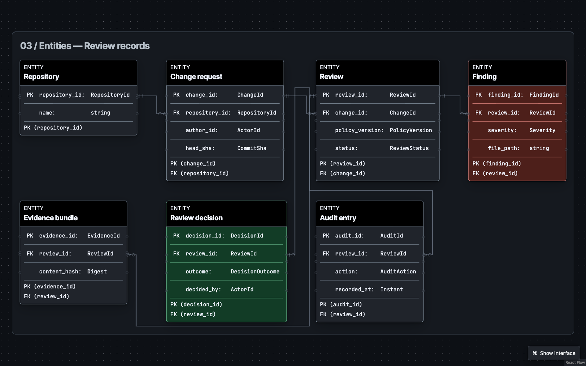

[Open the DSL](resources/examples/walkthrough/03-entities.canvas)

<details>
<summary>DSL that authors this diagram</summary>

```text
canvas 1
collection @walkthrough-entities "Release review records" theme=walkthrough {
 node @e-repository entity "Repository" size=medium {
  field @e-repository-id "repository_id" type="RepositoryId"
  field @e-repository-name "name" type="string"
  keygroup @e-repository-key kind=primary fields=[@e-repository-id]
 }
 node @e-change entity "Change request" size=large {
  field @e-change-id "change_id" type="ChangeId"
  field @e-change-repo "repository_id" type="RepositoryId"
  field @e-change-author "author_id" type="ActorId"
  field @e-change-sha "head_sha" type="CommitSha"
  keygroup @e-change-key kind=primary fields=[@e-change-id]
  keygroup @e-change-repo-ref kind=foreign fields=[@e-change-repo] references=[@e-repository.@e-repository-id]
 }
 node @e-review entity "Review" size=large {
  field @e-review-id "review_id" type="ReviewId"
  field @e-review-change "change_id" type="ChangeId"
  field @e-review-policy "policy_version" type="PolicyVersion"
  field @e-review-status "status" type="ReviewStatus"
  keygroup @e-review-key kind=primary fields=[@e-review-id]
  keygroup @e-review-change-ref kind=foreign fields=[@e-review-change] references=[@e-change.@e-change-id]
 }
 node @e-finding entity "Finding" role=warning size=medium {
  field @e-finding-id "finding_id" type="FindingId"
  field @e-finding-review "review_id" type="ReviewId"
  field @e-finding-severity "severity" type="Severity"
  field @e-finding-path "file_path" type="string"
  keygroup @e-finding-key kind=primary fields=[@e-finding-id]
  keygroup @e-finding-review-ref kind=foreign fields=[@e-finding-review] references=[@e-review.@e-review-id]
 }
 node @e-evidence entity "Evidence bundle" size=medium {
  field @e-evidence-id "evidence_id" type="EvidenceId"
  field @e-evidence-review "review_id" type="ReviewId"
  field @e-evidence-hash "content_hash" type="Digest"
  keygroup @e-evidence-key kind=primary fields=[@e-evidence-id]
  keygroup @e-evidence-review-ref kind=foreign fields=[@e-evidence-review] references=[@e-review.@e-review-id]
 }
 node @e-decision entity "Review decision" role=success size=medium {
  field @e-decision-id "decision_id" type="DecisionId"
  field @e-decision-review "review_id" type="ReviewId"
  field @e-decision-outcome "outcome" type="DecisionOutcome"
  field @e-decision-by "decided_by" type="ActorId"
  keygroup @e-decision-key kind=primary fields=[@e-decision-id]
  keygroup @e-decision-review-ref kind=foreign fields=[@e-decision-review] references=[@e-review.@e-review-id]
 }
 node @e-audit entity "Audit entry" size=medium {
  field @e-audit-id "audit_id" type="AuditId"
  field @e-audit-review "review_id" type="ReviewId"
  field @e-audit-action "action" type="AuditAction"
  field @e-audit-at "recorded_at" type="Instant"
  keygroup @e-audit-key kind=primary fields=[@e-audit-id]
  keygroup @e-audit-review-ref kind=foreign fields=[@e-audit-review] references=[@e-review.@e-review-id]
 }
 wire @e-repo-changes @e-repository.@e-repository-id -> @e-change.@e-change-repo "contains changes" kind=association from=1 to=0..many
 wire @e-change-review @e-change.@e-change-id -> @e-review.@e-review-change "is reviewed by" kind=association from=1 to=0..many
 wire @e-review-findings @e-review.@e-review-id -> @e-finding.@e-finding-review "produces findings" kind=association from=1 to=0..many
 wire @e-review-evidence @e-review.@e-review-id -> @e-evidence.@e-evidence-review "packages evidence" kind=association from=1 to=0..many
 wire @e-review-decision @e-review.@e-review-id -> @e-decision.@e-decision-review "receives decision" kind=association from=1 to=0..1
 wire @e-review-audit @e-review.@e-review-id -> @e-audit.@e-audit-review "records actions" kind=association from=1 to=0..many
 section @e-review-model "03 / Entities — Review records" mode=er layout=grid columns=4 direction=right gap=compact {
  show @e-repository @e-change @e-review @e-finding @e-evidence @e-decision @e-audit
  connect @e-repo-changes @e-change-review @e-review-findings @e-review-evidence @e-review-decision @e-review-audit
 }
}
```

</details>

### Repo trees

Follow 16 selected real paths through this repository. This is the current parent-child diagram view; an interactive, collapsible file explorer is not implemented yet.

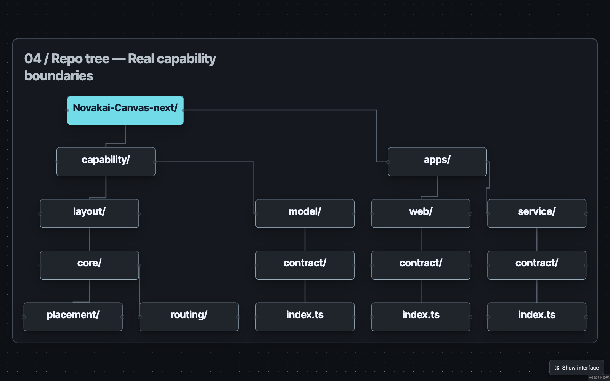

[Open the DSL](resources/examples/walkthrough/04-repo-tree.canvas)

<details>
<summary>DSL that authors this diagram</summary>

```text
canvas 1
collection @walkthrough-repo-tree "04 / Repo tree" theme=walkthrough description="Selected real paths in this repository; a semantic parent-child tree, not a collapsible file explorer." {
  node @r-root concept "Novakai-Canvas-next/" size=small role=primary {}
  node @r-apps concept "apps/" size=small {}
  node @r-cap concept "capability/" size=small {}
  node @r-web concept "web/" size=small {}
  node @r-service concept "service/" size=small {}
  node @r-layout concept "layout/" size=small {}
  node @r-model concept "model/" size=small {}
  node @r-wc concept "contract/" size=small {}
  node @r-sc concept "contract/" size=small {}
  node @r-lc concept "core/" size=small {}
  node @r-mc concept "contract/" size=small {}
  node @r-wi concept "index.ts" size=small {}
  node @r-si concept "index.ts" size=small {}
  node @r-place concept "placement/" size=small {}
  node @r-route concept "routing/" size=small {}
  node @r-mi concept "index.ts" size=small {}
  wire @r-edge-apps @r-root -> @r-apps "contains" kind=parent
  wire @r-edge-cap @r-root -> @r-cap "contains" kind=parent
  wire @r-edge-web @r-apps -> @r-web "contains" kind=parent
  wire @r-edge-service @r-apps -> @r-service "contains" kind=parent
  wire @r-edge-layout @r-cap -> @r-layout "contains" kind=parent
  wire @r-edge-model @r-cap -> @r-model "contains" kind=parent
  wire @r-edge-wc @r-web -> @r-wc "contains" kind=parent
  wire @r-edge-sc @r-service -> @r-sc "contains" kind=parent
  wire @r-edge-lc @r-layout -> @r-lc "contains" kind=parent
  wire @r-edge-mc @r-model -> @r-mc "contains" kind=parent
  wire @r-edge-wi @r-wc -> @r-wi "contains" kind=parent
  wire @r-edge-si @r-sc -> @r-si "contains" kind=parent
  wire @r-edge-place @r-lc -> @r-place "contains" kind=parent
  wire @r-edge-route @r-lc -> @r-route "contains" kind=parent
  wire @r-edge-mi @r-mc -> @r-mi "contains" kind=parent
  section @r-tree "04 / Repo tree — Real capability boundaries" mode=tree direction=down gap=compact {
    show @r-root @r-apps @r-cap @r-web @r-service @r-layout @r-model @r-wc @r-sc @r-lc @r-mc @r-wi @r-si @r-place @r-route @r-mi
    connect @r-edge-apps @r-edge-cap @r-edge-web @r-edge-service @r-edge-layout @r-edge-model @r-edge-wc @r-edge-sc @r-edge-lc @r-edge-mc @r-edge-wi @r-edge-si @r-edge-place @r-edge-route @r-edge-mi
    root @r-root
  }
}
```

</details>

### Sequence diagrams

Follow five participants through submission, a policy decision and repeated evidence collection. Messages, alternatives and loops remain structured DSL.

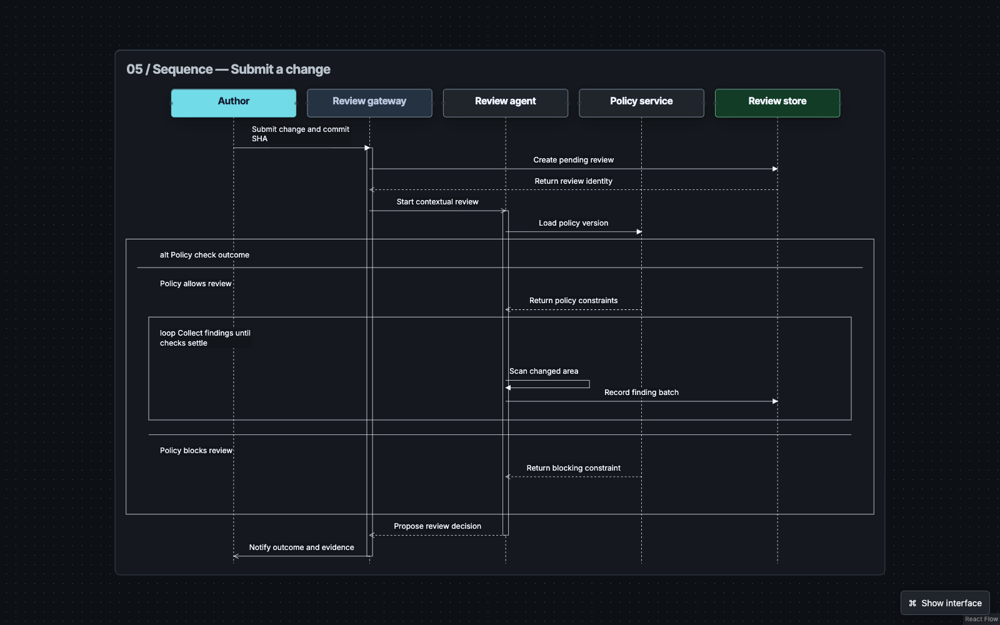

[Open the DSL](resources/examples/walkthrough/05-sequence.canvas)

<details>
<summary>DSL that authors this diagram</summary>

```text
canvas 1
collection @walkthrough-sequence "Submit a change for release review" theme=walkthrough {
 node @q-author participant "Author" role=primary {}
 node @q-gateway participant "Review gateway" role=supporting {}
 node @q-agent participant "Review agent" {}
 node @q-policy participant "Policy service" {}
 node @q-store participant "Review store" role=success {}
 section @q-submit "05 / Sequence — Submit a change" mode=sequence direction=down gap=compact {
  show @q-author @q-gateway @q-agent @q-policy @q-store
  event @q-submit-request @q-author -> @q-gateway "Submit change and commit SHA" kind=call activate=true
  event @q-create-review @q-gateway -> @q-store "Create pending review" kind=call
  event @q-accepted @q-store -> @q-gateway "Return review identity" kind=return activate=false
  event @q-start-agent @q-gateway -> @q-agent "Start contextual review" kind=async activate=true
  event @q-load-policy @q-agent -> @q-policy "Load policy version" kind=call
  fragment @q-policy-check alt "Policy check outcome" {
   branch @q-allowed "Policy allows review" {
    event @q-policy-result @q-policy -> @q-agent "Return policy constraints" kind=return activate=false
  fragment @q-findings loop "Collect findings until checks settle" {
   event @q-scan @q-agent -> @q-agent "Scan changed area" kind=call
   event @q-record-finding @q-agent -> @q-store "Record finding batch" kind=call
  }
   }
   branch @q-blocked "Policy blocks review" {
    event @q-policy-block @q-policy -> @q-agent "Return blocking constraint" kind=return activate=false
   }
  }
  event @q-propose @q-agent -> @q-gateway "Propose review decision" kind=return activate=false
  event @q-notify @q-gateway -> @q-author "Notify outcome and evidence" kind=async activate=false
 }
}
```

</details>

### Flowcharts

Trace a ten-step review with decisions and repair loops. Successful and unsuccessful paths are named in the nodes as well as the connections.

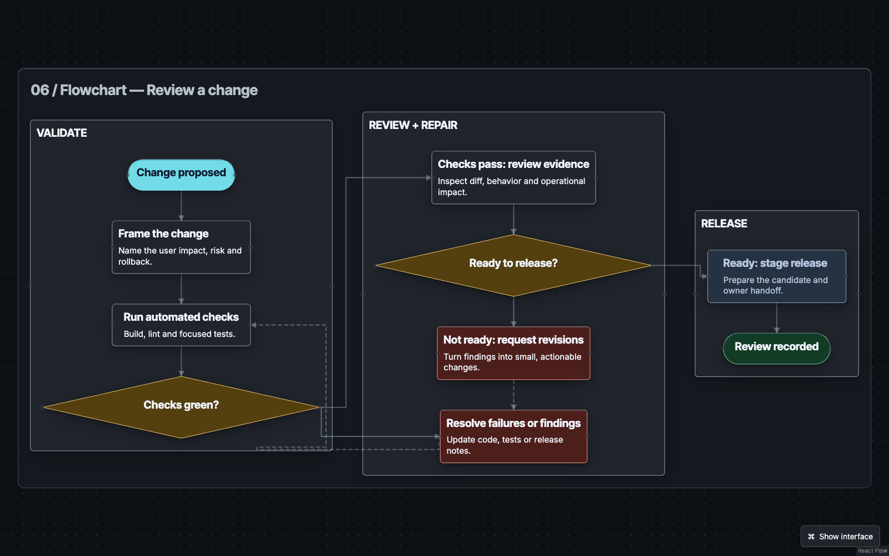

[Open the DSL](resources/examples/walkthrough/06-flowchart.canvas)

<details>
<summary>DSL that authors this diagram</summary>

```text
canvas 1
collection @f-review "06 / Flowchart — Review a change" theme=walkthrough {
 node @f-request start "Change proposed" role=primary size=small {}
 node @f-scope step "Frame the change" size=medium { text @f-scope-detail "Name the user impact, risk and rollback." }
 node @f-check step "Run automated checks" size=medium { text @f-check-detail "Build, lint and focused tests." }
 node @f-signal decision "Checks green?" role=decision size=medium {}
 node @f-review step "Checks pass: review evidence" size=medium { text @f-review-detail "Inspect diff, behavior and operational impact." }
 node @f-ask step "Not ready: request revisions" role=warning size=medium { text @f-ask-detail "Turn findings into small, actionable changes." }
 node @f-repair step "Resolve failures or findings" role=warning size=medium { text @f-repair-detail "Update code, tests or release notes." }
 node @f-approve decision "Ready to release?" role=decision size=medium {}
 node @f-ship step "Ready: stage release" role=supporting size=medium { text @f-ship-detail "Prepare the candidate and owner handoff." }
 node @f-done end "Review recorded" role=success size=small {}
 wire @f-start @f-request -> @f-scope "open review" kind=flow step=1
 wire @f-automate @f-scope -> @f-check "submit candidate" kind=flow step=2
 wire @f-green @f-check -> @f-signal "publish checks" kind=flow step=3
 wire @f-pass @f-signal -> @f-review "yes: inspect evidence" kind=flow
 wire @f-fail @f-signal -> @f-repair "no: fix failures" kind=flow
 wire @f-retry @f-repair -> @f-check "rerun checks" kind=flow style=dashed
 wire @f-findings @f-review -> @f-approve "share recommendation" kind=flow step=4
 wire @f-revise @f-approve -> @f-ask "no: request revisions" kind=flow
 wire @f-loop @f-ask -> @f-repair "resolve findings" kind=flow style=dashed
 wire @f-ready @f-approve -> @f-ship "yes: hand off" kind=flow
 wire @f-release @f-ship -> @f-done "record decision" kind=flow
 section @f-flow "06 / Flowchart — Review a change" mode=flow layout=layered direction=right gap=compact {
  group @f-validation "VALIDATE" layout=layered direction=down gap=compact { show @f-request @f-scope @f-check @f-signal }
  group @f-assessment "REVIEW + REPAIR" layout=layered direction=down gap=compact { show @f-review @f-approve @f-ask @f-repair }
  group @f-release-stage "RELEASE" layout=layered direction=down gap=compact { show @f-ship @f-done }
  connect @f-start @f-automate @f-green @f-pass @f-findings @f-ready @f-release source-side=auto target-side=auto
  connect @f-fail @f-revise @f-loop @f-retry source-side=auto target-side=auto
 }
}
```

</details>

### State diagrams

Separate a change’s seven lifecycle states from the events that move it forward. Transition guards and effects are retained in the source; select a wire to inspect its label.

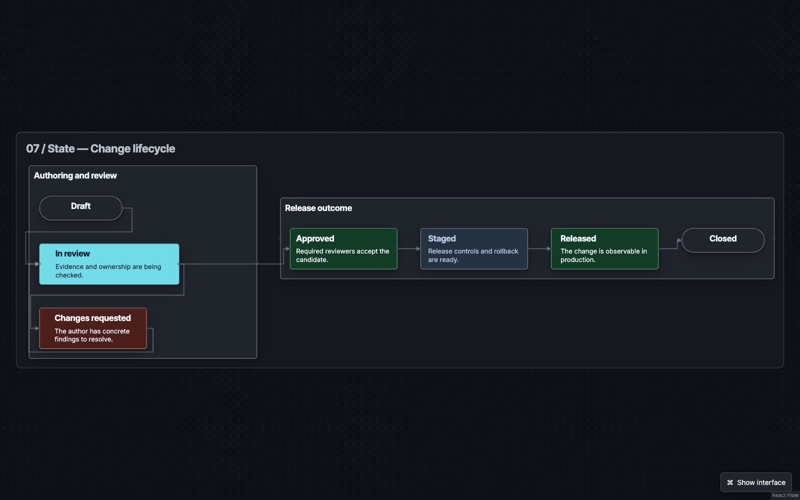

[Open the DSL](resources/examples/walkthrough/07-state.canvas)

<details>
<summary>DSL that authors this diagram</summary>

```text
canvas 1
collection @s-lifecycle "07 / State — Change lifecycle" theme=walkthrough {
 node @s-draft start "Draft" size=small {}
 node @s-review state "In review" role=primary size=large { text @s-review-detail "Evidence and ownership are being checked." }
 node @s-rework state "Changes requested" role=warning size=medium { text @s-rework-detail "The author has concrete findings to resolve." }
 node @s-approved state "Approved" role=success size=medium { text @s-approved-detail "Required reviewers accept the candidate." }
 node @s-staged state "Staged" role=supporting size=medium { text @s-staged-detail "Release controls and rollback are ready." }
 node @s-live state "Released" role=success size=medium { text @s-live-detail "The change is observable in production." }
 node @s-closed end "Closed" size=small {}
 wire @s-submit @s-draft -> @s-review "submit for review" kind=transition guard="owner ready" effect="capture revision"
 wire @s-request @s-review -> @s-rework "request changes" kind=transition guard="evidence incomplete" effect="record findings"
 wire @s-resubmit @s-rework -> @s-review "resubmit revision" kind=transition guard="findings addressed" effect="start review again"
 wire @s-accept @s-review -> @s-approved "approve candidate" kind=transition guard="checks and review pass" effect="record approval"
 wire @s-prepare @s-approved -> @s-staged "prepare release" kind=transition guard="release window open" effect="verify rollback"
 wire @s-deploy @s-staged -> @s-live "release change" kind=transition guard="owner confirms" effect="start monitoring"
 wire @s-close @s-live -> @s-closed "close review" kind=transition guard="signals stable" effect="archive receipt"
 section @s-state "07 / State — Change lifecycle" mode=state layout=layered direction=right gap=compact {
  group @s-active "Authoring and review" layout=layered direction=down gap=compact { show @s-draft @s-review @s-rework
   rank @s-draft @s-review @s-rework
  }
  group @s-release "Release outcome" layout=layered direction=right gap=compact { show @s-approved @s-staged @s-live @s-closed
   rank @s-approved @s-staged @s-live @s-closed
  }
  connect @s-submit @s-request @s-resubmit @s-accept @s-prepare @s-deploy @s-close source-side=right target-side=left
 }
}
```

</details>

### Mindmaps

Organise 13 concepts into scope, evidence, reasoning and ownership. The same tree semantics used for files can organise an argument.

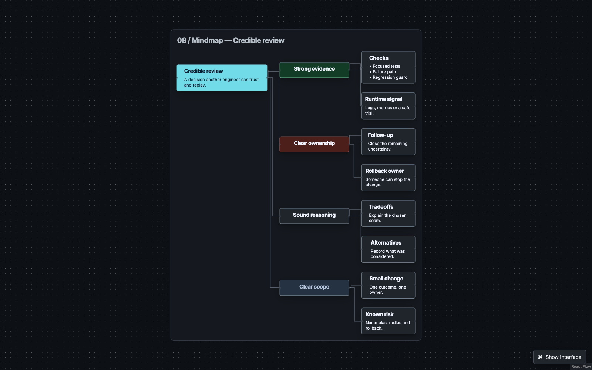

[Open the DSL](resources/examples/walkthrough/08-mindmap.canvas)

<details>
<summary>DSL that authors this diagram</summary>

```text
canvas 1
collection @t-credible "08 / Mindmap — What makes a review credible?" theme=walkthrough {
 node @t-root concept "Credible review" role=primary size=large { text @t-detail "A decision another engineer can trust and replay." }
 node @t-scope concept "Clear scope" role=supporting size=medium {}
 node @t-change concept "Small change" size=small { text @t-change-detail "One outcome, one owner." }
 node @t-risk concept "Known risk" size=small { text @t-risk-detail "Name blast radius and rollback." }
 node @t-evidence concept "Strong evidence" role=success size=medium {}
 node @t-tests concept "Checks" size=small { list @t-tests-points ["Focused tests", "Failure path", "Regression guard"] }
 node @t-runtime concept "Runtime signal" size=small { text @t-runtime-detail "Logs, metrics or a safe trial." }
 node @t-reasoning concept "Sound reasoning" size=medium {}
 node @t-tradeoff concept "Tradeoffs" size=small { text @t-tradeoff-detail "Explain the chosen seam." }
 node @t-alternatives concept "Alternatives" size=small { text @t-alternatives-detail "Record what was considered." }
 node @t-ownership concept "Clear ownership" role=warning size=medium {}
 node @t-rollback concept "Rollback owner" size=small { text @t-rollback-detail "Someone can stop the change." }
 node @t-followup concept "Follow-up" size=small { text @t-followup-detail "Close the remaining uncertainty." }
 wire @t-scope @t-root -> @t-scope "starts with" kind=parent
 wire @t-change @t-scope -> @t-change "narrows to" kind=parent
 wire @t-risk @t-scope -> @t-risk "names" kind=parent
 wire @t-evidence @t-root -> @t-evidence "demonstrates" kind=parent
 wire @t-tests @t-evidence -> @t-tests "checks" kind=parent
 wire @t-runtime @t-evidence -> @t-runtime "observes" kind=parent
 wire @t-reasoning @t-root -> @t-reasoning "explains" kind=parent
 wire @t-tradeoff @t-reasoning -> @t-tradeoff "states" kind=parent
 wire @t-alternatives @t-reasoning -> @t-alternatives "compares" kind=parent
 wire @t-ownership @t-root -> @t-ownership "assigns" kind=parent
 wire @t-rollback @t-ownership -> @t-rollback "protects" kind=parent
 wire @t-followup @t-ownership -> @t-followup "tracks" kind=parent
 section @t-map "08 / Mindmap — Credible review" mode=tree layout=tree direction=right gap=compact {
  show @t-root @t-scope @t-change @t-risk @t-evidence @t-tests @t-runtime @t-reasoning @t-tradeoff @t-alternatives @t-ownership @t-rollback @t-followup
  connect @t-scope @t-change @t-risk @t-evidence @t-tests @t-runtime @t-reasoning @t-tradeoff @t-alternatives @t-ownership @t-rollback @t-followup source-side=right target-side=left
  root @t-root
 }
}
```

</details>

### Comparison grids

Compare planning, building and review side by side. Three groups share the same questions, so responsibilities can be scanned rather than buried in paragraphs.

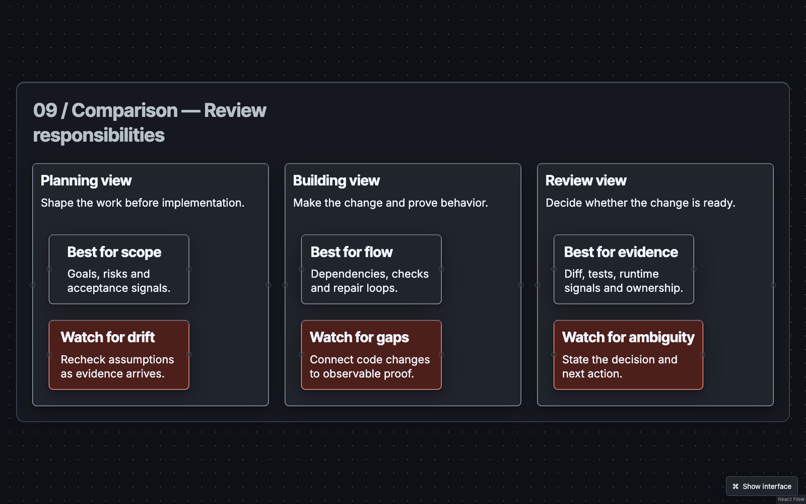

[Open the DSL](resources/examples/walkthrough/09-comparison.canvas)

<details>
<summary>DSL that authors this diagram</summary>

```text
canvas 1
collection @g-views "09 / Comparison — Choose the right view" theme=walkthrough {
 node @g-plan concept "Planning view" role=primary size=large { text @g-plan-purpose "Shape the work before implementation." }
 node @g-plan-scope note "Best for scope" size=small { text @g-plan-use "Goals, risks and acceptance signals." }
 node @g-plan-risk note "Watch for drift" role=warning size=small { text @g-plan-risk-use "Recheck assumptions as evidence arrives." }
 node @g-build concept "Building view" role=supporting size=large { text @g-build-purpose "Make the change and prove behavior." }
 node @g-build-flow note "Best for flow" size=small { text @g-build-flow-use "Dependencies, checks and repair loops." }
 node @g-build-proof note "Watch for gaps" role=warning size=small { text @g-build-proof-use "Connect code changes to observable proof." }
 node @g-review concept "Review view" role=success size=large { text @g-review-purpose "Decide whether the change is ready." }
 node @g-review-evidence note "Best for evidence" size=small { text @g-review-evidence-use "Diff, tests, runtime signals and ownership." }
 node @g-review-decision note "Watch for ambiguity" role=warning size=small { text @g-review-decision-use "State the decision and next action." }
 section @g-grid "09 / Comparison — Review responsibilities" mode=grid layout=grid columns=3 gap=compact {
  group @g-planning "PLAN / What should change?" represents=@g-plan layout=grid columns=1 gap=compact { show @g-plan-scope @g-plan-risk }
  group @g-building "BUILD / How does it work?" represents=@g-build layout=grid columns=1 gap=compact { show @g-build-flow @g-build-proof }
  group @g-reviewing "REVIEW / Is it ready?" represents=@g-review layout=grid columns=1 gap=compact { show @g-review-evidence @g-review-decision }
 }
}
```

</details>

## From a diagram to an agent build

1. **Plan together.** Define modules, entities, flows and constraints. Review the canvas with a frontier model.
2. **Build in small changes.** Give a builder the relevant DSL and acceptance criteria; keep stable IDs across edits.
3. **Review for drift.** Keep the `.canvas` source in Git, export the diagram, and compare each PR with the declared responsibilities and relationships. Code-to-plan review is currently a human/agent workflow, not an automatic proof of implementation correctness.

The export capability supports SVG, PNG, PDF, offline HTML and editable bundles. Editable bundles retain the resources and layout metadata needed for a portable diagram; a screenshot alone does not.

## Deterministic layout, owned routing

Agents describe meaning and grouping, never node coordinates. Presentation measures content; layout places it. Module diagrams use the custom roads-and-lanes engine, including nested boundaries and port attachments. Other diagram families currently use their existing engines; broader custom-engine coverage is future work.

Historical local measurements for the 50-module work showed **about 0.51–0.75 seconds from selection to paint**. A separate drag measurement was **110 ms to paint, including 54 ms calculation**. These are development observations, not a 100 ms full-load promise or a fresh cold-start benchmark. [Recorded measurements](docs/walkthrough/timing-evidence.json).

## Working with the source

```sh
pnpm canvas describe
pnpm canvas read walkthrough --out .novakai/current.canvas \
  --server http://127.0.0.1:5210 --workspace .novakai/walkthrough
pnpm canvas preview resources/examples/walkthrough/all-diagrams.canvas \
  --mode replace --revision 0 --request walkthrough-edit \
  --server http://127.0.0.1:5210 --workspace .novakai/walkthrough
pnpm canvas apply walkthrough-edit \
  --server http://127.0.0.1:5210 --workspace .novakai/walkthrough
```

Use the revision returned by `read`/`list`, not a guessed number. Preview validates before commit; apply returns a receipt. Matching replacements preserve human layout edits, and explicit resets clear them.

Old local collections and workspace history are archived under ignored `.novakai/`. The curated walkthrough, its assets and screenshots remain tracked so a clone can reproduce it. Existing regression-corpus diagrams remain in `resources/examples` because tests depend on them.

For development: [capability structure](docs/standards/REPO-FOLDER-STRUCTURE.md), [engineering contract](AGENTS.md), [agent authoring SOP](docs/agent-diagrams/visual-quality/SOP.md). Application code changes use `pnpm check`.
