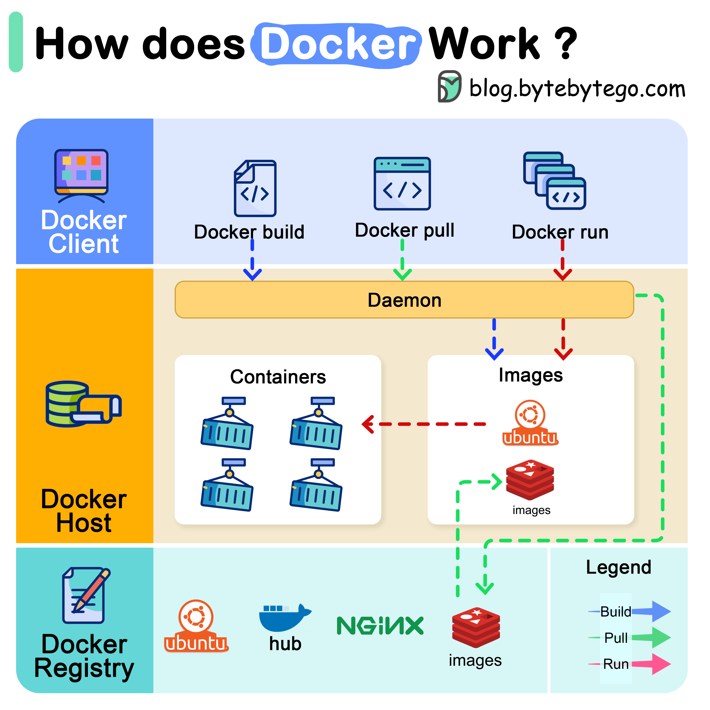
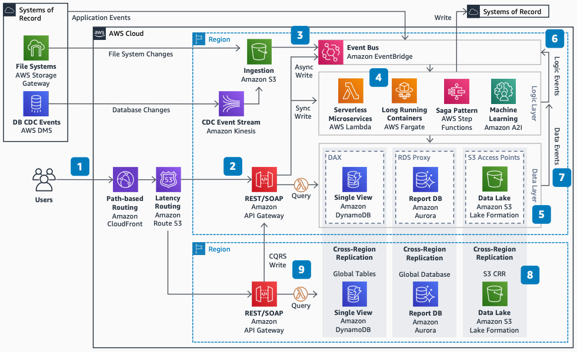
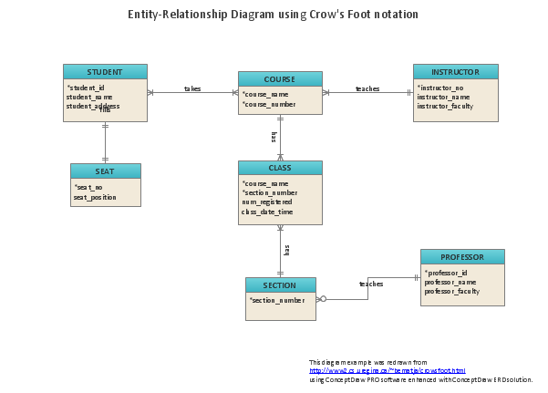
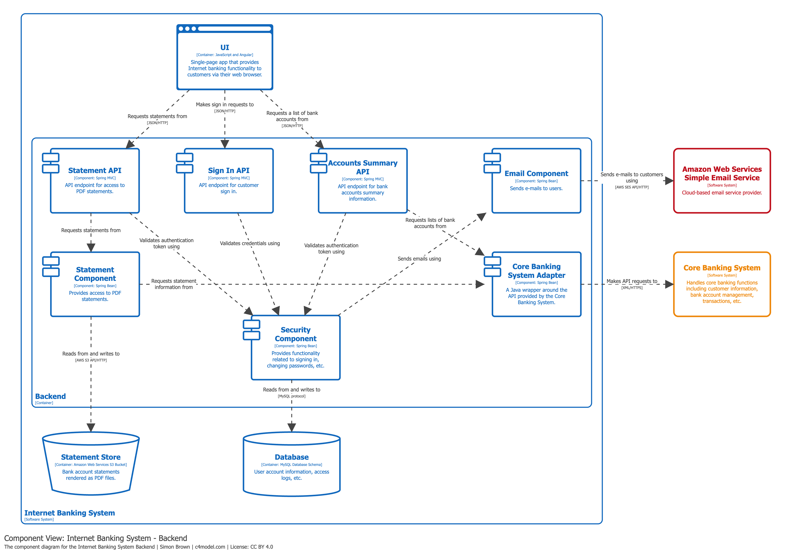
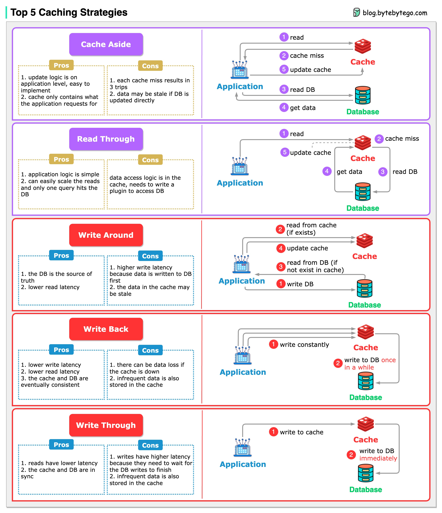

# Visual references

These references are binding acceptance context for rendered output. Reproduce their broad visual capabilities with original subjects; exact replicas, logos, pixels and a single special-purpose diagram layout are not required.

## Target A — educational infographic

[ByteByteGo: How does Docker work?](https://bytebytego.com/guides/how-does-docker-work/)
[Original image](https://assets.bytebytego.com/diagrams/0414-how-does-docker-work.png)

Required transferable qualities: clear headline and hierarchy; colored regions with meaningful grouping; prominent illustrations and short captions; visible differentiated flows; coherent composition without framing every actor as an identical text card. Meaningful wires have readable labels; color alone cannot carry essential meaning.

## Target B — engineering architecture

[AWS: Serverless Architecture for Global Applications](https://docs.aws.amazon.com/reference-architecture-diagrams/latest/serverless-global-applications/serverless-global-applications.html)
[Original image](https://docs.aws.amazon.com/images/reference-architecture-diagrams/latest/serverless-global-applications/images/serverless-global-applications.png)

Required transferable qualities: nested boundaries; aligned service/module actors; labelled orthogonal routes; typed interactions; compact readable detail; annotations that correspond to visible structure. ER and software-module meaning additionally follows the retained targets below.

## Retained target set

These retained files originate from `quality/agent-diagrams/references/target/`; preserve that original reference/provenance record. External reference copies are review material, not application templates or licensed product assets. App artwork must be original or admitted with its own permission/provenance.

## Acceptance criteria

| Dimension | Observable acceptance |
| --- | --- |
| Meaning | Viewer can trace labelled paths or compare aligned dimensions without reconstructing relationships from paragraphs. |
| Hierarchy | Title, regions, actors and details are visually distinct at their intended reading scale. |
| Imagery | Figures illustrate actors/concepts prominently; they are not tiny decorative duplicates on every card. |
| Engineering | Field rows, interface/function signatures, endpoint anchors and cardinalities are correct and legible. |
| Routing | Labels belong visibly to wires; no avoidable label collisions, clipped markers or needless scene-wide detours. |
| Reuse | Same semantic construct appears in another appropriate family/subject without new rendering code. |
| Delivery | Inspect fit overview and useful reading zoom, then inspect actual export with pinned fonts and resources. |

A green suite, node/edge count, screenshot count or numerical aesthetic score cannot replace this comparison. Record known visual gaps honestly.
