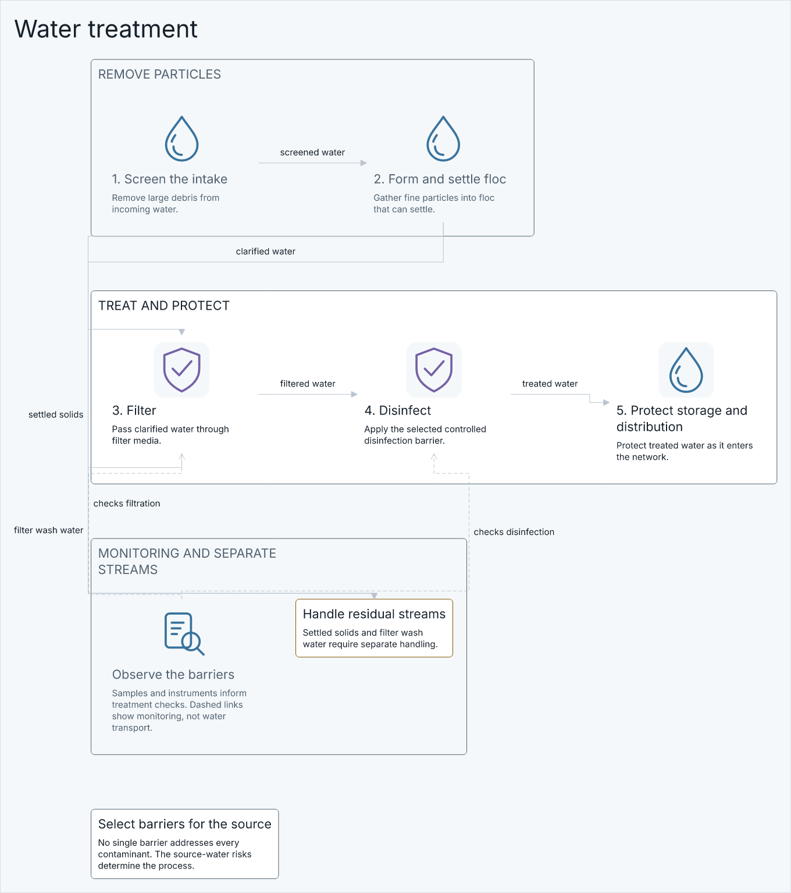

# Stage 3 — Connections and first benchmark infographic

**Responsibility:** Make relationship routes and annotations readable while retaining meaning, endpoint identity and bounded geometry recovery.

**Owners:** Model/Language own semantic step and route intent; Presentation measures labels/badges; Layout owns attachment/clearance/routing; Canvas/Export paint the same result.

Shared requirements: [SOP](../SOP.md), [current/target images](../References.md), [overall done](../README.md), [coding/error standards](../../../../CODING-STANDARDS.md).

## Scope tree

```text
capability/canvas/adapters/react-flow
capability/export/adapters/svg
capability/export/tests
capability/language/core/printing
capability/language/core/vocabulary
capability/language/tests
capability/layout/core/placement
capability/layout/core/routing
capability/layout/tests
capability/model/contract/records
capability/model/tests
capability/presentation/contract/records
capability/presentation/core/notation
capability/presentation/core/projection
capability/presentation/tests
resources/examples/showcase
```

[Doc6](Doc6-File-Scope-and-Estimates.md) lists candidate files and estimated sizes; private splits may change without changing accepted behavior. No unrelated panels, persistence rewrite or routing-engine replacement.

**Public imports:** outside consumers enter capability/<owner>/contract/index.ts only. Core uses own core and declaration-only contracts; concrete adapters compose only at contract/compose.ts.

**Stage exit:** all Doc5 conditions, bounded reviews and verified corrections, evidence and PR pushed. Continue to the next stage; intermediate exits do not claim overall benchmark completion.

## Visual context




See References.md for retained ER/module targets, attribution and exact acceptance dimensions.
