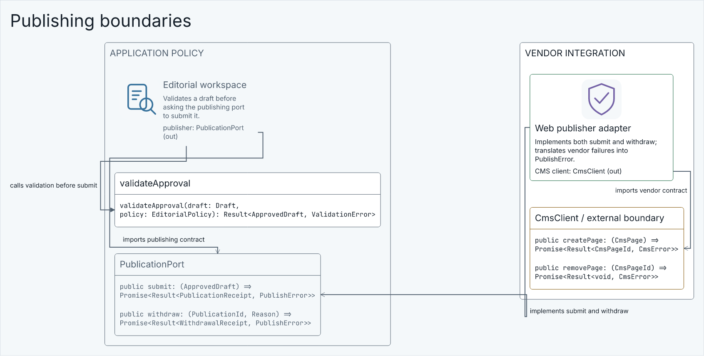

# Stage 4 — Engineering notation refinement

**Responsibility:** Make dense engineering meaning directly readable using the existing typed notation and shared rendering pipeline.

**Owners:** Model retains engineering validity; Presentation owns readable notation; Layout owns table/member clearance, tree hierarchy and sequence spacing.

Shared requirements: [SOP](../SOP.md), [current/target images](../References.md), [overall done](../README.md), [coding/error standards](../../../../CODING-STANDARDS.md).

## Scope tree

```text
capability/layout/core/placement
capability/layout/core/sequence
capability/layout/tests
capability/presentation/adapters/react
capability/presentation/core/content
capability/presentation/core/notation
capability/presentation/tests
resources/examples/showcase
```

[Doc6](Doc6-File-Scope-and-Estimates.md) lists candidate files and estimated sizes; private splits may change without changing accepted behavior. No unrelated panels, persistence rewrite or routing-engine replacement.

**Public imports:** outside consumers enter capability/<owner>/contract/index.ts only. Core uses own core and declaration-only contracts; concrete adapters compose only at contract/compose.ts.

**Stage exit:** all Doc5 conditions, bounded reviews and verified corrections, evidence and PR pushed. Continue to the next stage; intermediate exits do not claim overall benchmark completion.

## Visual context




See References.md for retained ER/module targets, attribution and exact acceptance dimensions.
