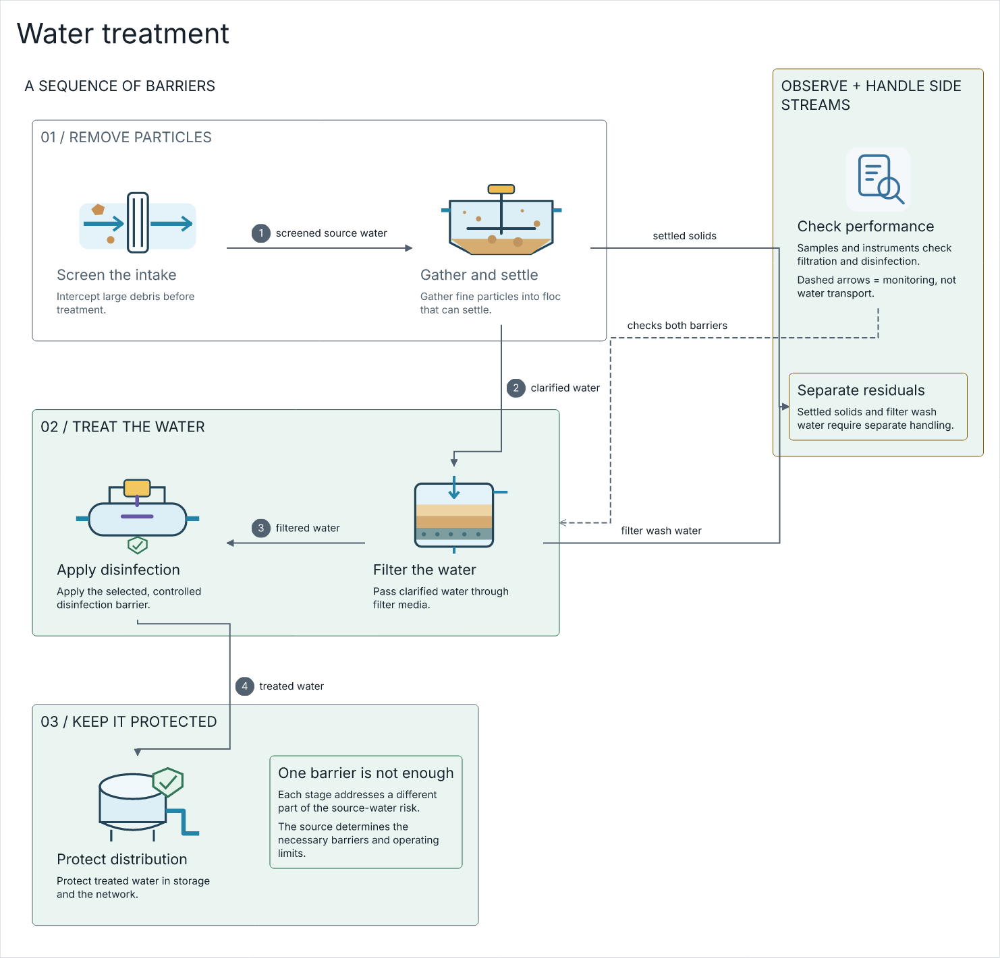
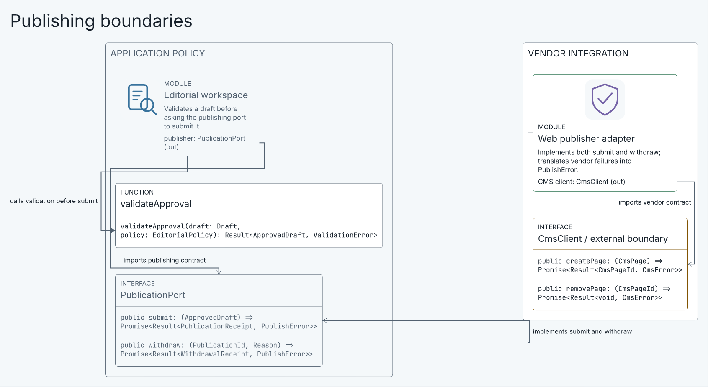

# Stage 5 — Incremental breadth and final acceptance

**Responsibility:** Demonstrate transferable benchmark-quality DSL authoring across all eight families without weakening readability, editability or durability.

**Owners:** Example source owns the explanation; existing capability boundaries provide validation/authoring/rendering/export. Evidence records do not write diagram state.

Shared requirements: [SOP](../SOP.md), [current/target images](../References.md), [overall done](../README.md), [coding/error standards](../../../../CODING-STANDARDS.md).

## Scope tree

```text
capability/export/tests
capability/language/tests
capability/layout/contract/records
capability/layout/core/placement
capability/layout/core/routing
capability/layout/tests
quality/agent-diagrams
resources/examples
resources/examples/showcase
```

[Doc6](Doc6-File-Scope-and-Estimates.md) lists candidate files and estimated sizes; private splits may change without changing accepted behavior. No unrelated panels, persistence rewrite or routing-engine replacement.

**Public imports:** outside consumers enter capability/<owner>/contract/index.ts only. Core uses own core and declaration-only contracts; concrete adapters compose only at contract/compose.ts.

**Stage exit:** all Doc5 conditions, bounded reviews and verified corrections, evidence and PR pushed. Close the goal only when README overall done is evidenced across all examples and workflows.

## Visual context






See References.md for retained ER/module targets, attribution and exact acceptance dimensions.
