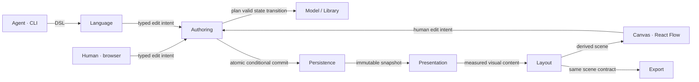

# 02 · Capability architecture and ownership

**Target baseline 1.0 · Proposed · 11 September 2026.** Companion documents: [functionality](01-Functionality.md), [repository](03-Repository.md), [language](04-DSL.md).

UI additions: [UI/UX](05-UI-UX.md) · [design tokens](06-Design-Tokens.md).

## The architecture in one view

**Legend:** arrows describe runtime data/requests, not permitted source imports. Application composition connects these capabilities using consumer-owned ports. Assets supply pinned media; Templates supply pinned starting content and themes. They are omitted from the main path to keep the write/read boundary visible.

**One authority:** Authoring alone accepts mutations to collection/workspace documents and requests their commit. Model and Library decide domain validity. Persistence performs the physical write. Presentation, Layout, Canvas and Export cannot independently save a changed diagram. UI drafts and generated geometry are not canonical diagram mutations.

## Eleven capabilities

The application composition layer is an integration responsibility, not a twelfth domain capability. CLI and HTTP are entry adapters, not independent business domains. A diagram kind is a policy/content extension, not a new top-level capability.

| Capability / folder | Single responsibility and owned decisions | Public contract, conceptually | Explicit boundary |
|---|---|---|---|
| **Model / `model`** | Define valid collection meaning and transitions: objects, relationships, appearances, content, sections and authored layout intent. Own kind-specific invariants. | `plan(snapshot, intent)`, `validate(snapshot)` → valid change plan or domain errors | No files, parser, React, pixels generated by layout or transaction execution. |
| **Authoring / `authoring`** | Safely admit, preview and commit changes from any author; own revision checks, request receipts and reversible transaction history. | `read`, `prepare`, `apply`, `receipt`, `undo`, `redo` | Coordinates collaborators; does not duplicate Model/Library rules or parse DSL. |
| **Language / `language`** | Translate readable DSL/document patches to typed intent and immutable snapshots back to faithful readable DSL. | `describe`, `parse`, `print`, `lower` | No storage, network calls or authoritative geometry generation. |
| **Library / `library`** | Organize and discover collections: folder tree, membership, ordering, archive visibility and search projections. | `planCatalogChange`, `validateCatalog`, `query` | Owns catalog rules, not collection graph rules or physical commits. Search index is rebuildable. |
| **Assets / `assets`** | Admit, identify and resolve safe, immutable media bytes with provenance and accessibility metadata. | `stage`, `resolve`, `verify`, `collectUnreferenced` | Staged bytes do not change diagrams. Bindings become durable only through Authoring. |
| **Templates / `templates`** | Manage immutable versioned recipes and themes; expand a chosen recipe into ordinary editable intent. | `list`, `read`, `instantiate`, `validatePreset` | Does not apply changes or maintain hidden live inheritance between instantiated diagrams. |
| **Presentation / `presentation`** | Resolve semantic objects and appearances into accessible visual content, notation and style; own measurement/render parity. | `project`, `measure`, `renderContent` | Does not decide domain validity, node positions or wire paths. React/DOM rendering is an adapter. |
| **Layout / `layout`** | Produce stable spatial arrangements and routes satisfying authored constraints. | `arrange`, `route`, `inspect` | Generated geometry is derived; cannot mutate authored intent. Engine details stay behind ports. |
| **Canvas / `canvas`** | Turn a scene into an explorable/editable workspace and gestures into typed edit intents. Own camera, selection, tools and transient drafts. | `transition`, `present`, `describeAccessibility` | React Flow nodes/edges remain view state. No direct database/save function. |
| **Persistence / `persistence`** | Atomically store/recover versioned records and receipts and create/restore consistent backups. | `readSnapshot`, `commit`, `receipt`, `backup`, `restore` | Structural/envelope integrity only; no ER rules, diagram edits or last-writer-wins behavior. |
| **Export / `export`** | Produce portable, revision-consistent reading/editing artifacts; prepare imports as authoring intent. | `export`, `inspectBundle`, `prepareImport` | No private renderer/second layout algorithm and no direct import commit. |

**The eleven capabilities are:** Model, Authoring, Language, Library, Assets, Templates, Presentation, Layout, Canvas, Persistence and Export. No separate “Components”, “Projection”, “History” or “Inspection” package is justified: those belong inside the named capability that owns their outcome.

## Authority and data lifetime

| State | Meaning owner | Lifetime / writer |
|---|---|---|
| Collection document, including authored layout overrides | Model | Durable versioned JSON; Authoring commits. |
| Folder tree and collection membership/order | Library | Durable catalog JSON; Authoring commits. |
| History transaction, request receipt, revision | Authoring | Atomic with changed records, persisted by Persistence. |
| Image/font/icon bytes | Assets | Immutable content-addressed blobs. Staging may write blobs independently; referencing/removal rules are transactional. |
| Recipe/theme payload and asset manifest | Templates / Assets respectively | Immutable pinned records; admission to workspace through Authoring. |
| Search index | Library | Derived from committed revisions; rebuildable; never source of truth. |
| Visual content, measurement and geometry | Presentation / Layout respectively | Derived, keyed by full input hash; discardable cache. |
| Camera, selection, tools, hover | Canvas | Per-session state; local preferences may persist outside diagram history. |
| Panel open state, mode, layout and local panel preferences | Web shell | Per-session/local preference state; Canvas emits inspect requests without owning panel visibility. |
| Drag/resize draft | Canvas | Ephemeral until an Authoring commit; conflicts restore committed state and preserve a recoverable draft. |
| Export artifact | Export | Immutable output tied to one snapshot and renderer version. |

The persistent canonical representation is app-serialized **JSON document records inside SQLite**, plus immutable asset files. JSON is an implementation storage format, never an agent authoring requirement. DSL is a readable semantic projection and input language; it is not a second competing database. Manual UI geometry is stored in the collection document and retained by DSL patches without asking the agent to describe it.

## Canonical entity model

IDs are opaque branded strings, distinct from editable display labels. DSL aliases are the human-readable stable IDs of authored entities, unique within their stated scope. Imported identities are remapped explicitly. Every record is immutable at the contract boundary.

| Entity | Fields that define its contract | Cardinality / rules |
|---|---|---|
| Workspace | workspace ID, schema version, active catalog ID | 1 catalog; 0..N collections; one local database authority. |
| Catalog | revision, folders, entries | Exactly one entry per live or archived collection. No entry for a deleted collection. |
| Folder | ID, title, parent ID, order | 0..1 parent; 0..N children; acyclic; catalog root implicit. |
| CatalogEntry | collection ID, folder ID or root, order, archive flag | Exactly one location per collection. Title is read from collection header, not duplicated authority. |
| Collection | ID, revision, title, description, theme pin, section arrangement intent, sections, objects, relationships, sources, asset bindings | Owns all contained IDs; 0..N sections/objects/relationships. Empty collection is valid. |
| Section | ID, title, mode, order, layout intent, appearances, groups, wire appearances, sequence structure | Exactly one collection; independent layout policy; mode selects additional validation. |
| Object | ID, kind, label, optional positive step number, content blocks, typed ports, source references | Exactly one collection; 0..N appearances, at most one per section. Step number is object-wide; use a separate object if a different numbered step is intended. Label required; kind from versioned vocabulary. |
| ContentBlock | ID, type, data, ordered children where supported | Exactly one object; all descendant IDs, including table rows and ports, share one object-local namespace. Tree is acyclic. Addressable kinds are field, member, signature and table row; text/image/list/link blocks are not endpoints. Link data contains label, target URI or object reference, and optional section reference. |
| Port | ID, direction `in/out/inout`, declared type, label | Exactly one object; endpoint type is documentation, not an executable TypeScript checker. |
| Relationship | ID, kind, label, source and target endpoint, cardinality/guard/order metadata | Exactly one collection; exactly two valid endpoints; self-loop allowed unless mode forbids. Nonempty label required. |
| Endpoint | object ID, optional port/field/member/signature/table-row ID | Exactly one object; at most one subtarget, resolved in that object’s unique descendant namespace. Entity endpoints permit fields/ports; module/interface/function endpoints permit members/signatures/ports; other objects permit ports or table rows. Whole-object endpoints are always permitted unless a kind-specific rule requires a field. Never points at a vanished member. |
| Appearance | object ID, local role/size/content visibility, tree/annotation participation, parent group, authored placement override | Exactly one section/object pair; 0..1 parent group. No separate copy of shared label/content. |
| Group | ID, title, member appearances/groups, optional represented object, layout intent | Exactly one section; 0..1 parent; acyclic. An appearance/group has one parent maximum. |
| WireAppearance | relationship ID, endpoint side intent, route style, manual routing override | At most one per relationship per section; both endpoint objects must appear in the section. |
| SourceReference | ID, URI, optional source revision/location, description, evidence status | Collection-owned; 0..N objects/relationships may refer to it. `asserted`, `source-backed`, `unverified` are explicit statuses. |
| AssetBinding | alias, content digest, media type, alt text, provenance | Exactly one immutable asset version; many collections may bind the same bytes. |
| PresetPin | recipe/theme ID, version, content digest | Always exact; “latest” resolves during preparation and becomes a pin before commit. |
| LayoutIntent | mode, direction, gap/density tokens, relative constraints, optional UI geometry | Belongs to collection/section/group/appearance/wire as appropriate. Collection arrangement defaults to a grid in section reading order; manual section positions are app-owned overrides. Generated geometry is excluded. |
| Transaction | ID, actor ID/kind, request ID/hash, read versions, before/after changes, timestamp | 1..N changed records; 1 receipt; no-op yields receipt without new content revision/history entry. |
| Receipt | request ID/hash, outcome, resulting revisions | Durable for workspace lifetime; removing receipts is an explicit incompatible maintenance operation, not silent pruning. |

A group with `represents` projects that object as its enclosing container; that representation counts as the object’s single appearance in the section. It may have border ports. Its child members are **visually** grouped; semantic containment requires an explicit `contains` relationship. Groups without a represented object cannot be wire endpoints. Nested groups can be collapsed in reading mode without deleting their members.

Removing an appearance also removes incident wire appearances in that section, but preserves canonical objects/relationships. Deleting an object requires an explicit cascade acknowledgment when references exist; the preview enumerates deleted relationships, appearances and invalidated source links. Deleting a field/port with a relationship is rejected unless the same transaction removes or reconnects it. Collection-local links to deleted targets are rejected or removed by explicit cascade; external source URLs cannot be guaranteed live.

## Kind-specific constraints

| Mode | Additional meaning |
|---|---|
| Flow / SOP | Decision outcomes must have distinct nonempty labels; forks and joins are explicit nodes. Cycles are valid. Step numbering is authored order metadata, not the only identity. |
| ER | Fields include type and key/nullability markers. FK reference names a real entity field. Cardinalities use `0..1`, `1`, `0..many`, `1..many`; no inference from arrow direction. Composite keys reference ordered field IDs. |
| Modules | Import/call/implements/contains are distinct relationship kinds. Ports, interface members and function parameter/result signatures have stable member IDs. Types are displayable declarations, not a compiler. |
| Tree / mind map | Exactly one root when tree participants exist; every other participant has exactly one incoming parent relationship; no cycle. Appearance participation is `tree` by default except kind `note`, which defaults to `annotation`; explicit `participation=annotation` excludes any appearance from root/connectivity rules. Reference wires may connect annotations; parent wires cannot. A section with annotations only has no root. |
| Sequence | Ordered events have participant endpoints, message kind and activation metadata. Fragments own ordered event ranges and named branches; ranges nest without partial overlap. No timestamps inferred from spatial coordinates. |
| State | Initial/final states explicit; transitions have event labels and optional guard/effect text. Diagram validity does not prove guards complete or mutually exclusive. |
| Story / infographic / grid | Membership and reading order convey composition; no graph connectivity requirement. Assets and long text receive measured content layout. |

Mode validation applies to objects/relationships shown in the section, not unrelated objects elsewhere in the collection. A relationship can appear in several modes only if it satisfies each mode’s applicable constraints. Semantic graph kinds and mode-specific layout never rewrite each other implicitly.

## Authoring transaction contract

Both browser edits and Language output produce the same immutable `ChangeIntent`. Transport owns authentication/argument parsing; it cannot manufacture a privileged bypass. The local service binds to loopback, restricts browser origins and uses a per-installation client token. Diagram content never executes as HTML/script; asset adapters sanitize SVG and validate bounded media inputs.

**Request envelope:** workspace ID, actor ID/kind, globally unique request ID, intent/document version, expected authoritative record versions for every client-observed mutation target (collection, catalog or admission record, including `absent` for creates), payload. Scope is explicit. A preparation result includes the complete read dependency set, semantic diff, warnings, candidate hash and optional preview artifacts. A prepared candidate is not authority to bypass validation at commit.

1. Authenticate, decode the basic envelope, compute its stable submitted-request fingerprint and check for an existing receipt **before** resource resolution or stale-revision checks. Same request/fingerprint returns the committed outcome and original resolved pins; same request/different fingerprint returns `request-reused`. Only after this lookup resolve assets/presets.
2. Read an immutable, consistent snapshot and compare all supplied client preconditions. A mutation missing an expected version for an existing target is `invalid-input`; no blind writes. Invoke Model/Library planners through narrow role ports. The orchestration pipeline is injected at composition; the engine cannot be extended by sprinkling kind switches throughout it.
3. Validate the entire candidate and references. Plans are data, not externally trusted executable functions. Compute complete read dependencies, including catalog membership/folder records, asset admissions and history participants.
4. Presentation/Layout may compute a preview. Preview failure does not write anything. Semantic invariant failure always blocks apply. Semantic relative constraints and explicit UI position/route locks are hard constraints: infeasibility rejects the entire edit with `constraint-conflict`, preserving a recoverable draft. Unlocked manually adjusted geometry is a soft preference and may move to satisfy content/route validity, with a preview diff. The feasibility check runs on every apply even when no preview image is requested. Layout warnings such as unavoidable wire crossings may be acknowledged; they never excuse a hard-constraint violation.
5. Submit one conditional transaction to Persistence: compare every read version, write changed records and history, increment each changed record revision once, and record the successful receipt together. Asset blobs must already be durable before their bindings commit.
6. After commit, publish revision notifications. Notifications are hints; clients re-read authoritative revisions. Losing a notification cannot lose a change. A caller with an uncertain response retries the same request ID.

`prepare` never reserves a revision. `apply` recomputes/validates or supplies a prepared hash whose dependencies still match. A stale prepared candidate returns a conflict, never a partial merge. Client preconditions and server-discovered read dependencies are both compared; a fresh server read never replaces the version the client observed. For example, two folder renames based on catalog revision 7 cannot both succeed: the second conflicts after the first creates revision 8. Unrelated collections can commit independently unless they also change a shared catalog record. One service owns SQLite writes; multiple browser/CLI clients use its API.

**Request identity and concurrent retries:** the fingerprint hashes the canonical submitted envelope excluding the request ID and transport credentials. It includes workspace, actor, language/intent version, expected record versions, exact canonical intent and submitted asset digest manifest. Server-resolved values of theme/template aliases are excluded from this fingerprint; the submitted alias names remain included in the canonical intent and recorded as exact pins in the commit. Client adapters persist the submitted envelope and asset manifest before sending; a retry does not re-read edited local files or resolve aliases again. `receipt` can recover a completed request without any source file. If no receipt exists, resend the persisted envelope and already-staged asset references; missing staged bytes are a typed failure, never substituted bytes. A changed source file requires a new request ID.

Persistence enforces uniqueness of `(workspace ID, request ID)` inside the same transaction as the write. Racing identical requests produce one effect and the same receipt; after a competing commit the loser looks up the receipt before reporting a version conflict. Racing different fingerprints under one ID return `request-reused`. Only successful commits and no-ops receive durable receipts. Rejections/cancellations before commit receive no receipt and may be revalidated on retry; no exactly-once promise is made for an uncommitted rejection. A no-op receipt is committed atomically with read-version comparisons, without incrementing content revisions.

**Typed outcomes:** success/no-op; `invalid-input`, `unsupported-version`, `unknown-reference`, `invariant-violation`, `constraint-conflict`, `revision-conflict`, `request-reused`, `missing-asset`, `permission-denied`, `storage-unavailable`, `corrupt-record`, `cancelled`. Each carries structured details, affected IDs and a recovery action. UI/CLI adapters turn unexpected failures into a typed boundary failure with a trace ID; they do not expose stack traces or rely on parsing messages.

**History:** transactions include before/after changes for all participating records. Undo checks every participant’s expected current state and creates an inverse transaction; it does not rewind the database. If any participant changed incompatibly, return conflict. Redo reapplies the original change against the post-undo participant versions; a divergent edit invalidates that redo branch. Assets and presets referenced by current state, retained history or backup manifests remain pinned. Garbage collection runs only on unreferenced staged blobs and explicitly released history, using a consistent reachability snapshot under a maintenance lock so a concurrent bind cannot race deletion.

**Recovery:** Persistence owns database rollback/recovery; Assets owns staged-file verification and cleanup; Authoring owns receipt reconciliation and inverse transaction validation. Backup freezes a consistent record snapshot and pins all referenced blobs until copying finishes. Restore verifies schema, Model/Library invariants, hashes and references in a new workspace location; the application switches only after success, retaining the old location for recovery.

## Read/render pipeline

Read one committed snapshot → Presentation resolves content/theme/notation → measurement adapter returns dimensions → Layout arranges and routes → Canvas or Export consumes the same immutable scene. Scene elements carry semantic IDs, bounds, paths, accessible labels and diagnostics. React Flow positions are derived view records, not storage records.

The cache key includes collection revision, appearance visibility, asset/theme digests, font metrics, layout engine version and viewport-dependent rendering inputs. Long-running jobs carry that key; stale results are discarded. A content-only patch relayouts the affected dependency region. Camera state is independent.

Manual positions/routes are user-authored constraints stored through Authoring. Agent DSL readouts expose their existence and stable target IDs, not coordinate fields. A patch preserves them. A full semantic replacement preserves overrides on surviving IDs unless it explicitly resets them; deleted IDs lose their overrides. Content expansion may make locked routes infeasible: reject the proposed transaction, retain committed state and the recoverable UI/agent draft, and offer an explicit unlock/reroute/reset transaction. Unlocked manual positions/routes are soft preferences; their adjustments appear in the preview and resulting geometry diagnostics. No committed candidate may violate a hard constraint.

## Extension seams and integration proof

Model registers versioned object/content/relationship validators; Language registers matching syntax-lowering rules; Presentation registers notation/content renderers; Layout selects a registered layout policy. These registries address already-required diagram families, not arbitrary runtime plugins. New families can require coordinated additions at those seams, but **must not require editing Authoring’s transaction internals**. Contract changes still require compatibility/version review; “extensible” does not mean any future semantics fit without design work.

Each capability must be usable through its contract by the browser service and a headless CLI/export composition. Core tests inject fakes; I/O adapters have shared contract suites. No capability reaches through another capability to a database, React instance or private helper. Detailed interfaces can grow inside these frozen authority boundaries; moving authority between capabilities requires an explicit revision to this document.
