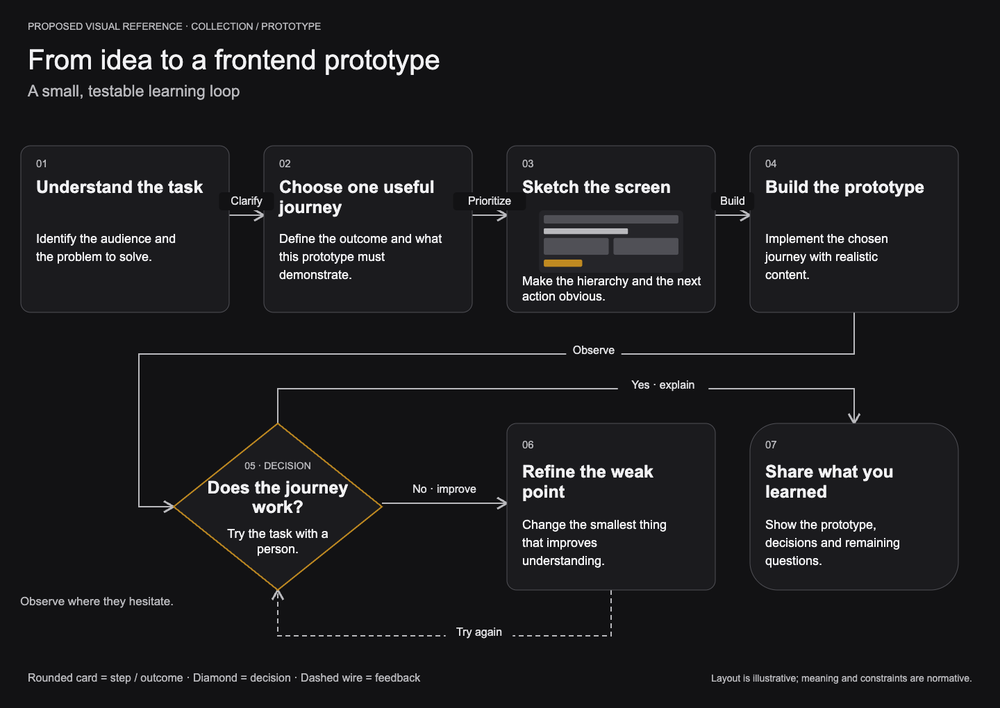

# 04 · Proposed DSL, example and visual contract

**Target baseline 1.0 · Proposed language, not supported by the current parser · 11 September 2026.** [Functionality](01-Functionality.md) · [capabilities](02-Capabilities.md) · [repository](03-Repository.md).

UI additions: [UI/UX](05-UI-UX.md) · [design tokens](06-Design-Tokens.md).

## The idea

Write the meaning once. Say where it appears. Let themes, measurement, layout and routing do the mechanical work. Use a small patch when editing. Names remain readable; no compression that forces a new agent to decode abbreviations or positional tuples.

The example below teaches a frontend prototyping process. It includes a real referenced image asset, prose, a decision, labelled wires and a feedback loop. The same primitives support engineering diagrams; the following sections demonstrate ER and typed modules explicitly.

## Reference image and exact authoring source



**What this image proves:** it makes the intended meaning, notation, content and reading order reviewable. It is a deliberately authored vector acceptance illustration. It was **not** generated by the proposed DSL parser or the current app. Generated placement may differ, but must preserve the content, references, relationships and constraints below. Pixel-identical reproduction is not a DSL requirement.

The [vector original](assets/prototype-reference.svg) is also included. The small wireframe inside “Sketch the screen” is a separately addressable [image asset](assets/wireframe.svg), not a background screenshot. Here is the [complete source file](prototype.canvas):

```canvas
canvas 1
collection @prototype "From idea to a frontend prototype" theme=ink {
  asset @wireframe image source="assets/wireframe.svg"
    alt="A wireframe with a navigation bar, content cards and a primary action"
  node @brief step "Understand the task" step=1 {
    text @detail "Identify the audience and the problem to solve."
  }
  node @scope step "Choose one useful journey" step=2 {
    text @detail "Define the outcome and what this prototype must demonstrate."
  }
  node @sketch step "Sketch the screen" step=3 {
    image @screen asset=@wireframe
    text @detail "Make the hierarchy and the next action obvious."
  }
  node @build step "Build the prototype" step=4 {
    text @detail "Implement the chosen journey with realistic content."
  }
  node @review decision "Does the journey work?" step=5 {
    text @detail "Try the task with a person. Observe where they hesitate."
  }
  node @refine step "Refine the weak point" step=6 {
    text @detail "Change the smallest thing that improves understanding."
  }
  node @share end "Share what you learned" step=7 {
    text @detail "Show the prototype, decisions and remaining questions."
  }
  wire @scope-work @brief -> @scope "Clarify" kind=flow
  wire @make-sketch @scope -> @sketch "Prioritize" kind=flow
  wire @implement @sketch -> @build "Build" kind=flow
  wire @try-task @build -> @review "Observe" kind=flow
  wire @needs-work @review -> @refine "No · improve" kind=flow
  wire @try-again @refine -> @review "Try again" kind=flow style=dashed
  wire @ready @review -> @share "Yes · explain" kind=flow
  section @journey "A small, testable learning loop" mode=flow layout=flow direction=right {
    show @brief @scope @sketch @build @review @refine @share
    connect @scope-work @make-sketch @implement @try-task @needs-work @try-again @ready
    rank @brief @scope @sketch @build
    rank @review @refine @share
    below @review @build
    before @refine @share
  }
}
```

The seven canonical objects, their step numbers and seven labelled relationships are all explicit. A single theme reference replaces repeated style choices; card dimensions, line colors, image sizing and wire bend coordinates are absent. Two row constraints and two relative-placement constraints express intentional composition. An agent can omit those constraints when no arrangement matters.

## Syntax to freeze

The language is UTF-8, versioned by `canvas 1` for documents and `patch 1` for edits. Whitespace/indentation do not carry meaning; braces delimit blocks. A declaration ends when its grammar is complete and the next declaration keyword begins. Newlines separate declarations for readability, but multiline attributes are valid. `#` starts a comment outside quotes. Quoted strings use `\"`, `\\`, `\n` and `\t`; unknown escapes are errors. No interpolation or executable expressions.

IDs use `@` followed by `[A-Za-z][A-Za-z0-9_-]*`. IDs are stable addresses, not labels. Collection object, relationship, section, asset and source IDs occupy distinct typed namespaces; duplicate IDs inside a namespace are errors. All blocks, nested descendants (including table rows), ports and fields share one namespace local to their object; duplicate descendant IDs anywhere in that object are errors; groups local to their section; events/fragments local to their sequence section. `@object.@member` addresses a port, field, member, signature or table row in that one unique descendant namespace. Entity subtargets are fields/ports; module/interface/function subtargets are members/signatures/ports; other object subtargets are ports/table rows. Paragraph/image/list/link blocks are never endpoints. Full collection-qualified references are required for navigation across collections; wires never cross collection boundaries.

### Grammar skeleton

```ebnf
document    = "canvas", version, collection ;
collection  = "collection", id, string, attributes, "{", { declaration }, "}" ;
declaration = asset | source | node | wire | section ;
node        = "node", id, kind, string, attributes, "{", { content | port }, "}" ;
wire        = "wire", id, endpoint, "->", endpoint, string, attributes ;
section     = "section", id, string, attributes, "{", { viewStatement }, "}" ;
endpoint    = id, [ ".", id ] ;
attribute   = name, "=", value ;
value       = string | token | integer | boolean | id | list ;
list        = "[", [ value, { ",", value } ], "]" ;
patch       = "patch", version, id, "{", { operation }, "}" ;
```

This skeleton describes framing. The construct/property tables below are normative; a generic `attribute` production is **not** permission to invent keys. Values are typed by property. Ordering is preserved for content, sections and sequence events. Graph declaration order does not imply graph meaning or reading order. Forward references resolve after the complete transaction is parsed; unresolved references fail the whole transaction.

### Construct vocabulary and required fields

| Construct | Form and owned content |
|---|---|
| `collection` | ID, title; `theme` preset alias/pin, optional `description`. |
| `asset` | ID, `image/icon/font`, `source` quoted local relative path or admitted digest, required `alt` for image/icon, optional `license`, `attribution`. Resolution pins the digest before apply. |
| `source` | ID, quoted URI; optional `revision`, `location`, `description`, `status=asserted/source-backed/unverified`. |
| `node` | ID, kind, label, optional semantic `role`, default `size`, positive integer `step`, `sources=[@source,...]`; block body. Step numbers are optional authored annotations and need not be unique across the collection. Kinds: `step/start/end/decision/fork/join/entity/module/interface/function/state/participant/concept/system/note`. |
| `text`, `code` | Local ID and quoted text; code optionally has `language`. Text is plain text with line breaks, not executable HTML. |
| `link` | Local ID, quoted label, `target` quoted URI or `@object` for a collection-local object; optional `section=@id`. Cross-collection navigation uses quoted `canvas:collection-id/object-id?section=section-id`; unresolved external collection links render as unavailable, never as graph endpoints. |
| `list` | Local ID and list of quoted items; optional `ordered=true/false`. |
| `image`, `icon` | Local ID and `asset=@alias`; optional `size=small/medium/large`, image `fit=contain/cover`. |
| `field` | Local ID, quoted field name, `type` string; optional `key=primary/foreign/unique`, `nullable` boolean, `references=@entity.@field`. Composite key groups use `keygroup` below. |
| `keygroup` | Local ID, `kind=primary/foreign/unique`, ordered `fields=[@id,...]`; foreign group requires equally sized `references=[@entity.@field,...]`. |
| `signature` | Local ID, quoted function name, `parameters` list of quoted `name: Type` strings and `returns` string. Stable parameter endpoints require separate `port` declarations. |
| `member` | Local ID, quoted name, `type` string; optional `visibility=public/private/protected`. |
| `table` | Local ID, `columns` list of quoted headings, brace body of `row @id cells=[...]`. Every row has the same cell count as headings. |
| `port` | Local ID, `in/out/inout`, quoted label, `type` string. |
| `wire` | ID, two endpoints and required label; `kind`, optional `from`, `to` cardinalities, `guard`, `effect`, `style=solid/dashed`, `sources=[@source,...]`. Direction is expressed by the arrow; `kind=association` may render without directional arrowheads. |
| `section` | ID/title, `mode=flow/er/modules/tree/sequence/state/story/grid`, `layout=flow/layered/tree/sequence/grid`, `direction=right/down/left/up`, optional `gap=compact/normal/roomy`, `order` integer. |
| `show` | List of object IDs; optional attributes apply to all listed appearances: `role`, `size`, `detail=full/summary/label`, `participation=tree/annotation` (tree mode only). Summary/detail changes visibility, not canonical content. |
| `connect` | List of relationship IDs; optional `route=orthogonal/curve`, `source-side` and `target-side` in `auto/top/right/bottom/left`. |
| `group` | Section-local ID/title, optional `represents=@object`, layout attributes; brace body of `show`, nested `group` and constraints. |
| Relative constraints | `rank @a @b ...` same rank; `before @a @b` reading order; `below @a @b` first below second; `align @a @b ...` shared main-axis coordinate (a column in right-directed flow). References target visible objects or section-local groups via `group:@id`. |
| `root` | One visible object ID for tree mode. |
| `event` | Sequence-local ID, source participant `->` target participant, quoted label; `kind=call/return/async`, optional `activate=true/false`. Declaration order is message order. |
| `fragment` | Sequence-local ID, `alt/opt/loop`, quoted condition/title; body of `branch "label" { event... }` for alt, or event/fragment declarations for opt/loop. Nested fragments are permitted. |

Node block order is visual reading order. A `member`, `signature`, field or table row can be an addressable subtarget where its kind allows it. General paragraph/image blocks are not wire endpoints. Node/section creation applies documented defaults; patches never reset omitted properties.

**Defaults:** theme `paper`; node role `neutral`, size `medium`; text plain; field `nullable=false`; section mode `flow`; omitted layout derives from mode: flow/state→flow, er/modules→layered, tree→tree, sequence→sequence, story/grid→grid; direction `right`, gap `normal`; wire kind `flow`, style `solid`; appearance detail `full`; route `orthogonal`, endpoint sides `auto`; image fit `contain`; list `ordered=false`. Asset alt text has no generated default. Modes supply notation and legal relationship defaults where specified below, not hidden domain assertions. All default-resolved values remain inspectable.

**Relationship kinds:** `flow`, `association`, `imports`, `calls`, `implements`, `contains`, `parent`, `reference`, `transition`. Sequence messages use ordered events, not unordered wires. ER relationships require explicit `kind=association` and both cardinalities; tree edges require `kind=parent`; state edges require `kind=transition`. No reverse inference of FK fields from wires. Validate field references and relationship cardinalities independently because optionality and join semantics can differ.

**Style vocabulary:** roles `neutral/primary/supporting/decision/success/warning`; size `small/medium/large`; theme is a versioned preset. Labels remain readable in every role. Custom theme data is created through a dedicated preset editor/import workflow, not repeated CSS/color values in every node. User-defined semantic roles must exist in the pinned theme schema; unknown role is an error. Image imports and template expansion produce exact immutable pins.

**Layout rules:** `rank` means a shared cross-axis coordinate, preserving declared order along the main axis. Thus in a right-directed flow it produces a row. `before` means earlier on the main axis; `below` means lower on the page regardless of direction. `align` means same main-axis coordinate, preserving cross-axis order. Constraints are hard unless explicitly removed; impossible combinations return `constraint-conflict` with the relevant statements. They never become pixel coordinates in agent output. Modes have compatible layouts: flow/state→flow or layered; ER/modules→layered; tree→tree; sequence→sequence; story/grid→grid. Explicit incompatible pairs are errors.

### Engineering example: real field endpoints and crow’s feet

```canvas
canvas 1
collection @commerce "Commerce model" {
  node @customer entity "Customer" {
    field @id "id" type="CustomerId" key=primary
    field @email "email" type="Email" key=unique
  }
  node @order entity "Order" {
    field @id "id" type="OrderId" key=primary
    field @customer "customerId" type="CustomerId" key=foreign references=@customer.@id
  }
  wire @places @customer.@id -> @order.@customer "places" kind=association from=1 to=0..many
  section @data "Customer and orders" mode=er layout=layered {
    show @customer @order
    connect @places
  }
}
```

`from=1` describes the source end; `to=0..many` the target end: one Customer per Order, zero or many Orders per Customer. The renderer draws the circle/crow’s-foot at Order and the exactly-one marker at Customer, attached to the specified field rows. These are not generic arrowhead approximations.

### Engineering example: types, functions and labelled imports

```canvas
canvas 1
collection @engineering "Authoring boundary" {
  node @authoring module "Authoring" {
    port @apply in "apply" type="ChangeRequest → Result<Receipt, AuthoringError>"
    port @plans out "planner" type="TransitionPlanner"
  }
  node @planner interface "TransitionPlanner" {
    member @plan "plan" type="(Snapshot, ChangeIntent) → Result<ChangePlan, DomainError>"
  }
  node @validate function "validateTransition" {
    signature @call "validateTransition" parameters=["snapshot: Snapshot", "intent: ChangeIntent"] returns="Result<ChangePlan, DomainError>"
  }
  wire @uses @authoring.@plans -> @planner "imports type contract" kind=imports
  wire @implements @validate -> @planner.@plan "implements plan" kind=implements
  section @modules "Module and function contracts" mode=modules layout=layered {
    show @authoring @planner @validate
    connect @uses @implements
  }
}
```

These fragments are separate complete documents for readability. To show them together, declare their objects/relationships and both sections inside one collection. Reusing an existing object uses `show @id`; it does not copy the object. Templates provide that merge with deterministic ID remapping when generating a collection from several recipes.

### Other modes use the same content model

A tree section uses `root @topic`, `show` and `connect` with `kind=parent` wires. `show @legend participation=annotation` excludes a note/legend from tree connectivity. Kind `note` defaults to annotation; other kinds default to tree participation. Parent wires cannot touch annotation appearances; reference wires may. A state section uses `node ... state`, explicit start/end nodes and `kind=transition` wires with `guard`/`effect`. A story section uses ordered `show` declarations and groups in grid layout. A sequence section shows participant objects and contains ordered `event`/`fragment` statements; its layout comes from event order, not agent geometry. Every message label is required. Alternative branches are individually labelled; fragment order is explicit.

## Creation, reading and editing workflow

Proposed CLI contract (the existing binary is not asserted to implement these commands):

```sh
nvk help
nvk language describe --version 1
nvk collections list
nvk check prototype.canvas
nvk preview prototype.canvas --out preview/
nvk apply prototype.canvas --create --request prototype-create-001
nvk read prototype --out current.canvas
nvk read prototype --section journey --out journey.canvas
nvk apply change.patch --expect 7 --request prototype-edit-008
nvk receipt prototype-edit-008
nvk undo prototype --transaction tx-008 --expect 8 --request undo-008
nvk redo prototype --transaction tx-008 --expect 9 --request redo-008
nvk export prototype --format svg --section journey --out journey.svg
```

`--create` requires absence; it never overwrites. Revision/request IDs belong in the invocation/envelope, not repeated on every DSL line. Full-document updates require `--replace --expect <revision>` and explicit collection scope. `--request` is required for mutations and must be reused unchanged after an uncertain response. The CLI durably records the exact submitted envelope and asset digest manifest before sending; retry/receipt lookup uses that record and never re-reads changed or vanished source files. See document 2 for fingerprint and concurrent-request rules. Catalog commands require `--expect-catalog <revision>`; multi-record commands supply the complete expected-version map from their read result, with the CLI carrying this map as an opaque revision token if needed. CLI prints readable results by default and can expose a structured machine output mode; agents are not required to author that output.

`read` returns version, scope, revision, canonical IDs, resolved theme/asset pins and semantic content. Full reads are re-applicable as full replacements. Scoped reads use a non-authorable `view` envelope and are input to patch work; `apply --replace` rejects this document kind structurally, not merely by reading a removable comment. The single normative header form is `view 1 @collection revision=7 scope=section:@journey { ... }`; `view` is deliberately not a document/patch production. Agents must deliberately construct a patch, not accidentally apply a partial read as the whole collection.

Pinned asset reads use `source="sha256:<64 hex characters>"`; pinned themes use a quoted `theme="paper@1.0.0#sha256:<digest>"`. Creation aliases such as `paper` resolve against the local library. Staged local source paths resolve relative to the input file's directory, restricted to that directory tree by default; symlink escapes, missing files and unsupported media fail with a diagnostic. Remote URLs are source references, not automatic asset fetches. Importing a remote asset is a separate explicit admission action. CLI staging uploads content to the service; browser input uses an upload adapter. Pure Language parsing never opens files.

### Small patch, safe preservation

```canvas
patch 1 @prototype {
  set node @build label="Build one realistic journey"
  set block @build.@detail text="Use realistic content. Keep the scope small."
  set appearance @journey/@build role=primary size=large
  set wire @try-task label="Observe a person using it"
}
```

This changes four named properties. It leaves the human's positions, section camera, existing IDs and other properties untouched. A changed node size may require adjacent routing. Infeasible explicit locks or relative constraints reject the entire transaction; unlocked manual geometry is a soft preference and adjustments appear in the preview. No image-preview option bypasses this feasibility gate.

| Operation | Exact semantics |
|---|---|
| `add <declaration>` | Create a new node/wire/asset/source/section using the document declaration grammar. Existing ID is an error, not upsert. |
| `set <target> <attributes>` | Update only named allowed properties. `label` edits object/relationship label; block `text` edits textual payload. Structural kind changes require replace. |
| `unset <target> <property...>` | Remove optional properties, restoring the documented default. Required properties cannot be unset. |
| `replace section @id "title" <attributes> { <view statements> }` | Replace one section’s semantic configuration, groups, membership, constraints, root and sequence events/fragments. Surviving section/object and section/wire pairs retain manual overrides; removed pairs lose them. Revalidate the whole candidate. Section kind/ID cannot change. |
| `replace node @id ...` | Replace semantic node content using the node grammar without a second ID; preserve appearance overrides for the surviving node ID; reject dangling endpoint changes. |
| `show @node in @section` / `hide @node in @section` | Add/remove an appearance. Hide also removes that section's incident wire appearances; canonical content remains. |
| `connect @wire in @section` / `disconnect @wire in @section` | Add/remove a wire appearance; both endpoint appearances must exist. |
| `add block @object { <one content declaration> }` | Insert a stable local block; `before=@block` optional after the body; default append. |
| `remove block @object.@block` | Delete block, reject referenced endpoints unless fixed in the same patch. |
| `move block @object.@block before=@other` | Reorder within the same object; no identity change. |
| `delete node @id [cascade=true]` | Delete canonical object; references require explicit cascade; preview lists the impact. |
| `delete wire/section/asset/source @id` | Delete named entity; sections remove only their appearances; referenced assets/sources reject deletion unless references are removed in the same patch. |
| `reset layout @section` | Remove manual node/group placement and routes in that section; retain semantic relative constraints. |
| `reset route @section/@wire` | Remove manual routing overrides only, restoring automatic routing. |
| `set section @id ...` | Edit mode/layout/title/order/gap/direction; validate the resulting section as a whole. |

Targets for `set/unset` are `collection`, `node @id`, `wire @id`, `block @object.@block`, `appearance @section/@object`, `section @id`, and `route @section/@wire`. Properties are limited to the owning construct's table, plus appearance `role/size/detail/participation` and route `route/source-side/target-side`. Structural members, identity, endpoints and membership are not arbitrary writable fields; provenance always uses `sources`, while endpoint properties are `from-end` and `to-end`; reconnecting endpoints uses `set wire @id from-end=@endpoint to-end=@endpoint`, validated atomically. Deleting/recreating a section in one patch is prohibited as an ambiguous duplicate identity; use `replace section` instead. Ports and structural node content can be edited with `replace node`; group membership, constraints, root and sequence structure use `replace section`. These bounded replacements are the v1 structural-edit surface; arbitrary nested `set` paths are deliberately unsupported. Omitted semantic content inside a replacement is removed, so read the complete target before replacement. Full collection replacement is needed only for whole-collection restructuring, not an ordinary group/event edit.

Patch operations build one candidate in statement order, then validate the whole candidate; forward references are allowed. Failed operations or final invariant failures commit nothing. Cross-collection copy, folder operations and template instantiation use CLI/UI commands that prepare the same typed authoring intents; they do not introduce filesystem operations or arbitrary scripting into diagram DSL.

### Bounded structural edit examples

Given participants `@user` and `@agent`, this replaces one existing sequence section and edits its message label without reading/replacing other sections:

```canvas
patch 1 @demo {
  replace section @conversation "Request and answer" mode=sequence {
    show @user @agent
    event @request @user -> @agent "Explain the concept" kind=call
    event @answer @agent -> @user "Return a visual explanation" kind=return
  }
}
```

Given objects `@a`, `@b`, `@c`, this changes group membership by replacing only the section’s view structure. Moving `@c` inside the group preserves its appearance identity and manual preference if feasible.

```canvas
patch 1 @demo {
  replace section @overview "Related concepts" mode=story {
    group @related "One explanation" { show @a @b @c }
  }
}
```

A represented group includes its represented object as a border appearance automatically; do not also `show` that object in the same section. Canonical relationships still require explicit `connect` statements; visual membership does not create semantic `contains` wires.

## Preservation and compatibility contract

| Case | Required behavior |
|---|---|
| Print → parse → lower | Same supported semantic content, IDs, ordering, pins, constraints and references. Comments/formatting are not semantic and need not round-trip. |
| Human geometry | Kept as app-owned state, with a read summary of locked/manual targets. Patch preserves it; full replacement preserves surviving IDs; explicit reset removes it. |
| Portable round-trip | Bundle combines semantic DSL, versioned layout-override sidecar, assets and preset pins. Agent never writes the sidecar. Import validates both parts before commit. |
| Unsupported field/kind/version | Typed diagnostic and no write. Never silently drop unknown properties when reading or replacing a newer document. |
| Unknown extension | Refuse until its registered contract and renderer are installed in the shipped application. No arbitrary downloadable code execution. |
| Renaming | Label edits do not rename IDs. Explicit identity migration is reserved for bundle import; ordinary patches keep stable identities. |
| Error location | Code, line/column/span, target ID, expected value/category, explanation and suggested correction; multiple independent syntax errors may be reported together. |

Language owns syntactic and lowering diagnostics; Model owns domain-rule diagnostics; Authoring maps both into one user-facing result. Semantic and geometric inspection remain distinguishable: a valid ER graph can still produce a crowded layout that needs a different composition.

## What implementation must prove

This document is a frozen design contract, **not an implemented parser**. Before the language is considered done: execute the complete example and engineering samples; verify semantic round-trips; verify patch preservation after a human drag; reject scoped replacement; prove stale-write and retry scenarios; compare exported visuals against independently specified semantic/notation expectations. Test crow’s-foot endpoints and labelled routes directly, not only screenshot similarity. A fresh agent should recreate and edit a collection using `help`, `describe` and these examples without reading source code.

## Written counterexamples to carry into acceptance tests

- A wire can bind evidence `sources=[@spec]` while reconnecting `from-end=@spec`: typed namespaces and different property names make both meanings unambiguous.
- A human-authored node with step 12, two source references and a navigation link prints and parses without losing any of them; step number is canonical/object-wide.
- Two nested tables in one object both declaring row `@total` are rejected as duplicate descendant IDs. A wire to one uniquely named row resolves consistently on print/read/delete/reconnect.
- `align @a @b` in right-directed flow means the same horizontal coordinate; in down-directed flow it means the same vertical coordinate. `rank` is the opposite axis.
- A tree with a disconnected `note` legend is valid; the same disconnected object explicitly marked `participation=tree` is invalid.
- `mode=er` with omitted layout resolves to layered; `mode=er layout=flow` is rejected. A `view` readout is never accepted by `apply --replace`.
- Growing a label across a locked route rejects the full change. Growing it beside an unlocked manual route can succeed with a reroute shown in the diff.
- Two clients renaming a folder from catalog revision 7 cannot both commit. A retried successful request returns its original receipt even after its local image file disappears or a theme alias changes.

These are independently specified expected behaviors for future tests, not assertions that a parser or runtime test suite has already passed.
