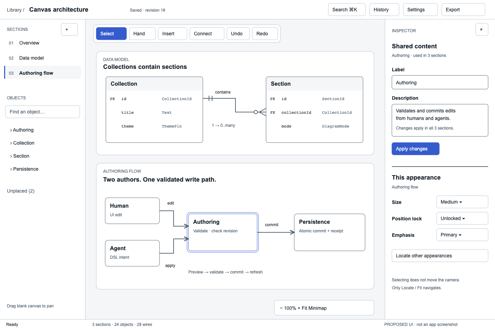

# 05 · User interface and interaction contract

**Target baseline 1.2 · Proposed · 11 September 2026.** This adds the UI/UX contract to documents [1](01-Functionality.md), [2](02-Capabilities.md), [3](03-Repository.md) and [4](04-DSL.md). [Document 6](06-Design-Tokens.md) defines its styling system. These are specifications, not a claim that the UI has been implemented.

## The experience

**The diagram is the work surface.** A person opens a collection and sees its engineering diagrams and explanations together. Navigation stays predictable; editing tools appear where needed. A person should be able to understand the collection before opening an inspector.

The signature interaction is the **shared-content / this-appearance inspector**: the interface makes the distinction visible exactly when a person edits. “Shared content · used in 3 sections” edits meaning everywhere; “This appearance · Data model” edits only this placement, emphasis or routing. It avoids both accidental global changes and duplicated diagram data.

React is mandatory for the web UI; React Flow is mandatory for interactive diagram nodes and edges. Reusable primitives, feature views, domain behavior and I/O adapters have separate responsibilities. The concrete source tree in document 3 is part of this contract.

## Workspace composition



This is a **proposed screen structure**, not an implemented React screen or a claim that interactions already work. The displayed collection is illustrative. The live ER view must use proper field rows and crow’s-foot markers. A [rendered workspace illustration](assets/workspace-ui-reference.svg) shows the intended hierarchy and shared-content inspector; it is a static proposal, not a running app screenshot. Color is restrained: neutral application chrome, one action accent, clear focus, and diagram colors chosen by its pinned theme. UI typography uses a legible sans face; identifiers/signatures use a monospace face. The font aliases are centrally controlled, not baked into components.

### Dimensions and responsive behavior

Numbers below are default CSS-pixel values at 100% browser zoom. CSS references generated tokens; these values are not repeated as literals in individual component styles. Browser zoom, text preferences and coarse-pointer controls must not clip content.

| ID | Rule | Required outcome |
|---|---|---|
| U01 | Desktop ≥1200px: header minimum 56px; status minimum 28px; navigator 248px default, adjustable 208–360px; inspector 320px default, adjustable 280–420px | Canvas occupies the remaining area. At 1440px wide with both panels open it has 872px width before separators. Panels scroll independently. |
| U02 | 800–1199px: navigator becomes a 280px overlay; inspector becomes a 320px overlay; only one side overlay open at a time | Canvas keeps the full workspace width. Opening or closing an overlay never fits or pans the diagram. |
| U03 | Below 800px: full-width library; workspace header wraps; edit/inspect/navigation controls open one bottom sheet at a time, maximum 70dvh | Touch pan/zoom and structured editing remain available. No feature disappears solely because the viewport is narrow; dense ER tables can scroll horizontally inside their editor. |
| U04 | UI text default 14px, line-height 1.5; secondary text ≥12px; titles 18–24px; body text preference 12–20px | Control/row heights grow for text. Header/status use min-height, not clipping fixed height. Diagram text has separate pinned metrics. |
| U05 | Fine-pointer control minimum 36×36px; coarse-pointer minimum 44×44px; focus ring 2px plus 2px offset | Adjacent hit areas do not overlap. Visible port dots may be 8px, with an explicit connect tool and keyboard endpoint picker providing larger interaction targets. |
| U06 | Inspector starts closed until explicitly opened or an editing action requests it; selection alone updates an already-open inspector | Selecting a node never changes camera, enters text editing, or opens a modal. |
| U07 | Panel resizing preserves the world point under the canvas center by adjusting viewport translation, without changing zoom | This is viewport compensation for changed usable area, not an automatic Locate/Fit. A transient side overlay does not resize the canvas. |

Breakpoints and dimensions come from `design-system` generated values. CSS media conditions cannot read normal CSS custom properties, so the build emits breakpoint literals and the corresponding TS values from one definition. Canvas geometry is measured from its actual element, not inferred from a breakpoint.

## Composable left and right panels · baseline 1.2

**One reusable panel composition, different registered contents.** A panel does not know every feature it might contain. Its persistent header and scrollable body are separate React components, and the body has its own context header plus independently registered sections. Changing section order or placement changes layout data; it does not require rewriting the shell or moving feature logic.

```text
WorkspaceSidePanel (host: binds one side's view model and actions)
└── SidePanel (Design System: frame, resize handle and layout slots)
    ├── PanelHeader (persistent title, mode/actions and close)
    └── PanelBody (one scroll owner)
        ├── PanelBodyHeader (current collection/selection and contextual actions)
        └── PanelSection[] (stable section ID, collapse and reorder controls)
            ├── PanelSectionHeader (title, scope badge and actions)
            └── PanelSectionBody (registered React feature content)
```

| Default side | Registered body section | React feature content |
|---|---|---|
| Left | Collections | `CollectionNavigator` — collection/folder browsing and switching |
| Left | Sections | `SectionNavigator` — section order and explicit Locate actions |
| Left | Objects | `ObjectOutline` — search, canonical objects, unplaced objects |
| Left | Create | `InsertPalette` — content kinds and entry actions for `AssetPicker` / `TemplatePicker` |
| Right | Shared content | `SharedContentEditor` and `SourceEditor` — canonical label, blocks, fields/signatures and evidence |
| Right | This appearance | `AppearanceEditor` — local role, size, membership, details and locks |
| Right | Connection | `WireEditor` — endpoints, label, cardinalities and routing |
| Right | Collection theme | `CollectionThemeSection` with `ThemeEditor` — preview/commit a pinned diagram theme |
| Right | Interface | `UiPreferencesSection` with `ThemeEditor` — personal UI theme/colors, density, text and motion |

Left Collections and Create start collapsed; Sections/Objects expanded. Right content/appearance sections start expanded when applicable; Collection theme/Interface start collapsed. Connection appears for wire selection, Shared content for object selection, and This appearance for a selected appearance. The right body header shows the current target and editable scope. A person can open collection/theme/interface controls without selecting a diagram object.

**Where extension happens:** `contract/panel-types.ts` defines stable `PanelId`, `PanelSectionId`, `PanelSectionDefinition`, `PanelLayout`, `PanelPreferencesV1` and readonly panel view models. Definitions contain title, supported contexts, renderer key and whether hiding/moving/collapsing is allowed. `contract/compose.ts` binds trusted feature renderers once through narrow slots. `core/panels/resolve-panel.ts` combines registered definitions, current context and layout preferences into ordered applicable sections. `resources/ui/panels.default.json` contains the shipped layout; it contains IDs/order/collapse state, never JSX, functions, CSS or validation rules.

To add a feature: implement its feature view/controller, register its section definition and renderer, and place its ID in the default layout. Existing SidePanel/PanelBody implementations do not change. New applicability rules are typed registered predicates injected into the resolver, not hard-coded feature-ID switches. Unknown renderer IDs fail development validation; removed/unknown preference IDs are ignored with a settings notice. New registered sections use their default placement without overwriting the user's arrangement. These are shipped feature registrations, not arbitrary downloadable plugin execution.

**User rearrangement:** Customize panels supports hide/show, move to the other side, reorder and collapse/expand, including keyboard Move up/down/left/right commands. Each registered section occurs at most once across the two panels. Per-section drafts, expansion, focus and scroll anchors use stable IDs, not array positions. Reordering does not remount an editor; moving across different React parent trees may remount its view, so drafts are held by the host edit-session owner and restored. Moving a focused editor restores focus to its matching field. Hide/close with a dirty draft uses Keep draft / Discard / Stay; no operation silently submits or drops it.

`PanelPreferencesV1` is a separate versioned local preference record from `UiPreferencesV1`: workspace ID, ordered section IDs per side, hidden IDs, collapsed IDs, widths and schema version. Resize bounds remain U01–U03. Preferences cannot suppress conflict/save status, deletion scope, validation or required accessibility controls. Every feature remains findable in the command palette and Customize panels when hidden. Reset layout resets panel arrangement only; Reset UI appearance resets token preferences only; neither changes a collection.

**Ownership amendment:** panel-container open state, active panel mode, widths and arrangement are owned solely by the web shell (`core/workspace/panel-state.ts`). This deliberately replaces baseline 1.1's Canvas-owned inspector-open flag, because panels now host many features beyond inspecting a selection. Canvas owns camera, selection and diagram gestures, and emits an inspect/edit request. The web shell reveals the registered feature wherever the user placed it. There is no second inspector visibility boolean. Narrow-screen exclusive modal behavior, focus recovery and camera compensation still follow U01–U07 and the overlay contract below.

**Themes/colors:** ThemeEditor changes validated design tokens, not individual component styles. Interface changes produce a personal theme/preference pin; Collection theme changes go through Authoring and layout feasibility. Panel section placement has no authority over either theme's validation or persistence rules. Color changes continue to use the centralized token resolver and contrast gates in document 6.

**Acceptance additions:** U15 reorder a dirty section and retain its text/focus; U16 move it to the other side and restore its draft after remount; U17 add a registered feature by layout/registration changes without editing PanelBody; U18 hide/show/reset panels without touching diagram data or camera; U19 change UI accent/theme once and see both panels, headers, section controls and portals update. No new automated tests are authored in this scaffold task.

## Screens, panels and primary actions

| Surface | What the person sees and can do | Entry / exit; feature references |
|---|---|---|
| Collection library | Search, folders, recent collections, thumbnail/title, archived toggle; New collection, duplicate, move, archive, restore, delete | Home screen; open collection resumes its own saved camera. F01–F02. |
| Workspace | Named sections on one canvas, floating tool strip, navigator, optional inspector, compact save/revision status | Open collection; Library returns without discarding a draft. F03–F06. |
| Section navigator | Ordered section list, disclosure for objects; rename/reorder/add section; separate Unplaced list | Single click selects an entry without camera movement; explicit Locate action or Enter on its Locate control navigates. F03–F06. |
| Insert palette | Searchable node/content kinds and templates with plain-language previews | Toolbar Insert or keyboard shortcut; choose kind then click placement, or use “Add to selected section.” No coordinates required. F07–F16. |
| Shared content inspector | Label, kind-specific fields, blocks, signatures, source links and number of appearances | Edit action, double-click text or keyboard Enter on an editable node. Shared scope remains visible during editing. F08–F17. |
| Appearance inspector | Section/group membership, role, size, details shown, position lock; reset layout | Operates on section/object pair. Does not copy shared labels into appearance data. F29–F38. |
| Wire inspector | Required label, kind, source/target row or port, cardinalities, route style, endpoint sides, lock and reset | Selecting a wire updates an open inspector; Edit connection opens it explicitly. F15, F30, F36. |
| Asset / template pickers | Searchable previews, alt text/provenance fields, pinned version, offline availability | Choose image/icon/template; staged uploads remain pending until Authoring binds them. F39–F41. |
| Change review | Before/after semantic diff, affected sections, deletions and layout diagnostics; Apply / Keep editing | Bulk destructive changes, template upgrades, DSL paste/import and agent preview review. F21–F25. |
| Conflict panel | “The collection changed while you were editing”; current content, your draft, affected targets | Read current state, reopen draft, prepare a new request. No “Force overwrite” bypass. F23–F26. |
| History | Transactions with author, time, affected sections; inspect, undo, redo | History command; undo uses current participant versions and can conflict. F24. |
| Export / import | Format, section/collection scope, scale/page choice, preview, output location; bundle validation summary | Export creates revision-labelled output; import goes through change review and Authoring. F43–F46. |
| Settings | Appearance, density, text size, motion, interaction profile; separate “Collection theme” action | Personal UI preferences are local; collection theme is a versioned authoring change. F27, F38, F41. |
| Reading mode | Ordered sections, accessible outline, expand/collapse details, previous/next, exit | Has its own camera; exiting restores editing camera and selection. F42. |

New/empty collection: title, “Add a section,” “Start from a template,” “Paste DSL.” Empty search: show the query and Clear filters. Missing image: preserve the frame, show alt text and Replace image. No loading spinner replaces an already-visible valid canvas.

## Exact navigation and editing behavior

### Pointer, trackpad and keyboard

| Input | Canvas outcome | Guard |
|---|---|---|
| Two-finger scroll / wheel | Pan; horizontal deltas remain horizontal | Only inside the canvas. Panels/editors retain native scrolling. |
| Trackpad pinch / Ctrl+wheel over canvas | Zoom about pointer | Prevent browser page zoom only for the canvas gesture; browser zoom controls remain available outside it. Never intercept global keyboard browser-zoom shortcuts. |
| Space + primary drag; middle drag; Hand-tool primary drag | Pan | Space does not activate Hand while typing; release/cancel restores the previous tool. |
| Primary drag on blank canvas in Select tool | Pan by default | Shift + blank drag starts marquee. Preference can choose marquee-default; explicit Hand always pans. |
| Click node/wire | Select; Shift toggles selection | Movement below drag threshold is a click; selection does not Fit/Locate. |
| Drag node / selected group | Preview movement; pointer release creates one intent | Ignore starts on inputs, links and interactive content. Escape/pointer cancellation discards the draft. |
| Double-click label / Enter on editable selection | Edit text | No camera recenter. Escape restores previous text; Ctrl/Cmd+Enter commits multiline editing. |
| Connect tool | Pick source endpoint, then target; enter wire label in form | Invalid endpoints are identified before submission; same Authoring validation still runs. |
| Arrow keys with canvas focused | Navigate object selection in reading/spatial order | Alt+Arrow nudges a selected appearance; Shift+Alt+Arrow uses coarse nudge. Typing/form controls retain native keys. |
| Ctrl/Cmd+K | Command palette | Available from workspace; dialog focus rules apply. |
| Ctrl/Cmd+Z; Ctrl/Cmd+Shift+Z | Undo / redo committed diagram transaction | Inside a text editor, native draft undo wins; diagram undo occurs only after leaving text editing. |
| Delete / Backspace | Preview “Remove from this section” for selected object/wire appearances | Never intercept in text inputs; cascade impacts require explicit acknowledgment. |
| Escape | Cancel innermost edit/tool/dialog, then clear selection | Modal Escape returns focus to its trigger; no hidden global reset of camera. |

**Explicit camera commands:** Fit collection, Fit section, Locate result, zoom percentage, and reading-mode next/previous. A new collection may fit once on its first successful render; subsequent data, revision, selection or theme updates must not trigger Fit. If objects move outside the view, show “Updated outside view · Locate.”

### Commit and failure state machine

`ready → drafting → validating → committing → saved` is the normal flow. `validating → invalid` keeps the draft; `committing → conflict` keeps both latest committed content and the draft. An uncertain response enters `checking receipt`, then saved or retryable; it never displays “Saved” based on optimism alone.

- Text editors update local draft immediately; single-line Enter/blur requests a commit, multiline uses Ctrl/Cmd+Enter or its Apply button. Blur into Cancel must not commit first. Unchanged fields are no-ops.
- A drag is one history operation, not a write on each pointer move. `onNodesChange` updates an immutable view draft; it cannot directly save React Flow JSON.
- An invalid edit shows a nearby message and a Problems entry with target IDs and an explicit Locate action. A locked layout conflict rejects the entire transaction. Unlocked layout preferences may adjust, shown in preview.
- A human edit is never silently dropped because an agent committed. Refresh committed state, retain the recoverable draft and explain what changed. Applying the revised draft uses a **new** request ID and fresh versions; retrying an uncertain identical submission reuses its request ID.
- Service disconnected: keep the last committed canvas readable; preserve drafts, disable Apply and show Reconnect. This baseline has no background offline merge queue. Before navigation, offer Keep draft / Discard / Stay. Pending submissions are reconciled by receipt before resubmission.
- Persist pending requests/drafts through the host's local draft adapter. Malformed/unavailable browser storage yields a visible “Draft recovery unavailable” state; do not promise restart recovery when it failed. Tokens/preferences have a separate store.

### Scope, overlays and concurrent drafts

**Deletion scope:** on-canvas Delete defaults to removing selected appearances from the current section, with the preview labelled “Remove from this section.” Canonical objects and relationships remain; incident wire appearances are listed. A separately named “Delete shared object” action shows every affected section/reference and requires explicit cascade acknowledgment. Unplaced-object deletion uses that shared-object action. Removing a section previews the loss of its appearances, preserving canonical content. Removing a visual group offers “Ungroup” and keeps its child appearances. Library collection deletion remains a distinct collection-level action.

**Overlay modality:** at U02/U03 widths, the one active side overlay or bottom sheet is a modal dialog. Background canvas and other chrome are inert; focus enters its heading or first relevant control, stays trapped inside, and returns to the opening control when dismissed. Escape or backdrop click dismisses an unchanged overlay; a dirty edit invokes Keep draft / Discard / Stay before closing. Sheet header/actions stay visible, body scrolls independently within the 70dvh maximum and safe-area padding; no body-scroll or focus trap remains after exit. Desktop docked panels are nonmodal and never trap focus. Resizing from docked to overlay first preserves panel/draft state and then establishes modal focus; expanding back removes the trap without clearing that state.

**Pending commits:** permit one in-flight mutation per collection per browser client. Apply and further mutation submissions are disabled until a definitive outcome is known; successful/no-op outcomes are confirmed by receipt, while definitive rejection or cancellation releases the slot immediately and retains drafts. Only uncertain outcomes remain in receipt reconciliation; text inputs may continue accumulating a new local draft, and navigation remains available. Each submission captures an immutable payload, expected versions and draft generation. Success marks only that submitted generation saved. A newer generation remains visibly “Draft not applied” and is never cleared or submitted automatically. If no foreign changes intervened, its base can advance to the just-committed own result; otherwise it requires comparison with current state before a new submission. A lost response preserves both the pending generation and any newer draft while receipt reconciliation runs. Browser-local coordination does not replace server revision checks against other tabs or agents.

## React component and state architecture

A component receives the smallest readonly view model and callbacks it needs. Native semantics first: buttons, labelled inputs, headings and lists; Radix supplies established dialog/menu/tab/tooltip keyboard and focus behavior. Its accessibility support does not excuse missing labels or application-level checks. [Radix accessibility](https://www.radix-ui.com/primitives/docs/overview/accessibility), [Dialog behavior](https://www.radix-ui.com/primitives/docs/components/dialog).

| Layer | Responsibility | Source location |
|---|---|---|
| Reusable visual primitives | Button states, Field labels/errors, Dialog focus, Menu/Tabs/Tooltip, StatusMessage | `capability/design-system/adapters/react/*.tsx` with colocated `.module.css` |
| Feature views | Workspace, library, inspector, pickers, history, review, export, settings | `apps/web/adapters/react/*.tsx` with scoped CSS modules |
| Diagram interaction adapter | React Flow surface, wrappers, edge handles, controls and accessible outline | `capability/canvas/adapters/react-flow/*.tsx` |
| Diagram content adapters | Entity fields, interface members, prose/media blocks, sequence labels | `capability/presentation/adapters/react/*.tsx` |
| Framework-free behavior | Interaction reducer/commands, edit session transitions, token resolution, view-model selection | Each owning package's `core/**.ts` |
| Host I/O | Service subscription, request receipts, draft/preferences persistence, mounting and focus/measurement boundaries | Named `adapters/**.ts` in the owning capability/host |

No file is both a domain validator and a React screen. No reusable Button knows a collection ID. No inspector owns a second authoritative object store.

**One owner for each state:** committed collection snapshot belongs to Authoring; Canvas owns camera/selection/tool/draft-interaction state; the web host owns editor form sessions and request presentation; Design System owns token resolution, while the host owns personal preference persistence. The host’s `panel-state.ts` exclusively owns panel visibility, mode, dimensions and overlay arrangement. Canvas emits edit/inspect requests; the host reveals the corresponding registered section. Opening another narrow-screen overlay switches the host’s single active overlay while retaining drafts; there is no Canvas inspector visibility flag. Derived filtered lists, selected-object details and status labels are computed, not copied into competing `useState` values. This follows React's [single-source-of-truth guidance](https://react.dev/learn/sharing-state-between-components) and [state-structure guidance](https://react.dev/learn/choosing-the-state-structure).

**Reuse rules:** use composition/slots rather than boolean-heavy mega-components or inheritance. Form controls can be controlled or locally draft-controlled, with a documented commit callback. Extract hooks for repeated subscription/lifecycle logic, not to conceal feature policy; custom hooks share logic, not a magically shared state instance. Effects synchronize actual external systems and clean up subscriptions; they do not mirror props into state or auto-submit changes. [React custom hooks](https://react.dev/learn/reusing-logic-with-custom-hooks), [Effects](https://react.dev/reference/react/useEffect).

**Strict folder compatibility:** the SOP does not grant adapter-to-adapter imports. Therefore `contract/compose.ts` wires sibling TSX components and hooks through narrowly typed slots/dependencies before mounting. An adapter imports own declarations, permitted external public contracts, React/Radix/React Flow and its own CSS asset, but no sibling adapter behavior or private core. `contract/react-types.ts` contains adapter-only React prop/slot declarations; core is forbidden to import it. Public `createReactBindings` exposes a stable environment-specific UI binding, separately from framework-free capability APIs. Do not export a component by bypassing compose with a deep import. This costs explicit assembly in compose; it does not justify one package or wrapper per visual atom.

Component identities, node/edge registries and injected slots are created once at composition, never inside render. Use stable semantic keys, not array indexes; selection subscriptions should not subscribe to the complete moving-node array. Memoize hot React Flow boundaries and handlers where reference stability matters; do not apply indiscriminate memoization as a substitute for sensible state ownership. [React Flow performance guidance](https://reactflow.dev/learn/advanced-use/performance).

## CSS and TypeScript that specify the experience

Document 3 enumerates the actual target files. This table names the controlling contract for each visible behavior; the values are centralized, never repeated in event handlers.

| Concern | TypeScript owner / configuration | CSS owner / tokens | Default / bound |
|---|---|---|---|
| Shell panels, responsive changes | `apps/web/core/workspace/panel-state.ts`; generated `breakpoints.ts` | `WorkspaceShell.module.css`; shell dimensions in `layout.generated.css` | U01–U03; keyboard-resizable separators |
| Gesture precedence | `canvas/core/interaction/gesture-policy.ts`; `contract/interaction-profile.ts` | `CanvasSurface.module.css` handles cursors/touch behavior only | Drag threshold 4px fine / 8px coarse; no JS UA sniffing |
| Zoom / keyboard nudge | `canvas/contract/interaction-profile.ts` | Controls use Design System tokens | Zoom 0.1–4, 0.1 explicit button step; nudge 8 world units, coarse 32 |
| Edit/commit/retry | `apps/web/core/editing/edit-session.ts` | `SharedContentEditor.module.css`, `ConflictPanel.module.css`, `ServiceStatus.module.css` | Immediate draft; explicit commit rules above; no magic debounce write |
| Search | `apps/web/core/search/search-session.ts`; injected scheduler | `CommandPalette.module.css`, `CollectionLibrary.module.css` | 150ms input debounce; stale responses ignored; Enter acts on visible result |
| Scene subscription | `canvas/adapters/react-flow/use-scene.ts` via injected subscription | Node/edge modules; explicit geometry values from scene | Cached immutable snapshots; revision/input-hash stale rejection |
| Node body / notation | Presentation public view model; `presentation/core/content/content-model.ts` | `EntityTable.module.css`, `NodeContent.module.css`, `InterfaceCard.module.css` | Row dimensions measured from resolved diagram tokens, not hard-coded CSS height |
| Token/preferences application | Design System resolver; `apps/web/core/preferences/preference-state.ts` | Generated token/semantic/override layers | Document 6; shell and diagram scopes remain independent |
| Focus / announcements | `apps/web/adapters/browser/focus.ts`; `canvas/core/accessibility/outline.ts` | Focus/visually-hidden utilities and StatusMessage styles | Polite save announcements; assertive actionable failure; no every-frame announcements |

Timing/nudge/gesture values are product defaults, not universal “industry standards.” They are named profile values with validation and readable settings where useful. A reset-to-defaults action restores the shipped profile. Fonts, colors, dimensions, motion and breakpoints are centrally declared in document 6; geometric world coordinates and pointer deltas remain typed TS data, not design tokens.

## Accessibility and acceptance evidence

Target WCAG 2.2 AA for application controls, with 4.5:1 normal-text contrast, 3:1 large-text and essential UI-boundary contrast. The product's 36/44px controls exceed WCAG's basic 24px target minimum; diagram geometry has an accessible outline and endpoint-picker alternative. Preserve browser zoom, visible focus, reading order, reduced motion and forced colors. Accessibility must be checked on the rendered states, including hover, disabled, selected and error. [WCAG 2.2](https://www.w3.org/TR/WCAG22/).

| ID | Acceptance demonstration | Related requirements |
|---|---|---|
| U08 | A person pans, selects three nodes, opens inspector, edits a label and receives an agent update without an unsolicited Fit/Locate | F23, F27–F30 |
| U09 | One shared object has three appearances; shared label edits affect all three, local size/lock edits affect one | F04, F17, F25 |
| U10 | Keyboard-only user adds a field, connects two endpoints, supplies cardinalities and exports an ER section | F08, F15, F31, F43 |
| U11 | Stale commit, lost response, invalid lock, disconnect and restart each retain correct committed state and explain draft/retry status | F22–F26, F49 |
| U12 | At 390px, 900px and 1440px widths, plus 200% zoom and 20px UI text, every action remains reachable with no clipped dialogs or trapped focus | F31 |
| U13 | Existing 1,000-object fixture meets document 1's performance budget; dragging one node does not rerender unrelated inspectors/library rows | F37, F50 |
| U14 | Personal UI theme/text changes leave pinned diagram/export metrics unchanged; explicit collection-theme changes go through Authoring | F38, F41 |

**Test budget for this documentation change: 0 new automated application tests.** The table is acceptance evidence to specify before implementation, not an authorization to generate hundreds of tests. At each implementation slice, inventory existing coverage and freeze a justified test budget under the engineering skill/SOP. Browser interaction, accessibility and visual review complement contract tests; screenshots alone cannot prove correct concurrency or navigation.

## Prior pressure-test record · baseline 1.1

Completed 11 September 2026. A new reviewer started with no conversation history and examined documents 5–6, the expanded tree/import rules and the relevant original contracts. All seven finding groups were verified and corrected, then rechecked:

- Token recipes now support bounded, same-unit addition and validate arity/units.
- System/pinned theme selection, density names/deltas and preference recovery are explicit.
- The token compiler has concrete source/artifact ports and a filesystem build adapter.
- Baseline 1.1 assigned inspector visibility to Canvas; the explicit baseline 1.2 panel-ownership amendment above supersedes that decision.
- Delete distinguishes local appearances from shared objects.
- Narrow overlays/sheets have modal focus, scroll, dismissal and draft rules.
- Pending commits preserve newer draft generations and release their slot on **any definitive outcome**; uncertain outcomes reconcile by receipt.

The recheck also corrected the icon-only hover outline so default controls cannot inherit white on-accent styling on a pale background. No remaining specification freeze blocker was found.

Local artifact checks confirmed the 40-TSX/39-colocated-module inventory, links and SVG structure; the UI illustration was browser-rendered and visually inspected. Numeric checks cover the specified default/example contrast pairs. These are design/artifact checks, not proof of runtime accessibility, completed React components, token-coverage percentages or future per-file scores. Those remain implementation gates.

Baseline 1.2 panel composition/naming amendments were checked by the author for ownership, stable identity, draft preservation and consistency with the scaffold; they are not covered by the earlier independent-review claim.
