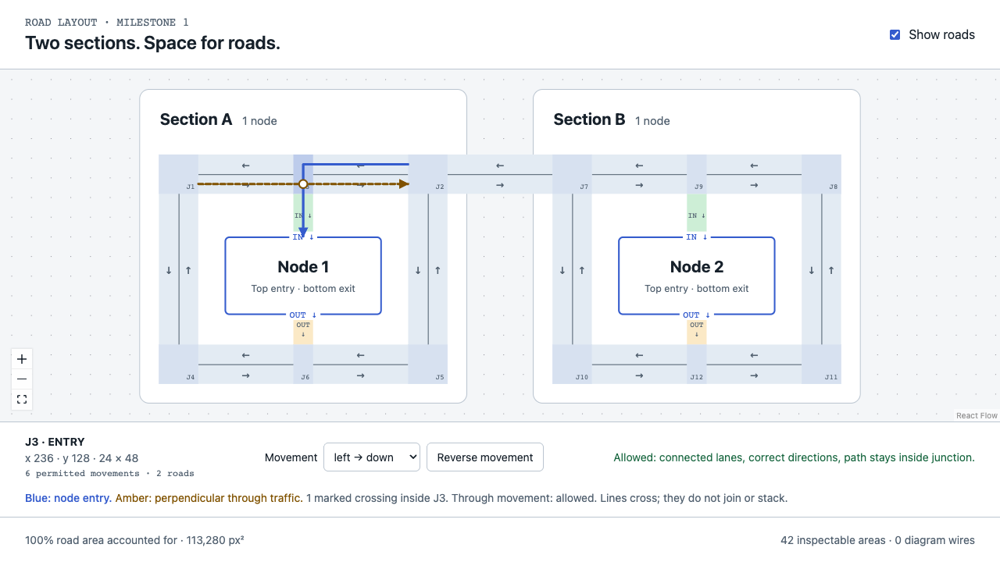
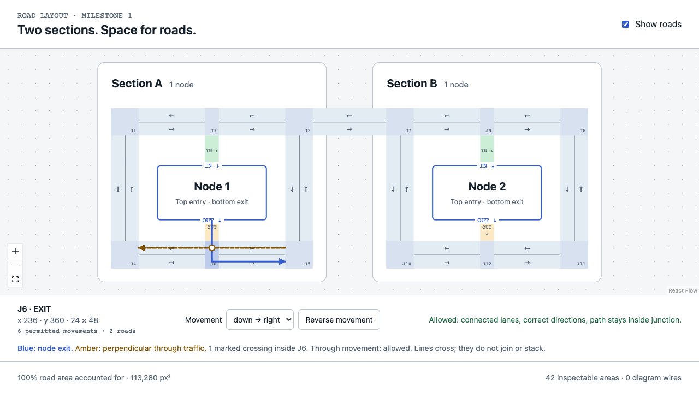
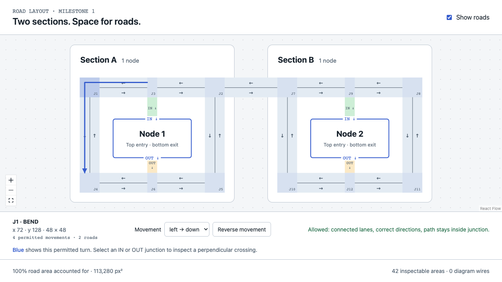

# Road inspection evidence

## Result

- All 13 roads are accounted for: 113,280 square layout pixels, no uncovered area, no double-owned area, no inspectable region outside roads.
- All 42 regions are inspectable: 30 lanes and 12 junctions (6 bends, 2 intersections, 2 entries, 2 exits).
- 378 real browser clicks passed: 9 interior positions per region, including positions near all four corners.
- All 113,280 road unit-square centers hit an inspectable control at fit zoom; zero dead areas in that scan.
- All 66 permitted junction movements passed in both the model and browser inspector. Reversing a bend movement was rejected.
- Both entries and both exits have two individually valid paths with a measured perpendicular crossing inside their junction.

## What changed

Before this fix, all 12 junction centers hit the canvas background: their model rectangles had no inspector controls. They now have full-area buttons, IDs J1–J12, coordinates, permitted movements and path previews.

Entry roads explicitly name their node, entry role and top side. Exit roads name their node, exit role and bottom side. Both point down because top-entry travel approaches the node from above while bottom-exit travel leaves below. IN/OUT labels and distinct fills make their different roles visible.

## Crossing demonstrations

Blue solid paths enter or leave nodes; amber dashed paths carry perpendicular through traffic. Circles mark crossings, not connected junctions between the two paths. Each displayed path follows its own directed lane before and after the junction.

| Junction | Role | Crossing x, y | Validation |
| --- | --- | --- | --- |
| J3 | entry | 248, 164 | Both paths allowed |
| J6 | exit | 248, 372 | Both paths allowed |
| J9 | entry | 728, 164 | Both paths allowed |
| J12 | exit | 728, 372 | Both paths allowed |

## Every road

Areas below include shared junctions; the union total above counts each shared area once.

| Road | Area | Uncovered | Inspectable regions touching road |
| --- | ---: | ---: | ---: |
| road-between-sections | 6,144 | 0 | 2 |
| section-1-street-horizontal-0 | 16,896 | 0 | 7 |
| section-1-street-horizontal-1 | 16,896 | 0 | 7 |
| section-1-street-vertical-0 | 13,440 | 0 | 4 |
| section-1-street-vertical-1 | 13,440 | 0 | 4 |
| section-1-entry-top | 1,248 | 0 | 1 |
| section-1-exit-bottom | 864 | 0 | 1 |
| section-2-street-horizontal-0 | 16,896 | 0 | 7 |
| section-2-street-horizontal-1 | 16,896 | 0 | 7 |
| section-2-street-vertical-0 | 13,440 | 0 | 4 |
| section-2-street-vertical-1 | 13,440 | 0 | 4 |
| section-2-entry-top | 1,248 | 0 | 1 |
| section-2-exit-bottom | 864 | 0 | 1 |

## Every inspectable region

| Region | Role / direction | Bounds x, y, width, height | Real clicks passed |
| --- | --- | --- | ---: |
| road-between-sections:part-0:left | left | 424, 128, 128, 24 | 9/9 |
| road-between-sections:part-0:right | right | 424, 152, 128, 24 | 9/9 |
| section-1-street-horizontal-0:part-0:left | left | 120, 128, 116, 24 | 9/9 |
| section-1-street-horizontal-0:part-0:right | right | 120, 152, 116, 24 | 9/9 |
| section-1-street-horizontal-0:part-1:left | left | 260, 128, 116, 24 | 9/9 |
| section-1-street-horizontal-0:part-1:right | right | 260, 152, 116, 24 | 9/9 |
| section-1-street-horizontal-1:part-0:left | left | 120, 360, 116, 24 | 9/9 |
| section-1-street-horizontal-1:part-0:right | right | 120, 384, 116, 24 | 9/9 |
| section-1-street-horizontal-1:part-1:left | left | 260, 360, 116, 24 | 9/9 |
| section-1-street-horizontal-1:part-1:right | right | 260, 384, 116, 24 | 9/9 |
| section-1-street-vertical-0:part-0:down | down | 72, 176, 24, 184 | 9/9 |
| section-1-street-vertical-0:part-0:up | up | 96, 176, 24, 184 | 9/9 |
| section-1-street-vertical-1:part-0:down | down | 376, 176, 24, 184 | 9/9 |
| section-1-street-vertical-1:part-0:up | up | 400, 176, 24, 184 | 9/9 |
| section-1-entry-top:part-0:down | down | 236, 176, 24, 52 | 9/9 |
| section-1-exit-bottom:part-0:down | down | 236, 324, 24, 36 | 9/9 |
| section-2-street-horizontal-0:part-0:left | left | 600, 128, 116, 24 | 9/9 |
| section-2-street-horizontal-0:part-0:right | right | 600, 152, 116, 24 | 9/9 |
| section-2-street-horizontal-0:part-1:left | left | 740, 128, 116, 24 | 9/9 |
| section-2-street-horizontal-0:part-1:right | right | 740, 152, 116, 24 | 9/9 |
| section-2-street-horizontal-1:part-0:left | left | 600, 360, 116, 24 | 9/9 |
| section-2-street-horizontal-1:part-0:right | right | 600, 384, 116, 24 | 9/9 |
| section-2-street-horizontal-1:part-1:left | left | 740, 360, 116, 24 | 9/9 |
| section-2-street-horizontal-1:part-1:right | right | 740, 384, 116, 24 | 9/9 |
| section-2-street-vertical-0:part-0:down | down | 552, 176, 24, 184 | 9/9 |
| section-2-street-vertical-0:part-0:up | up | 576, 176, 24, 184 | 9/9 |
| section-2-street-vertical-1:part-0:down | down | 856, 176, 24, 184 | 9/9 |
| section-2-street-vertical-1:part-0:up | up | 880, 176, 24, 184 | 9/9 |
| section-2-entry-top:part-0:down | down | 716, 176, 24, 52 | 9/9 |
| section-2-exit-bottom:part-0:down | down | 716, 324, 24, 36 | 9/9 |
| J1 | bend | 72, 128, 48, 48 | 9/9 |
| J2 | intersection | 376, 128, 48, 48 | 9/9 |
| J3 | entry | 236, 128, 24, 48 | 9/9 |
| J4 | bend | 72, 360, 48, 48 | 9/9 |
| J5 | bend | 376, 360, 48, 48 | 9/9 |
| J6 | exit | 236, 360, 24, 48 | 9/9 |
| J7 | intersection | 552, 128, 48, 48 | 9/9 |
| J8 | bend | 856, 128, 48, 48 | 9/9 |
| J9 | entry | 716, 128, 24, 48 | 9/9 |
| J10 | bend | 552, 360, 48, 48 | 9/9 |
| J11 | bend | 856, 360, 48, 48 | 9/9 |
| J12 | exit | 716, 360, 24, 48 | 9/9 |

## Method and scope

The area audit partitions geometry at every road, lane and junction boundary. Rectangle membership is constant inside each resulting cell, so its area totals are exact for this supplied scene.

Browser clicks used real pointer events after rendering settled. An initial rapid-click probe ran during redraw and missed transient targets; the settled-frame run passed all 378 clicks. The dense hit scan checked controls without clicking all 113,280 points. At 2,451 shared-boundary samples, the browser selected a neighboring region at a maximum distance of 0.5 layout pixels; none hit background.

This evidence covers the current two-section fixture. Diagnostic paths demonstrate legal crossings; they do not implement wire allocation, collision scheduling, dragging, or arbitrary-layout routing.

Visual review: personally inspected entry, exit and bend screenshots at overview scale. Section hierarchy and node labels remain clear; paths remain within roads, only cross at marked junctions and do not overlap for any distance in these examples. This sparse road milestone does not claim to satisfy the full production diagram-density benchmark.

Validation: pnpm check passed — types, lint, formatting, architectural boundaries and all 70 existing test files / 208 tests. No new test files.

Raw evidence: [model and complete geometry](model-audit.json), [42-region click audit](browser-audit.json), [dense hit scan](pixel-hit-audit.json), [browser movement checks](movement-browser-audit.json), [direction checks](direction-audit.json).
