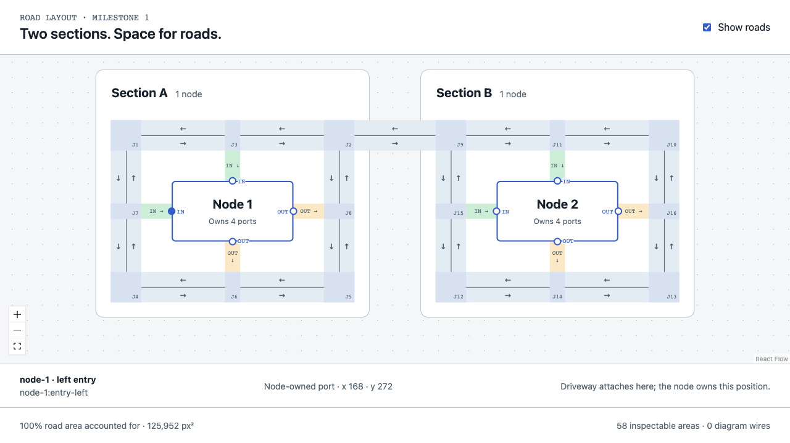
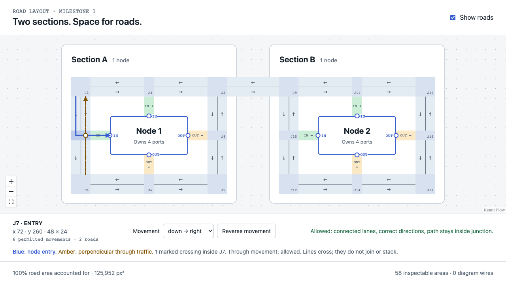
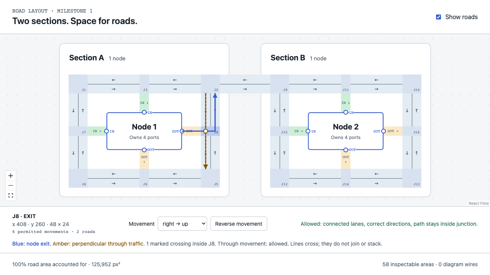

# Node-owned ports and measured road layout

## Implemented

- Two nodes, each owning four ports: top and left inputs; bottom and right outputs.
- A node definition owns its dimensions, local port offsets, IDs and roles. `readPrototypeNodePorts(node)` translates those offsets to world positions.
- The road builder consumes those returned positions. Eight driveways attach exactly to their named ports; it never writes a node or a port.
- Default footprint: nodes 192 × 96; driveways 24 wide × 48 long; main roads 48 wide. Roads, ports and junctions are inspectable.
- Fixed scope remains two sections and one node each. Wire-count-based capacity calculation and per-wire allocation are not implemented. Width variation below supplies the capacity directly.

## Dependency direction

Choose capacity → place nodes → read node-owned ports → place main roads → attach driveways → compile lanes and connections → render.

The section grid reserves road width and driveway clearance before placing nodes. Wider roads can move nodes, as predicted, but that is a forward dependency. There is no road-to-node feedback, solver convergence loop or render-driven geometry recalculation. The optional measurement callback observes the same public layout path; clocks do not enter scene data.

## Stage timings

Warm measurements: Chromium on this machine, local Vite prototype, 30 batches × 100 builds at each of three widths, following 30 warm-up builds per width. Each batch is normalized to one build. The sub-0.01 ms stage estimates are approximate because the browser clock is quantized; treat them as below 0.01 ms, not nanosecond precision. Instrumentation overhead remains included.

| Stage | Approximate mean ms per warm build, width 48 |
| --- | ---: |
| Reserve capacity | 0.0002 |
| Place two nodes and their local port records | 0.0006 |
| Locate eight world-space ports | 0.0002 |
| Position nine main roads | 0.0004 |
| Attach eight driveways | 0.0014 |
| Build lanes, junctions, connections and crossing examples | 0.0970 |

Median complete warm build: **0.101 ms**. Section translation, measurement overhead and scene assembly are included in the total but sit outside named stages.

### Actual page reloads

12 same-session reloads of the local development server. These are not cold production deployments. The readiness measure ends after the initial React commit, font readiness and two animation-frame opportunities. It is a useful view-readiness proxy, not isolated GPU paint time. Every sample had 8 port controls, 37 visible React Flow objects and loaded fonts.

| Process | Median ms | Observed range ms |
| --- | ---: | ---: |
| Style binding import | 9.45 | 5.30–15.90 |
| Renderer import | 2.75 | 1.90–7.80 |
| Complete geometry on reload | 0.80 | 0.70–0.90 |
| Exact road coverage audit | 0.60 | 0.40–0.70 |
| Render request → font-ready frame | 33.85 | 24.30–40.40 |
| Navigation start → ready view | 95.60 | 79.70–97.20 |

These rows are nested, and medians do not add. Navigation also includes HTML/static module fetching, evaluation and scheduling. Reload geometry is slower than repeatedly warmed geometry because each reload creates a fresh JavaScript context.

## The 10,000-calculation concern

There was no repeated positioning loop. However, the original connection builder tested every ordered lane pair against junctions: 1,764 pair candidates and 26,871 junction predicates for this four-port fixture. Those comparisons are not node repositionings.

The implementation now gathers incoming/outgoing lanes at each junction: 1,344 endpoint-containment checks, followed by only local combinations. A 42-entry endpoint index handles straight continuations with 42 lookups. These counts cover connection discovery, not every operation in the entire layout.

Before/after comparison preserves exactly the same 90 connection IDs and canonical paths. At width 48, median warm build time changed from 0.178 to 0.101 ms. This is a small-fixture measurement, not a large-diagram scalability guarantee.

### Width experiment

| Main-road width | Node 1 position | Calls to each of six stages | Port local offsets | Driveway length |
| ---: | --- | --- | --- | ---: |
| 48 | x 168, y 224 | Once per build | Unchanged | 48 |
| 96 | x 216, y 272 | Once per build | Unchanged | 48 |
| 192 | x 312, y 368 | Once per build | Unchanged | 48 |

All three widths passed: 8 exact port attachments, 90 valid canonical connections, 8 crossing demonstrations, no uncovered/double-owned/outside-road inspection area, and deterministic reconstruction. Selecting an inspector caused no layout-stage rerun.

## Ownership and whitespace recommendation

**Keep the node’s ports and required clearance node-owned. Keep the connecting driveway in the road layout.** A driveway depends on both a port and a main road, so making the whole driveway node-owned would make the node know about external roads. The current prototype reserves a fixed 48-pixel driveway length in the layout plan.

**Do not repeatedly inflate and shrink until a whitespace ratio is met.** Pick road capacity from demand, then place nodes once. If compaction is later needed, use a bounded pass with minimum lane widths and clearances. In this experiment, wider roads enlarge section footprints while reducing the fraction of blank space; a whitespace percentage alone can therefore reward a larger, worse layout.

No automatic compaction was added. No claim is made that two nodes prove large-diagram performance, or that variable wire counts have been routed.

## Verification and source map

- Real clicks opened inspectors for all 58 road regions and all 8 node-owned ports. All 8 driveway junctions displayed a perpendicular crossing.
- Personally inspected left-input, right-output and port-owner screenshots. The four sides attach visibly at node-owned circles, with separate input/output roles.
- Exact road union at width 48: 125,952 layout px²; zero gaps, multiply-owned area or inspection area outside roads.
- `pnpm check` passed: types, lint, formatting, architecture boundaries, 70 existing test files / 208 tests. No permanent test files were added.

| Responsibility | Source |
| --- | --- |
| Node footprint and owned ports | `capability/layout/core/prototype-road-nodes.ts` |
| One-pass capacity and positioning | `capability/layout/core/prototype-roads.ts` |
| Read-only port-to-road attachment | `capability/layout/core/prototype-road-driveways.ts` |
| Directed lane and junction graph | `capability/layout/core/prototype-road-network.ts` |
| Browser timing boundaries | `apps/web/cli/roads-prototype.ts` |
| Rendering and port inspection | `capability/canvas/adapters/react-flow/RoadPrototype.tsx` |

Raw evidence: [geometry and width experiments](geometry.json), [browser interactions](browser.json), [page loads](page-load-timing.json), [warm timings before](timing-before.json), [warm timings after](timing-after.json), [summary](timing-summary.json), [unchanged connections](network-comparison.json).
