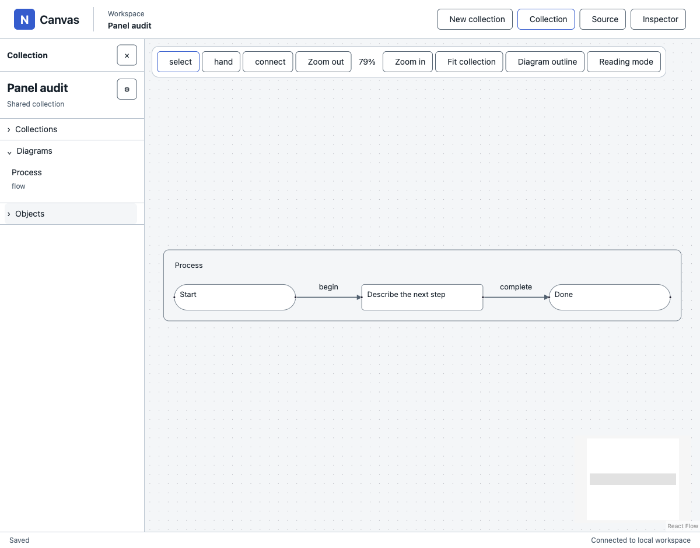
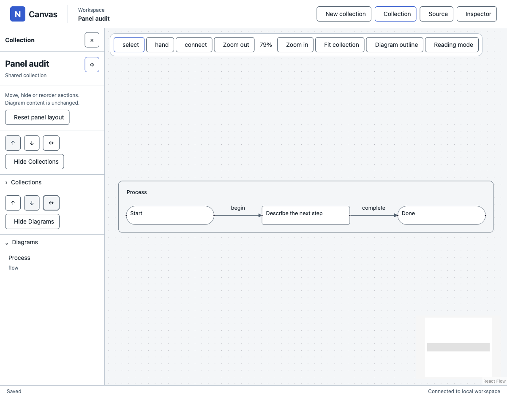
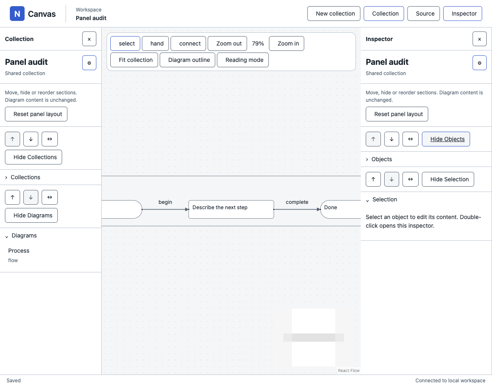
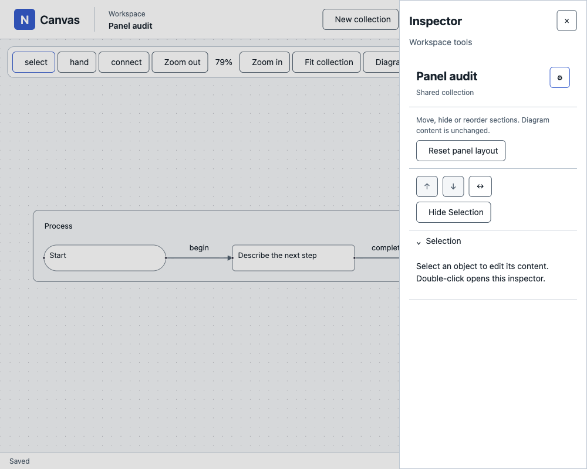
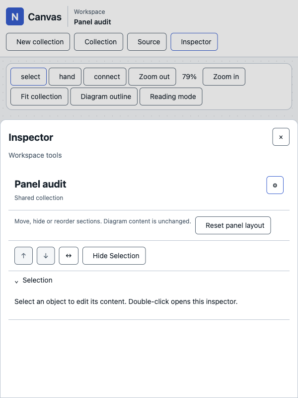
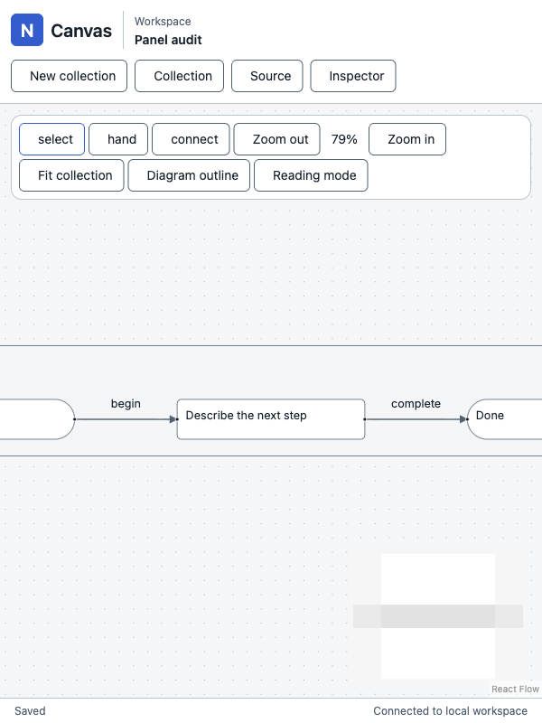

# Unit 2 — shared panels audit

Status: **partial visible audit; remaining coverage explicitly unverified**.

2026-09-12. Target http://127.0.0.1:5174/. Same audit resumed through an isolated headed Playwright session after IAB tooling blocked the initial attempt. Recovery bounded to five minutes from 06:33:20 UTC. No implementation edits or implementation source reads. Baselines: Host-Build-Plan React/UX and unit2; baseline05 panel composition, U01–U03, U15–U19 and overlay modality.

## Method and isolation

IAB creation returned “IAB visibility is not supported in a subagent thread”; parent tab handoff returned “Tab not found: 6 in browser 1”, with an empty subagent tab inventory. Native inventory reported a locked Mac. Recovery used the installed Playwright skill and a separate `panel-audit` session launched with `--headed`; process evidence confirmed the headed daemon and a Google Chrome process without a headless launch flag. Actual rendered browser screenshots were saved and inspected. This does not establish what was physically visible on the locked desktop. No headless browser, synthetic screenshot, CSS injection, or existing user tab was used.

Created only the authorized **Panel audit** collection through New collection UI: `collection-cc8d7593-9c83-4067-99c0-44d907a61695`. All actions stayed in that session and collection. Browser viewport changes used the skill's documented `resize` command, which invokes the real browser viewport API; they are not physical window measurements.

## Verified flow

1. **Collection shell and collapse — healthy observed state.** Default Collection panel open, Inspector closed; Collections collapsed and Diagrams/Objects expanded. Clicking Objects collapsed it, with surrounding structure intact. .
2. **Customize reorder and cross-panel move — healthy observed state, draft/focus coverage limited.** Move Objects up changed order from Collections/Diagrams/Objects to Collections/Objects/Diagrams and retained collapse; AX marked the same Move Objects up control active. Move Objects to other panel removed it from Collection; opening Inspector showed Objects exactly once and still collapsed. The move did not itself open Inspector.  captures the intermediate closed-destination state; the following AX snapshot established arrival in Inspector.
3. **Hide toggle and reset — reset healthy; minor clarity issue.** Hide Objects became pressed while remaining visible within Customize. Reset restored Objects to its original left position and expanded default. Full hide outside Customize/show round-trip was not exercised. .
4. **U02 transition — healthy observed geometry; modal enforcement not fully tested.** At 1000×800 only Inspector appeared as a 320px right overlay, background dimmed and aria-hidden, close control active, zoom still 79%. This proves rendered transition and accessibility exposure, not full inertness or focus trapping. .
5. **U03 transition — healthy observed geometry.** At 600×800 the header wrapped and Inspector became a full-width bottom sheet from y≈240 to 800 (70% viewport height), retaining Customize/Selection state. .
6. **Clean Escape dismissal — healthy observed closure; focus return unverified.** Escape removed the sheet and restored the canvas/chrome accessibility tree; zoom remained 79%. .

## Findings

| ID | classification | evidence | consequence | smallest fix |
|---|---|---|---|---|
| U2-01 | minor | Step 3 / screenshot 3: after hiding Objects, its toggle remains labelled “Hide Objects” although pressed. | The reverse action is unclear when recovering a hidden section. | Use “Show Objects” while hidden, retaining clear toggle state. |

No engineering violation or major build risk was established within the observed subset. This is not a claim that the entire unit passes.

## Remaining limits

Not exercised before the bound: dirty editor text retained across reorder/move/remount; matching-field focus restoration; dirty hide/close Keep draft / Discard / Stay; pointer or keyboard panel resizing and width bounds; independent scrolling and scroll anchors; desktop close/reopen; full hide/show outside Customize; persistence across reload; modal Tab trapping, click inertness and backdrop dismissal; camera world-point compensation; reverse responsive transition with draft; touch/safe-area behavior; registration extensibility. Empty Selection body was observed; feature-body completeness was outside scope. No claims of full accessibility compliance. The initial console showed one error, not investigated because no panel failure tied it to this unit.

Screenshots above are actual inspected browser captures; all accepted images are stored under `output/playwright/panel-audit/`. Parent verification/fixes may proceed from these findings, but outstanding acceptance states remain open.
