# Final original DSL gallery

24 original diagrams across eight families, plus one small mixed collection. Click a source to inspect readable authoring; PNG/SVG are actual native app exports, not mockups. Browser links show the same admitted collections in the existing visible in-app tab. Use full exports to read entire diagrams; 618px browser detail captures are intentionally crops.

[Acceptance record](README.md) · [Approved targets and original baseline](../../../../docs/agent-diagrams/visual-quality/References.md) · [Source index / run instructions](../../../../resources/examples/showcase/README.md)

ER — Er Museum Loans (38 DSL lines)

Movement chain with junction and optional inspections.

[DSL](../../../../resources/examples/showcase/er-museum-loans.canvas) · [SVG](final/er-museum-loans.svg) · [PNG](final/er-museum-loans.png) · [Browser overview](browser/er-museum-loans-overview.png) · [Browser detail](browser/er-museum-loans-detail.png)

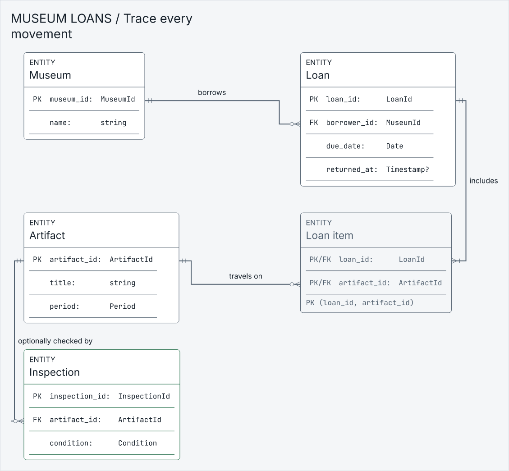

ER — Er Course Enrollment (51 DSL lines)

Five-part composite identity and dependent assessment.

[DSL](../../../../resources/examples/showcase/er-course-enrollment.canvas) · [SVG](final/er-course-enrollment.svg) · [PNG](final/er-course-enrollment.png) · [Browser overview](browser/er-course-enrollment-overview.png) · [Browser detail](browser/er-course-enrollment-detail.png)

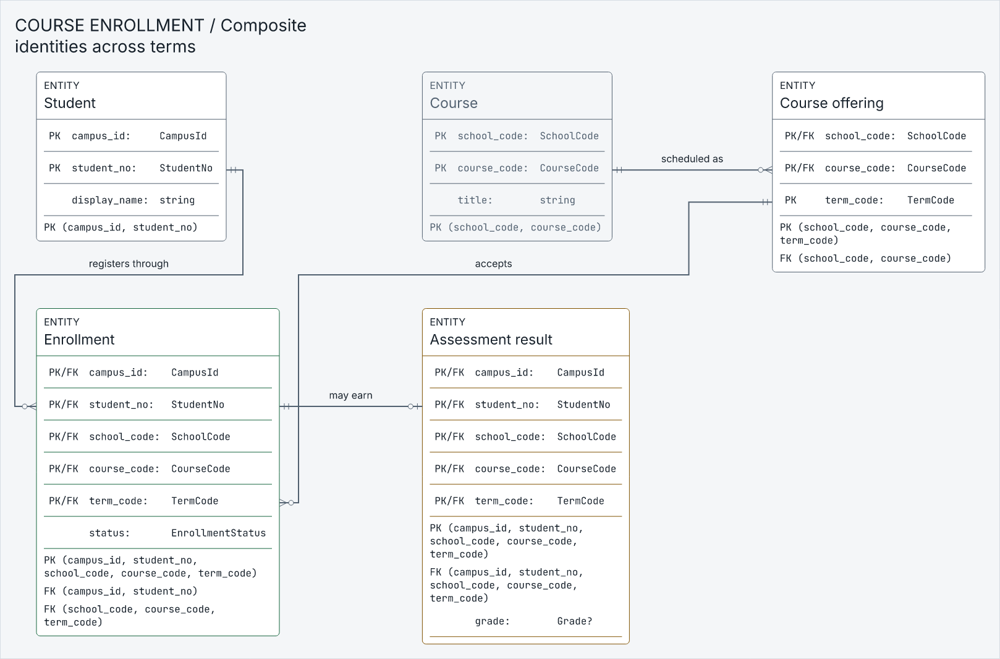

ER — Er Habitat Survey (43 DSL lines)

Self-referencing habitat with several evidence contributors.

[DSL](../../../../resources/examples/showcase/er-habitat-survey.canvas) · [SVG](final/er-habitat-survey.svg) · [PNG](final/er-habitat-survey.png) · [Browser overview](browser/er-habitat-survey-overview.png) · [Browser detail](browser/er-habitat-survey-detail.png)

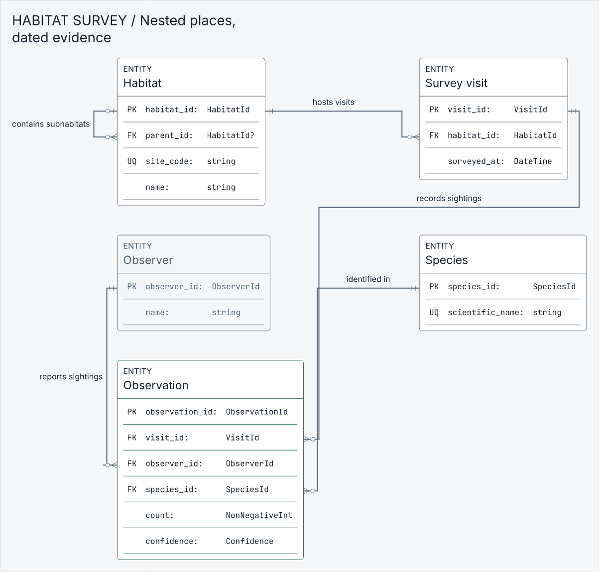

Modules — Modules Document Publishing (43 DSL lines)

Inward interface dependency across an external vendor boundary.

[DSL](../../../../resources/examples/showcase/modules-document-publishing.canvas) · [SVG](final/modules-document-publishing.svg) · [PNG](final/modules-document-publishing.png) · [Browser overview](browser/modules-document-publishing-overview.png) · [Browser detail](browser/modules-document-publishing-detail.png)

Modules — Modules Sensor Gateway (34 DSL lines)

Two transport adapters converge on a typed input port.

[DSL](../../../../resources/examples/showcase/modules-sensor-gateway.canvas) · [SVG](final/modules-sensor-gateway.svg) · [PNG](final/modules-sensor-gateway.png) · [Browser overview](browser/modules-sensor-gateway-overview.png) · [Browser detail](browser/modules-sensor-gateway-detail.png)

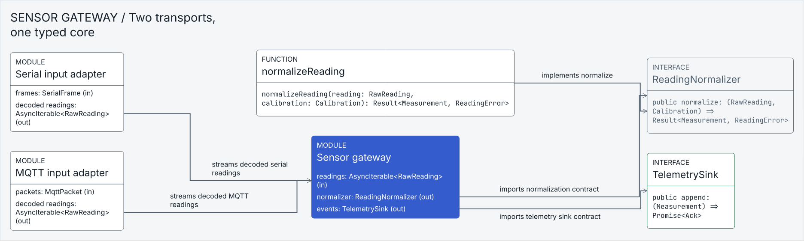

Modules — Modules Payroll Policy (47 DSL lines)

Several callable rules implement two contracts.

[DSL](../../../../resources/examples/showcase/modules-payroll-policy.canvas) · [SVG](final/modules-payroll-policy.svg) · [PNG](final/modules-payroll-policy.png) · [Browser overview](browser/modules-payroll-policy-overview.png) · [Browser detail](browser/modules-payroll-policy-detail.png)

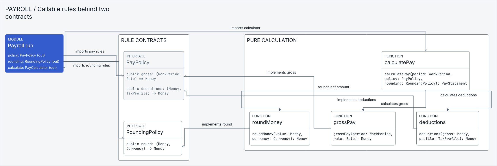

Flow/SOP — Flow Research Approval (41 DSL lines)

Parallel reviews converge with a revision loop.

[DSL](../../../../resources/examples/showcase/flow-research-approval.canvas) · [SVG](final/flow-research-approval.svg) · [PNG](final/flow-research-approval.png) · [Browser overview](browser/flow-research-approval-overview.png) · [Browser detail](browser/flow-research-approval-detail.png)

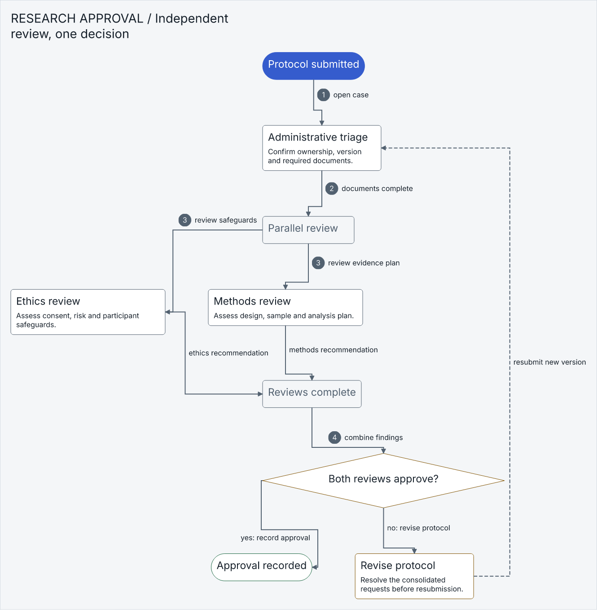

Flow/SOP — Flow Equipment Return (20 DSL lines)

Inspection decision and repair recheck.

[DSL](../../../../resources/examples/showcase/flow-equipment-return.canvas) · [SVG](final/flow-equipment-return.svg) · [PNG](final/flow-equipment-return.png) · [Browser overview](browser/flow-equipment-return-overview.png) · [Browser detail](browser/flow-equipment-return-detail.png)

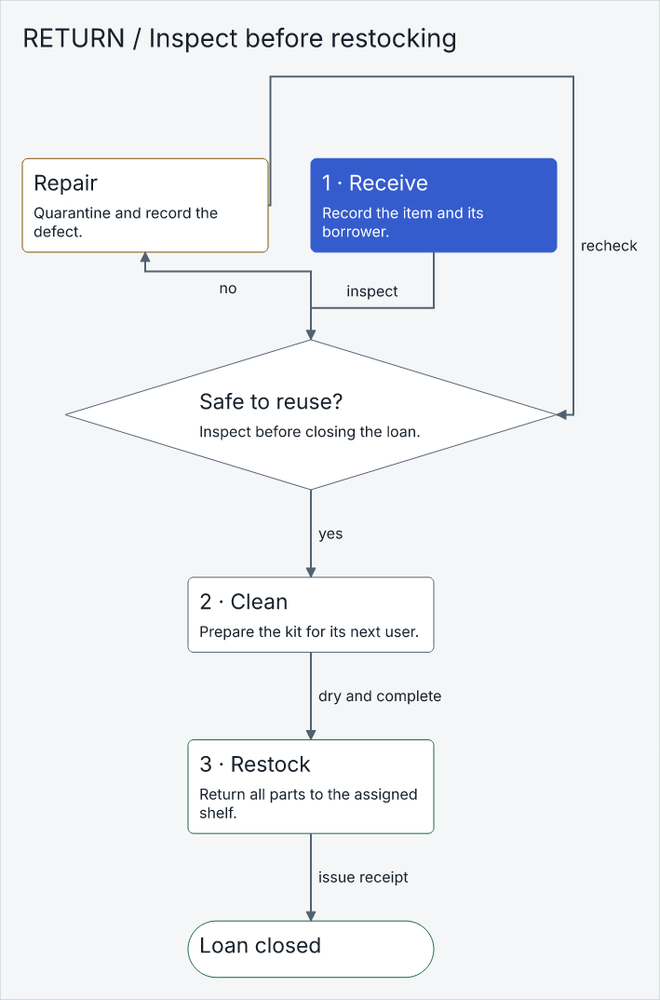

Flow/SOP — Flow Emergency Dispatch (29 DSL lines)

Escalation branches converge at handoff.

[DSL](../../../../resources/examples/showcase/flow-emergency-dispatch.canvas) · [SVG](final/flow-emergency-dispatch.svg) · [PNG](final/flow-emergency-dispatch.png) · [Browser overview](browser/flow-emergency-dispatch-overview.png) · [Browser detail](browser/flow-emergency-dispatch-detail.png)

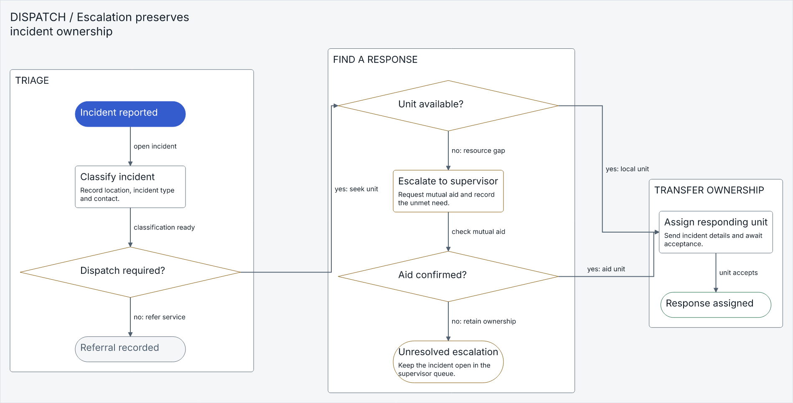

Sequence — Sequence Payment Settlement (29 DSL lines)

Nested loop and alternatives plus asynchronous confirmation.

[DSL](../../../../resources/examples/showcase/sequence-payment-settlement.canvas) · [SVG](final/sequence-payment-settlement.svg) · [PNG](final/sequence-payment-settlement.png) · [Browser overview](browser/sequence-payment-settlement-overview.png) · [Browser detail](browser/sequence-payment-settlement-detail.png)

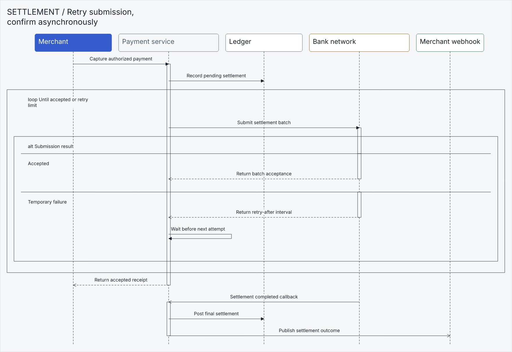

Sequence — Sequence Library Reservation (25 DSL lines)

Alternative reservation and waitlist paths.

[DSL](../../../../resources/examples/showcase/sequence-library-reservation.canvas) · [SVG](final/sequence-library-reservation.svg) · [PNG](final/sequence-library-reservation.png) · [Browser overview](browser/sequence-library-reservation-overview.png) · [Browser detail](browser/sequence-library-reservation-detail.png)

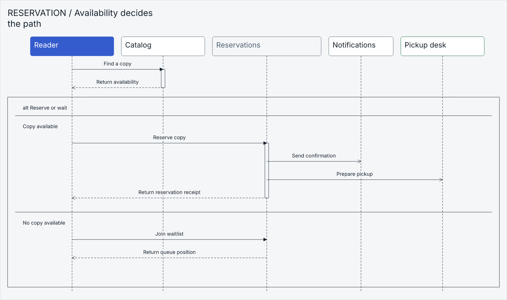

Sequence — Sequence Incident Notification (26 DSL lines)

Independent optional fragments and self-calls.

[DSL](../../../../resources/examples/showcase/sequence-incident-notification.canvas) · [SVG](final/sequence-incident-notification.svg) · [PNG](final/sequence-incident-notification.png) · [Browser overview](browser/sequence-incident-notification-overview.png) · [Browser detail](browser/sequence-incident-notification-detail.png)

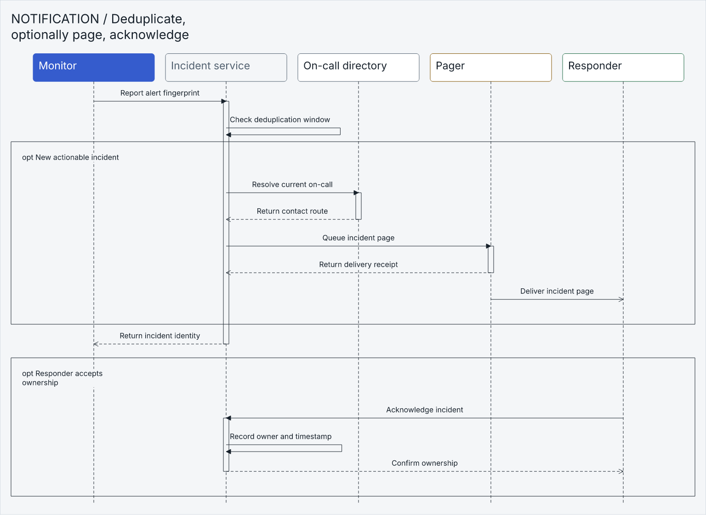

State — State Batch Job (36 DSL lines)

Retry/cancellation branches and durable outcomes.

[DSL](../../../../resources/examples/showcase/state-batch-job.canvas) · [SVG](final/state-batch-job.svg) · [PNG](final/state-batch-job.png) · [Browser overview](browser/state-batch-job-overview.png) · [Browser detail](browser/state-batch-job-detail.png)

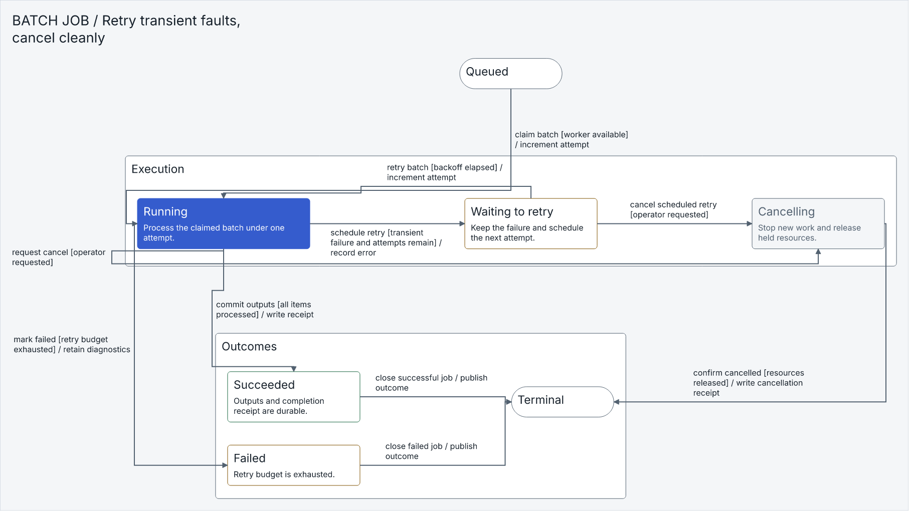

State — State Exhibition Lifecycle (31 DSL lines)

Publication lifecycle and rollback.

[DSL](../../../../resources/examples/showcase/state-exhibition-lifecycle.canvas) · [SVG](final/state-exhibition-lifecycle.svg) · [PNG](final/state-exhibition-lifecycle.png) · [Browser overview](browser/state-exhibition-lifecycle-overview.png) · [Browser detail](browser/state-exhibition-lifecycle-detail.png)

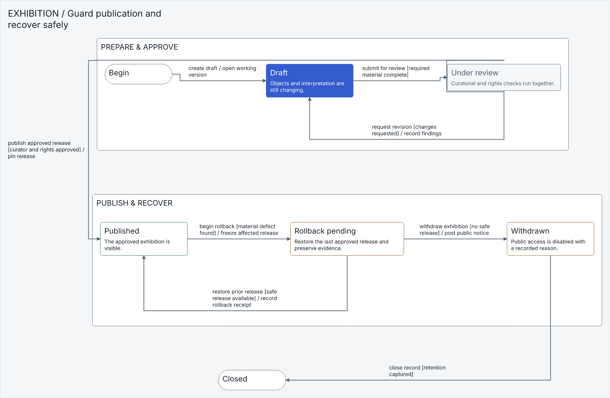

State — State Membership Reinstatement (34 DSL lines)

Suspension, review and monitored re-entry.

[DSL](../../../../resources/examples/showcase/state-membership-reinstatement.canvas) · [SVG](final/state-membership-reinstatement.svg) · [PNG](final/state-membership-reinstatement.png) · [Browser overview](browser/state-membership-reinstatement-overview.png) · [Browser detail](browser/state-membership-reinstatement-detail.png)

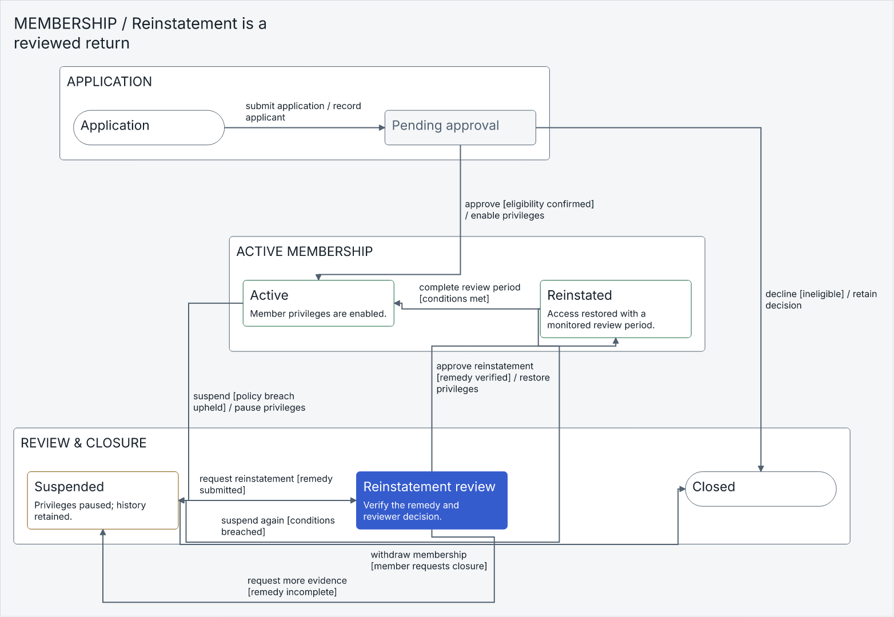

Tree/mindmap — Tree Field Research (29 DSL lines)

Uneven evidence hierarchy with cross-reference.

[DSL](../../../../resources/examples/showcase/tree-field-research.canvas) · [SVG](final/tree-field-research.svg) · [PNG](final/tree-field-research.png) · [Browser overview](browser/tree-field-research-overview.png) · [Browser detail](browser/tree-field-research-detail.png)

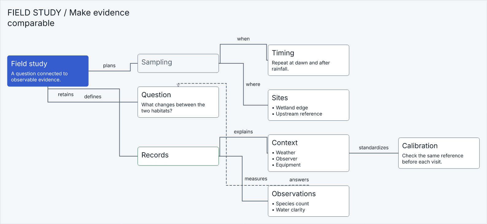

Tree/mindmap — Tree Course Objectives (27 DSL lines)

Deep learning prerequisite hierarchy.

[DSL](../../../../resources/examples/showcase/tree-course-objectives.canvas) · [SVG](final/tree-course-objectives.svg) · [PNG](final/tree-course-objectives.png) · [Browser overview](browser/tree-course-objectives-overview.png) · [Browser detail](browser/tree-course-objectives-detail.png)

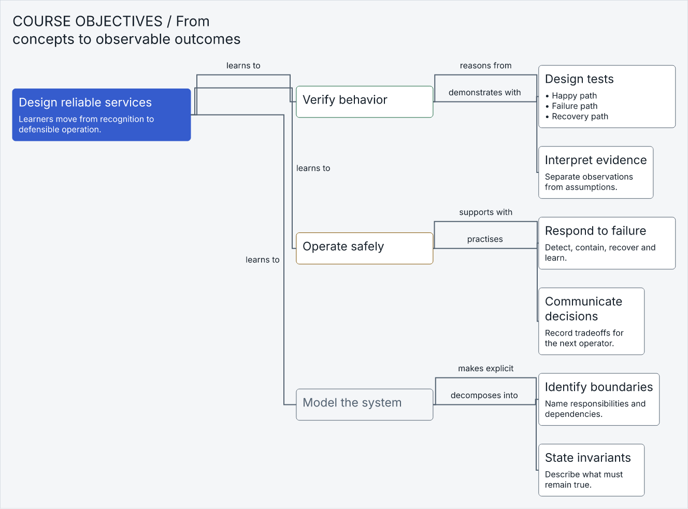

Tree/mindmap — Tree Incident Causes (29 DSL lines)

Downward causal hypotheses with unequal depth.

[DSL](../../../../resources/examples/showcase/tree-incident-causes.canvas) · [SVG](final/tree-incident-causes.svg) · [PNG](final/tree-incident-causes.png) · [Browser overview](browser/tree-incident-causes-overview.png) · [Browser detail](browser/tree-incident-causes-detail.png)

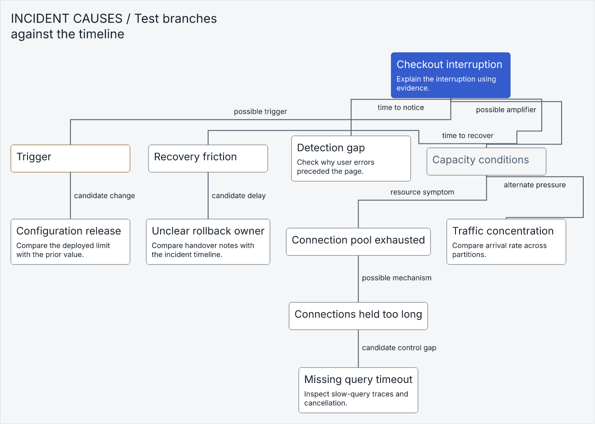

Story/infographic — Story Water Treatment (74 DSL lines)

Serpentine barrier process with monitoring and side streams.

[DSL](../../../../resources/examples/showcase/story-water-treatment.canvas) · [SVG](final/story-water-treatment.svg) · [PNG](final/story-water-treatment.png) · [Browser overview](browser/story-water-treatment-overview.png) · [Browser detail](browser/story-water-treatment-detail.png)

Story/infographic — Story Evidence Lesson (44 DSL lines)

Contrasting evidence converges on a principle and transfer check.

[DSL](../../../../resources/examples/showcase/story-evidence-lesson.canvas) · [SVG](final/story-evidence-lesson.svg) · [PNG](final/story-evidence-lesson.png) · [Browser overview](browser/story-evidence-lesson-overview.png) · [Browser detail](browser/story-evidence-lesson-detail.png)

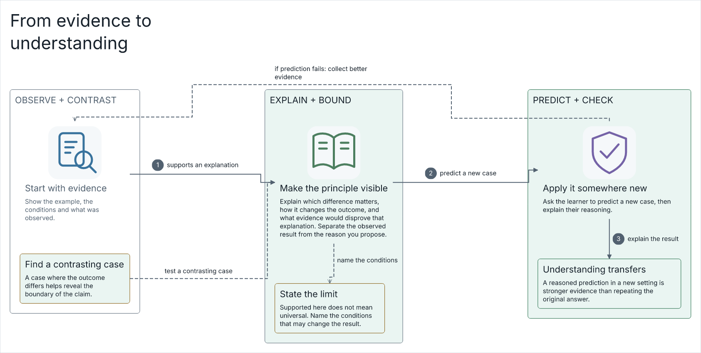

Story/infographic — Story Safe Deployment (51 DSL lines)

Bounded rollout with healthy/unsafe feedback decisions.

[DSL](../../../../resources/examples/showcase/story-safe-deployment.canvas) · [SVG](final/story-safe-deployment.svg) · [PNG](final/story-safe-deployment.png) · [Browser overview](browser/story-safe-deployment-overview.png) · [Browser detail](browser/story-safe-deployment-detail.png)

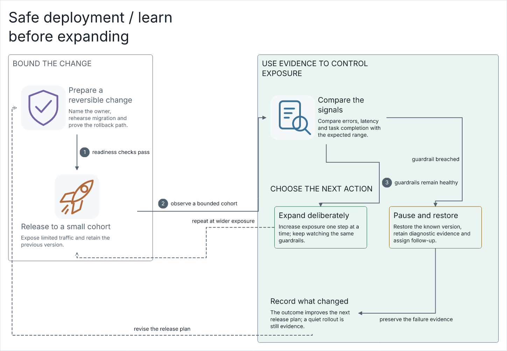

Grid/comparison — Grid Research Methods (28 DSL lines)

Single aligned matrix of shared comparison dimensions.

[DSL](../../../../resources/examples/showcase/grid-research-methods.canvas) · [SVG](final/grid-research-methods.svg) · [PNG](final/grid-research-methods.png) · [Browser overview](browser/grid-research-methods-overview.png) · [Browser detail](browser/grid-research-methods-detail.png)

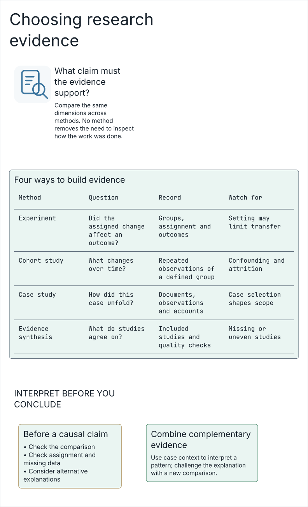

Grid/comparison — Grid Archive Comparison (19 DSL lines)

Three nested operating-model columns.

[DSL](../../../../resources/examples/showcase/grid-archive-comparison.canvas) · [SVG](final/grid-archive-comparison.svg) · [PNG](final/grid-archive-comparison.png) · [Browser overview](browser/grid-archive-comparison-overview.png) · [Browser detail](browser/grid-archive-comparison-detail.png)

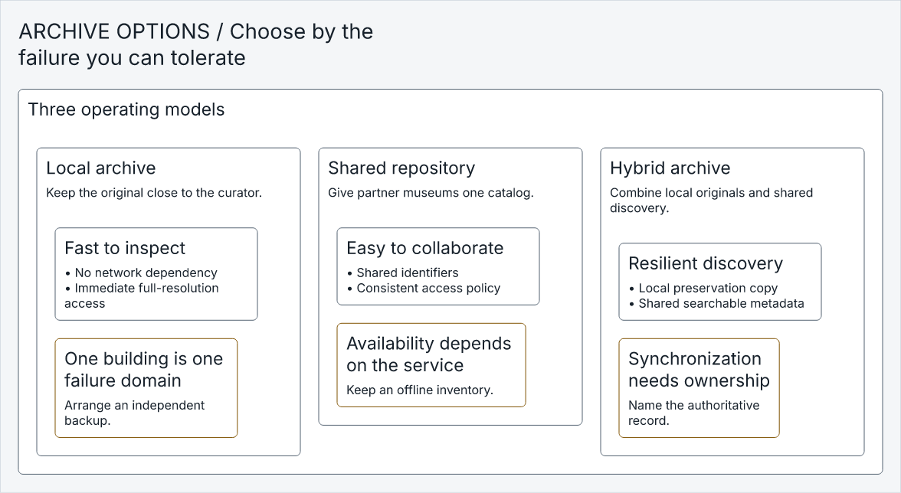

Grid/comparison — Grid Feedback Methods (21 DSL lines)

Four illustrated method quadrants with paired strengths and limits.

[DSL](../../../../resources/examples/showcase/grid-feedback-methods.canvas) · [SVG](final/grid-feedback-methods.svg) · [PNG](final/grid-feedback-methods.png) · [Browser overview](browser/grid-feedback-methods-overview.png) · [Browser detail](browser/grid-feedback-methods-detail.png)

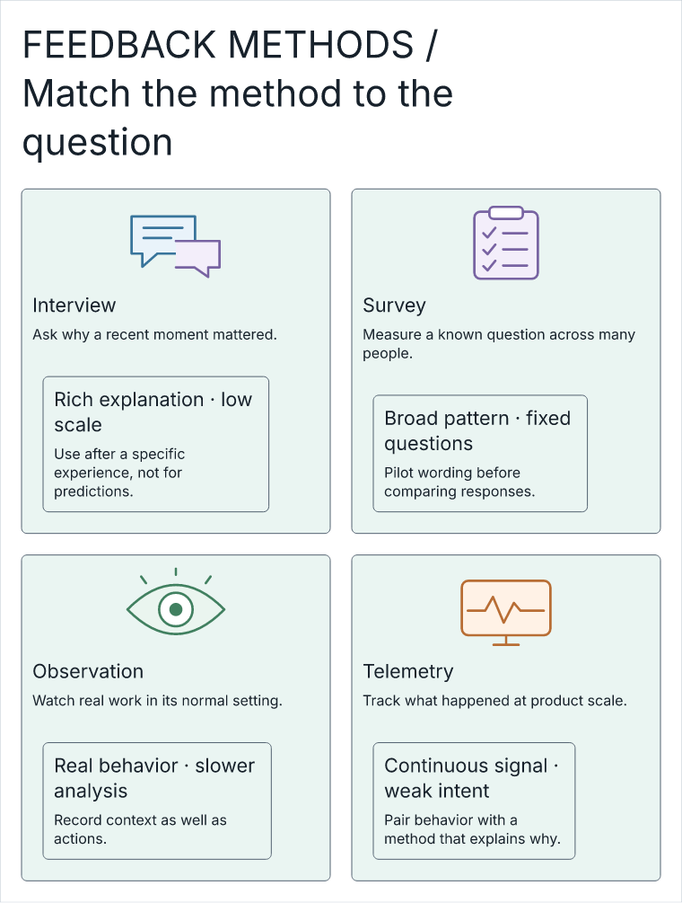

Mixed infographic + modules — Mixed Authoring Contract (60 DSL lines)

Shared admission flow beside actual typed Committer boundary.

[DSL](../../../../resources/examples/showcase/mixed-authoring-contract.canvas) · [SVG](final/mixed-authoring-contract.svg) · [PNG](final/mixed-authoring-contract.png) · [Browser overview](browser/mixed-authoring-contract-overview.png) · [Browser detail](browser/mixed-authoring-contract-detail.png)

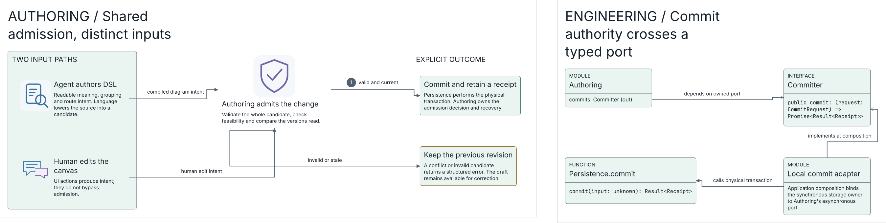

